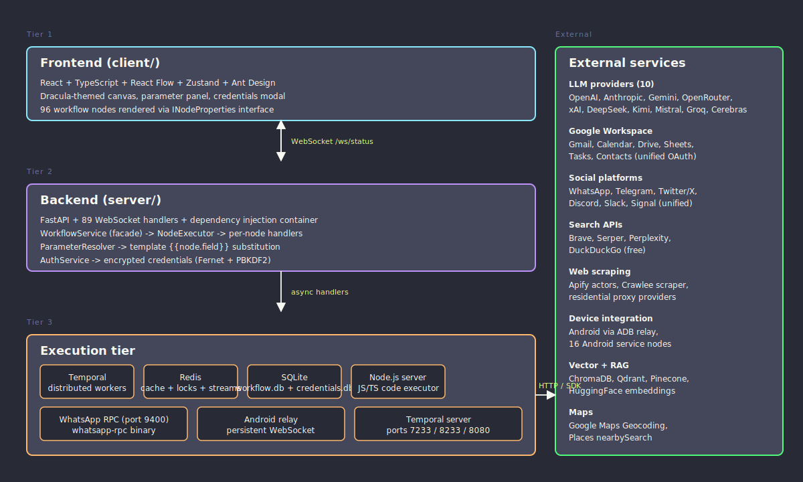
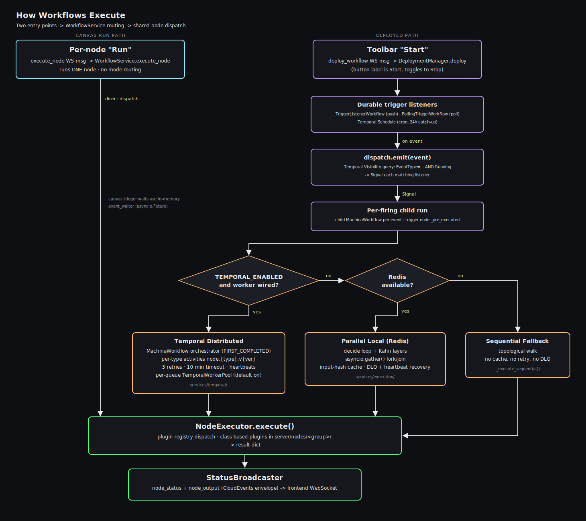
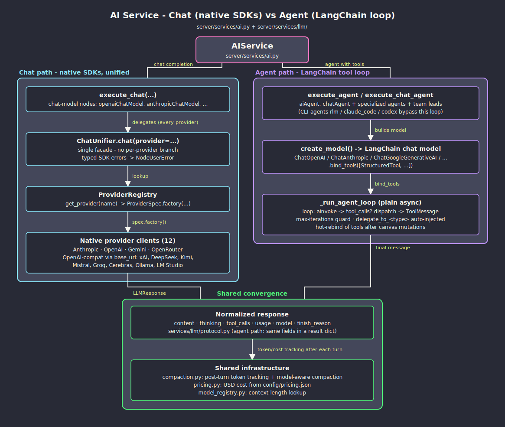
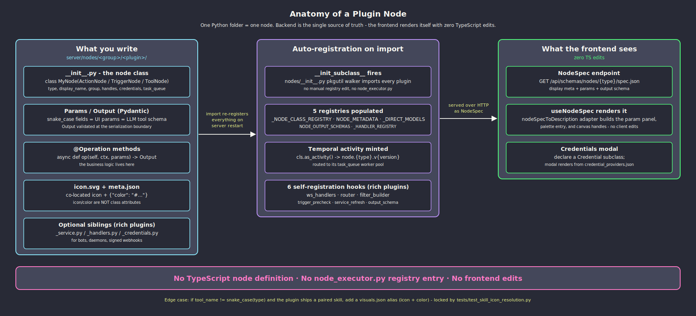

# Contributing to MachinaOS

Welcome! This guide is a contributor's map to the codebase. It tells you *where things live* and *where to start reading* when you want to add a feature. For the full architecture tour, use the [DeepWiki badge](https://deepwiki.com/zeenie-ai/MachinaOS) on the README or browse [docs-internal/](docs-internal/).

## Contribution Workflow

1. Fork the repository
2. Create a feature branch
3. Make your changes
4. Submit a pull request

See [SETUP.md](docs-internal/SETUP.md) for environment setup and [SCRIPTS.md](docs-internal/SCRIPTS.md) for the full scripts reference.

## System Overview

[](https://raw.githubusercontent.com/zeenie-ai/MachinaOS/main/docs/diagrams/system-overview.svg)

At a glance:

- **106 workflow nodes** across 25 categories (AI, agents, social, Android, Google Workspace, email, browser, documents, code, proxies, utilities)
- **10 LLM providers** via a hybrid native SDK + LangChain architecture
- **16 specialized AI agents** with the Agent Teams delegation pattern
- **127 WebSocket handlers** replacing most REST endpoints
- **55 built-in skills** across 10 categories, editable in-UI with SKILL.md defaults on disk
- **Three execution modes** with automatic fallback: Temporal distributed, Redis parallel, sequential

## How Workflows Execute

[](https://raw.githubusercontent.com/zeenie-ai/MachinaOS/main/docs/diagrams/execution-flow.svg)

[WorkflowService](server/services/workflow.py) is a thin facade that routes each run through one of three execution modes. Every run has an isolated `ExecutionContext` with no shared global state, orchestrated by Conductor's decide pattern (`_workflow_decide` under a Redis `SETNX` lock). Layers are computed via Kahn's algorithm and each layer runs via `asyncio.gather()`. Results are cached by input hash (Prefect pattern), failed nodes go to a Dead Letter Queue, and a `RecoverySweeper` handles crashes via heartbeats.

Deep dives: [DESIGN.md](docs-internal/DESIGN.md) - [TEMPORAL_ARCHITECTURE.md](docs-internal/TEMPORAL_ARCHITECTURE.md) - [event_waiter_system.md](docs-internal/event_waiter_system.md)

## AI Agent System

[](https://raw.githubusercontent.com/zeenie-ai/MachinaOS/main/docs/diagrams/ai-agent-routing.svg)

AI execution splits into two paths. `execute_chat()` for direct chat completions prefers the native SDK layer in [services/llm/](server/services/llm/) (10 providers, lazy imports, normalized `LLMResponse`), falling back to LangChain for Groq and Cerebras. `execute_agent()` and `execute_chat_agent()` always use LangChain + LangGraph because tool-calling, state graphs, and the checkpointer have no native equivalent today. Team leads (`orchestrator_agent`, `ai_employee`) auto-inject `delegate_to_<type>` tools for every agent connected to their `input-teammates` handle. The Deep Agent variant uses [LangChain DeepAgents](https://github.com/langchain-ai/deepagents) with built-in filesystem tools, sub-agent delegation, and todo planning; the RLM Agent uses a REPL-based recursive language model pattern. Long-running activities (DeepAgent, browser automation) stay alive across Temporal's 2-minute heartbeat window via per-message `activity.heartbeat()` calls in the WebSocket read loop.

Deep dives: [agent_architecture.md](docs-internal/agent_architecture.md) - [native_llm_sdk.md](docs-internal/native_llm_sdk.md) - [agent_teams.md](docs-internal/agent_teams.md) - [memory_compaction.md](docs-internal/memory_compaction.md)

## Repository Map

| Directory | What lives here | Start reading |
|---|---|---|
| `server/nodes/<category>/<node>.py` | Workflow node plugins (NodeSpec + execute) — backend SSOT since Wave 11 | [plugin_system.md](docs-internal/plugin_system.md), [server/nodes/README.md](server/nodes/README.md) |
| `client/src/components/` | React Flow canvas, parameter panel, modals | [CLAUDE.md](CLAUDE.md) |
| `server/services/` | WorkflowService, NodeExecutor, AI service | [DESIGN.md](docs-internal/DESIGN.md) |
| `server/services/handlers/` | One handler per node type (dispatch targets) | [node_creation.md](docs-internal/node_creation.md) |
| `server/services/llm/` | Native LLM SDK layer (10 providers) | [native_llm_sdk.md](docs-internal/native_llm_sdk.md) |
| `server/services/execution/` | Decide pattern, DLQ, recovery, conditions | [DESIGN.md](docs-internal/DESIGN.md) |
| `server/services/temporal/` | Distributed execution via Temporal | [TEMPORAL_ARCHITECTURE.md](docs-internal/TEMPORAL_ARCHITECTURE.md) |
| `server/routers/websocket.py` | 127 WebSocket handlers | [status_broadcaster.md](docs-internal/status_broadcaster.md) |
| `server/core/` | Cache, encryption, DI container, config | [credentials_encryption.md](docs-internal/credentials_encryption.md) |
| `server/skills/` | 55 skill SKILL.md files across 10 folders | [GUIDE.md](server/skills/GUIDE.md) |
| `server/config/` | llm_defaults.json, pricing.json, model_registry.json, email_providers.json, google_apis.json | [pricing_service.md](docs-internal/pricing_service.md) |
| `docs-internal/` | In-repo architecture deep dives (30 files) | Index below |

## How to Contribute Features

[](https://raw.githubusercontent.com/zeenie-ai/MachinaOS/main/docs/diagrams/node-anatomy.svg)

The diagram above shows the full lifecycle of a workflow node from TypeScript definition to Python handler. Use these recipes as a starting point:

**Add a workflow node**
- Author a plugin: `server/nodes/<category>/<node>.py` — subclasses `BaseNode`, declares `NodeSpec` + `execute`
- Add a contract test: `server/tests/nodes/test_<category>.py`
- Guide: [plugin_system.md](docs-internal/plugin_system.md) + [server/nodes/README.md](server/nodes/README.md)

**Add an LLM provider**
- OpenAI-compatible (DeepSeek, Kimi, Mistral pattern): config-only in `server/config/llm_defaults.json`
- Custom-SDK provider: new file in `server/services/llm/providers/`, branch in `factory.py`
- Backend plugin: `server/nodes/model/<provider>_chat_model.py`
- Guide: [native_llm_sdk.md](docs-internal/native_llm_sdk.md)

**Add a dual-purpose tool (workflow node + AI tool)**
- Plugin folder under `server/nodes/<category>/<name>/` with `group: ['category', 'tool']` and `usable_as_tool = True`
- Pydantic `Params` doubles as the LLM-visible tool schema (no separate `_get_tool_schema` entry)
- Guide: [node_creation.md](docs-internal/node_creation.md)

**Add a specialized AI agent**
- Add the plugin under `server/nodes/agent/<name>/` (extends `SpecializedAgentBase` from `server/nodes/agent/_specialized.py`)
- Add to `SPECIALIZED_AGENT_TYPES` in `server/constants.py`
- Guide: [node_creation.md](docs-internal/node_creation.md)

**Add a skill**
- New folder under `server/skills/<category>/`
- Create `SKILL.md` with YAML frontmatter + markdown body
- Guide: [GUIDE.md](server/skills/GUIDE.md)

**Add an event-based trigger**
- Register in `TRIGGER_REGISTRY` in `server/services/event_waiter.py`
- Add a filter builder in the same file
- Frontend node with `group: ['category', 'trigger']`
- Guide: [event_waiter_system.md](docs-internal/event_waiter_system.md)

**Integrate a new external service with OAuth**
- Reference implementation: Google Workspace (7 nodes sharing one OAuth connection)
- Guide: [new_service_integration.md](docs-internal/new_service_integration.md)

## Local Dev Quick Reference

Development from source uses **pnpm** (not npm). The `scripts/preinstall.js` hook enforces this when `pnpm-workspace.yaml` is present. Install pnpm once with `npm install -g pnpm`.

```bash
pnpm install           # install workspace dependencies
pnpm run dev           # start frontend + backend + Temporal + WhatsApp
pnpm run stop          # stop everything
pnpm run build         # production build
pnpm exec tsc --noEmit # typecheck client (from client/)
python -m pytest       # run backend tests (from server/)
```

Full setup and scripts reference: [SETUP.md](docs-internal/SETUP.md) - [SCRIPTS.md](docs-internal/SCRIPTS.md)

## Full Documentation Index

| Document | Description |
|---|---|
| [DESIGN.md](docs-internal/DESIGN.md) | Execution engine architecture, design patterns, execution modes |
| [TEMPORAL_ARCHITECTURE.md](docs-internal/TEMPORAL_ARCHITECTURE.md) | Distributed execution via Temporal activities |
| [workflow-schema.md](docs-internal/workflow-schema.md) | Workflow JSON schema and full node catalog (106 nodes) |
| [deep_agent.md](docs-internal/deep_agent.md) | LangChain DeepAgents integration with filesystem tools and sub-agents |
| [ROADMAP.md](docs-internal/ROADMAP.md) | Implementation status and completed phases |
| [SETUP.md](docs-internal/SETUP.md) | Development environment setup |
| [SCRIPTS.md](docs-internal/SCRIPTS.md) | npm/shell scripts reference |
| [server-readme.md](docs-internal/server-readme.md) | Python backend architecture and API |
| [agent_architecture.md](docs-internal/agent_architecture.md) | AI Agent / Chat Agent skill and tool discovery |
| [agent_delegation.md](docs-internal/agent_delegation.md) | How delegated agents share context and memory |
| [agent_teams.md](docs-internal/agent_teams.md) | Agent Teams pattern with `input-teammates` handle |
| [native_llm_sdk.md](docs-internal/native_llm_sdk.md) | Native LLM SDK layer and provider protocol |
| [rlm_service.md](docs-internal/rlm_service.md) | Recursive Language Model agent via REPL |
| [claude_code_agent_architecture.md](docs-internal/claude_code_agent_architecture.md) | Claude Code SDK integration as a specialized agent |
| [autonomous_agent_creation.md](docs-internal/autonomous_agent_creation.md) | Autonomous agents with Code Mode patterns |
| [event_waiter_system.md](docs-internal/event_waiter_system.md) | Push-based trigger waiters |
| [status_broadcaster.md](docs-internal/status_broadcaster.md) | WebSocket broadcaster (live handler count via `len(MESSAGE_HANDLERS) + len(get_ws_handlers())`) |
| [credentials_encryption.md](docs-internal/credentials_encryption.md) | Fernet + PBKDF2 credentials system |
| [memory_compaction.md](docs-internal/memory_compaction.md) | Token tracking and model-aware compaction |
| [pricing_service.md](docs-internal/pricing_service.md) | LLM and API cost tracking |
| [proxy_service.md](docs-internal/proxy_service.md) | Residential proxy provider management |
| [ci_cd.md](docs-internal/ci_cd.md) | GitHub Actions workflows |
| [node_creation.md](docs-internal/node_creation.md) | How to create new nodes |
| [memory_lifecycle.md](docs-internal/memory_lifecycle.md) | Canonical home for markdown memory format, vector store, claude_code_agent session resume |
| [tool_building_pipeline.md](docs-internal/tool_building_pipeline.md) | Canonical home for `_build_tool_from_node`, tool discovery, per-type Temporal dispatch |
| [new_service_integration.md](docs-internal/new_service_integration.md) | External service integration guide |
| [cli_services_integration.md](docs-internal/cli_services_integration.md) | CLI service lifecycle management |
| [onboarding.md](docs-internal/onboarding.md) | Welcome wizard and replay |
| [Skill Creation Guide](server/skills/GUIDE.md) | How to create new skills |

## Community

Join our [Discord](https://discord.gg/NHUEQVSC) for help, feedback, and updates.
