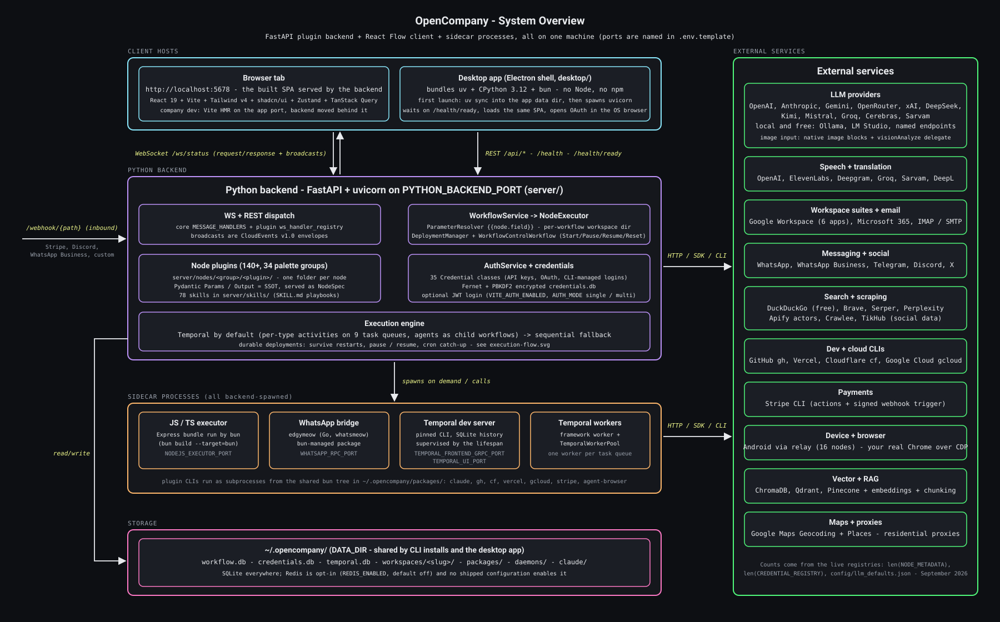
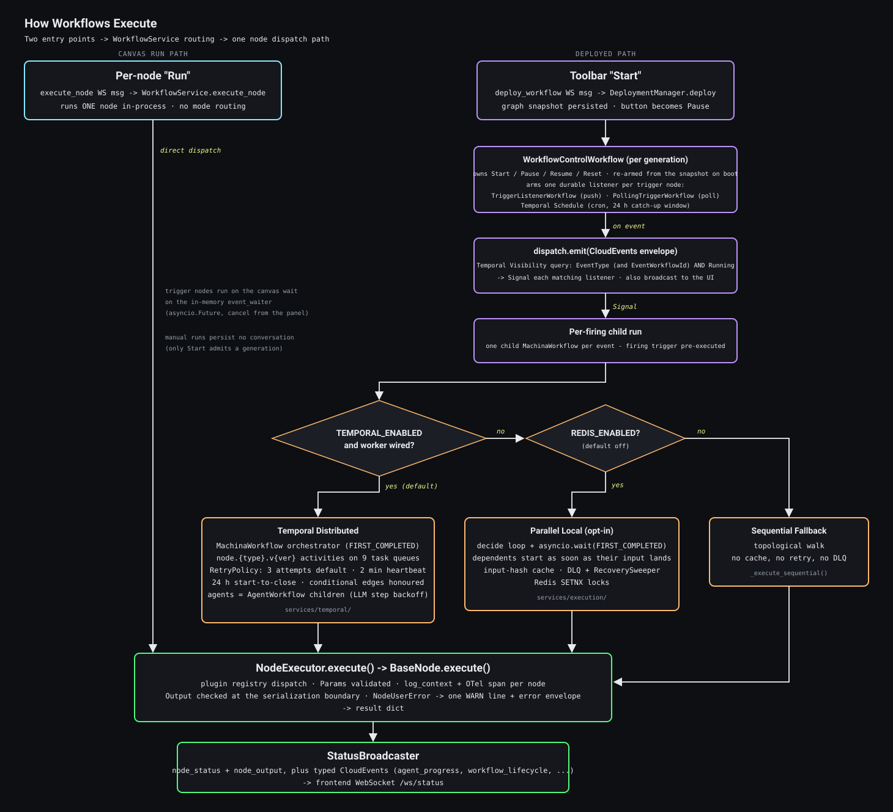
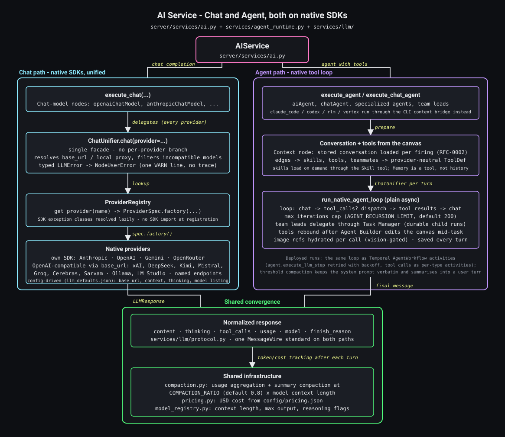
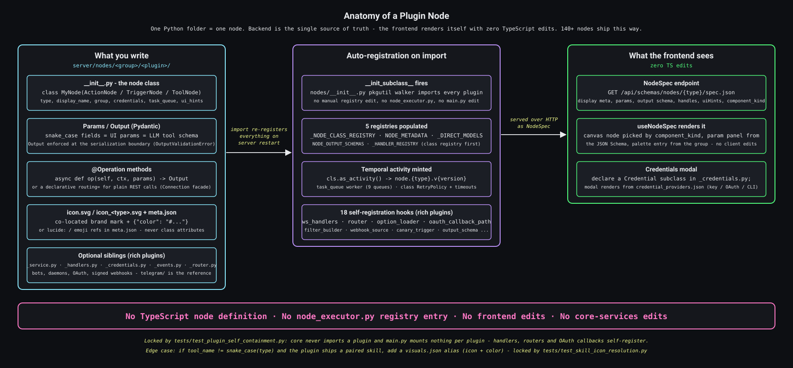

# Contributing to OpenCompany

Welcome! This guide is a contributor's map to the codebase. It tells you *where things live* and *where to start reading* when you want to add a feature. For the full architecture tour, use the [DeepWiki badge](https://deepwiki.com/zeenie-ai/OpenCompany) on the README or browse [docs-internal/](docs-internal/).

## Contribution Workflow

1. Fork the repository
2. Create a feature branch
3. Make your changes
4. Submit a pull request

See [SETUP.md](docs-internal/SETUP.md) for environment setup and [SCRIPTS.md](docs-internal/SCRIPTS.md) for the full scripts reference.

## System Overview

[](https://raw.githubusercontent.com/zeenie-ai/OpenCompany/main/docs/diagrams/system-overview.svg)

At a glance:

- **140+ workflow nodes** across 33 populated palette groups (34 registered in `server/nodes/groups.py`) (live count: `len(services.node_registry.NODE_METADATA)` *after* importing `nodes` — a bare `server/nodes/**/__init__.py` glob both over-counts helper packages and under-counts groups that hold several node types in one package)
- **Native LLM providers**: 11 cloud providers, Ollama and LM Studio, plus any number of user-named OpenAI-compatible endpoints (llama.cpp, vLLM, a LiteLLM proxy) added in the Credentials Modal with no code. One standalone chat-model node per provider except xAI, which agent nodes select directly, plus `openaiCompatibleChatModel` for a named endpoint
- **Specialized AI agents** with the Agent Teams delegation pattern — SSOT is the `AI_AGENT_TYPES` frozenset in `server/constants.py`, which spans the base/specialized/team-lead agents plus the CLI-backed (`claude_code_agent`, `rlm_agent`) and Vertex-hosted (`vertex_managed_agent`) variants; `codex_agent` is a sibling CLI-agent plugin
- **WebSocket-first API** replacing most REST endpoints (live handler count = `MESSAGE_HANDLERS` + plugin registries)
- **78 built-in skills** across 18 folders, editable in-UI with SKILL.md defaults on disk (live count: `find server/skills -name SKILL.md | wc -l`)
- **Two execution modes** with automatic fallback: Temporal distributed, sequential

## How Workflows Execute

[](https://raw.githubusercontent.com/zeenie-ai/OpenCompany/main/docs/diagrams/execution-flow.svg)

[WorkflowService](server/services/workflow.py) is a thin facade that routes each run through Temporal when available, falling back to a plain sequential walk otherwise. Every run has an isolated `ExecutionContext` with no shared global state. Nodes are scheduled continuously — when any node completes, its newly-ready dependents start immediately (`FIRST_COMPLETED` pattern) instead of waiting for a whole layer to finish.

Deep dives: [DESIGN.md](docs-internal/DESIGN.md) - [TEMPORAL_ARCHITECTURE.md](docs-internal/TEMPORAL_ARCHITECTURE.md) - [event_framework.md](docs-internal/event_framework.md)

## AI Agent System

[](https://raw.githubusercontent.com/zeenie-ai/OpenCompany/main/docs/diagrams/ai-agent-routing.svg)

Direct chat completions and every new agent execution use the native SDK layer in [services/llm/](server/services/llm/) through `ChatUnifier`. The shared `run_native_agent_loop` consumes lossless native messages and provider-neutral `AgentToolSpec` definitions; Groq, Cerebras, xAI, DeepSeek, Kimi, Mistral, the local servers and every named OpenAI-compatible endpoint ride the OpenAI-compatible client with provider-specific `base_url` values. LangChain has been removed; Temporal histories recorded before the native cutover are refused rather than replayed. Team leads (`orchestrator_agent`, `ai_employee`) receive an intrinsic Task Manager and may assign only agents connected to their `input-teammates` handle. Delegate descriptors stay internal. `task_manager(assign_task)` persists and returns `queued`; Temporal hands work to a detached `DelegatedTaskWorkflow`, while legacy execution reuses the same durable task record. Completion emits `taskTrigger` with owning execution context for a separate lead review. The RLM Agent uses a REPL-based recursive language model pattern. Long-running activities remain alive through activity heartbeats.

Deep dives: [agent_architecture.md](docs-internal/agent_architecture.md) - [native_llm_sdk.md](docs-internal/native_llm_sdk.md) - [agent_teams.md](docs-internal/agent_teams.md) - [memory_compaction.md](docs-internal/memory_compaction.md) - [cli_agent_framework.md](docs-internal/cli_agent_framework.md)

## More Diagrams

Fourteen source-backed architecture and product-panel diagrams live next to the ones above in [docs/diagrams/](docs/diagrams/). Each carries the source files it was drawn from in its `<desc>`.

| Diagram | What it shows |
|---|---|
| [System context](docs/diagrams/system-context.svg) | Who uses OpenCompany and which external capabilities it orchestrates |
| [Runtime and trust topology](docs/diagrams/runtime-trust-topology.svg) | Browser, desktop and CLI clients, the authenticated REST / WebSocket / MCP / webhook surfaces, Temporal and the lazy sidecars |
| [Workflow execution routing](docs/diagrams/workflow-execution-routing.svg) | Temporal, parallel and sequential branches converging on the NodeExecutor pipeline |
| [Durable deployment and events](docs/diagrams/durable-deployment-events.svg) | Generation snapshots, WorkflowControlWorkflow, push / poll / cron triggers, CloudEvents dispatch |
| [Plugin, agent and team composition](docs/diagrams/plugin-agent-team-composition.svg) | How plugins become chat-model and agent nodes, assemble context, skills and tools, and form teams |
| [Persistence and secret plane](docs/diagrams/persistence-secret-plane.svg) | workflow.db versus the encrypted credentials.db boundary |
| [Workspace anatomy](docs/diagrams/workspace-anatomy.svg) | Immutable id to mutable slug directories, contained I/O, CLI worktrees and materialized skills |
| [Node configuration anatomy](docs/diagrams/node-configuration-anatomy.svg) | The Input / Parameters / Output modal, local draft, save-before-run and correlated output |
| [Credentials architecture](docs/diagrams/credentials-architecture.svg) | Server-owned catalogue, WebSocket handlers, AuthService and encrypted storage |
| [Team operations](docs/diagrams/team-operations.svg) | Task Manager lifecycle from blocked and queued through submission, review and finish |
| [Agent context versus memory](docs/diagrams/agent-context-memory.svg) | The stored conversation (RFC-0002) beside the explicit Memory tool |
| [Master Skill editor](docs/diagrams/master-skill-editor.svg) | Skill sources, the catalogue and instruction panes, expansion and runtime badges |
| [Workspace files](docs/diagrams/workspace-files.svg) | The Gallery node panel: WebSocket listing, HTTP content and the FileRef output |
| [Runtime observability dock](docs/diagrams/runtime-observability-dock.svg) | Chat, Console and Terminal producers, retention and the dock UI |

## Repository Map

| Directory | What lives here | Start reading |
|---|---|---|
| `server/nodes/<category>/<node>/__init__.py` | Workflow node plugins (self-contained folders, NodeSpec + execute) — backend SSOT since Wave 11 | [plugin_system.md](docs-internal/plugin_system.md), [server/nodes/README.md](server/nodes/README.md) |
| `client/src/components/` | React Flow canvas, parameter panel, modals | [CLAUDE.md](CLAUDE.md) |
| `server/services/` | WorkflowService, NodeExecutor, AI service | [DESIGN.md](docs-internal/DESIGN.md) |
| `server/services/handlers/` | Cross-cutting orchestration only (`tools.py` AI-tool dispatch + delegation, `triggers.py`, `todo.py`) — per-node handlers live inside the plugins since Wave 11 | [node_creation.md](docs-internal/node_creation.md) |
| `server/services/llm/` | Native LLM SDK layer (every provider, plus named OpenAI-compatible endpoints) | [native_llm_sdk.md](docs-internal/native_llm_sdk.md) |
| `server/services/execution/` | Decide pattern, DLQ, recovery, conditions | [DESIGN.md](docs-internal/DESIGN.md) |
| `server/services/temporal/` | Distributed execution via Temporal | [TEMPORAL_ARCHITECTURE.md](docs-internal/TEMPORAL_ARCHITECTURE.md) |
| `server/routers/websocket.py` | WebSocket endpoint + core `MESSAGE_HANDLERS` (plugins register more via `ws_handler_registry`) | [status_broadcaster.md](docs-internal/status_broadcaster.md) |
| `server/core/` | Cache, encryption, DI container, config | [credentials_encryption.md](docs-internal/credentials_encryption.md) |
| `server/skills/` | Skill SKILL.md files, one folder per agent domain (live count: glob `server/skills/**/SKILL.md`) | [GUIDE.md](server/skills/GUIDE.md) |
| `server/config/` | llm_defaults.json, pricing.json, model_registry.json, email_providers.json, google_apis.json, credential_providers.json, ai_cli_providers.json, node_allowlist.json | [pricing_service.md](docs-internal/pricing_service.md), [node_allowlist.md](docs-internal/node_allowlist.md) |
| `server/tests/` | Contract-test invariants + per-category node tests + `NodeTestHarness` | [tests/nodes/_harness.py](server/tests/nodes/_harness.py), [tests/credentials/README.md](server/tests/credentials/README.md) |
| `client/src/` (styling + themes) | Tailwind tokens, shadcn primitives, the 12-theme contract | [frontend_architecture.md](docs-internal/frontend_architecture.md), [theme_system.md](docs-internal/theme_system.md) |
| `desktop/` | Electron desktop shell — a standalone bun package (not a root workspace member) that bundles uv + Python + bun (no Node, no npm), provisions the backend venv on first launch and hosts the backend-served SPA in a native window | [desktop_app.md](docs-internal/desktop_app.md), [desktop_host_contract.md](docs-internal/desktop_host_contract.md) |
| `docs-internal/` | In-repo architecture deep dives (50+ files) | Index below |

## How to Contribute Features

[](https://raw.githubusercontent.com/zeenie-ai/OpenCompany/main/docs/diagrams/node-anatomy.svg)

The diagram above shows the full lifecycle of a workflow node: one self-contained Python plugin folder that auto-registers on import and renders itself on the frontend with zero TypeScript edits. Use these recipes as a starting point:

**Add a workflow node**
- Start at [node_creation.md](docs-internal/node_creation.md) (the decision tree routes action / trigger / tool / dual-purpose / agent work), copy the recipe from [server/nodes/README.md](server/nodes/README.md), and reach for [plugin_system.md](docs-internal/plugin_system.md) as the deep reference
- One plugin folder: `server/nodes/<category>/<node>/__init__.py` — subclasses `ActionNode` / `TriggerNode` / `ToolNode`, declares Pydantic `Params`/`Output` + `@Operation` methods; auto-registers on import, zero frontend edits
- Icon = `icon.svg` in the folder, color = `meta.json` (never class attributes); raise `NodeUserError` for user-correctable failures
- Add a behavioral test in `server/tests/nodes/test_<category>.py` (the invariant suites cover the contract automatically — see Testing below)

**Add an LLM provider**
- Guide: [native_llm_sdk.md](docs-internal/native_llm_sdk.md) → "Adding a New Provider"
- OpenAI-compatible (DeepSeek, Kimi, Mistral pattern): add the provider configuration to `server/config/llm_defaults.json` and its name to `services/llm/providers/_compat.py::_COMPAT_PROVIDERS`
- Custom-SDK provider: new file in `server/services/llm/providers/` that calls `register_provider(ProviderSpec(...))` at module bottom (lazy factory + `sdk_exception_refs`; the legacy `factory.py` was removed — `register_provider` is the only entry point)
- Chat-model node plugin: `server/nodes/model/<provider>_chat_model/__init__.py`, plus a branch in `detect_ai_provider` (`server/constants.py`), or the node falls through to `'openai'`. Agent dropdowns need no edit: their `provider` field is the loader-driven `ProviderRef` (`nodes/agent/_provider.py`), which lists every registered provider
- A server the user runs (llama.cpp, vLLM, a LiteLLM proxy, another Ollama host) needs no code at all: it is a named endpoint added in the Credentials Modal ([RFC-0003](RFC-0003-OPENAI-COMPATIBLE-PROVIDER-CONTRACT.md))

**Add a dual-purpose tool (workflow node + AI tool)**
- Guide: [node_creation.md](docs-internal/node_creation.md); live references: the whatsapp / twitter / stripe folders
- Plugin folder with `group: ['category', 'tool']` and `usable_as_tool = True`; the Pydantic `Params` doubles as the LLM-visible tool schema (keep it flat — no nested models / `$defs`)
- If you give the tool a short `tool_name` that isn't `<snake_case_of_node_type>` AND ship a paired skill, add a `visuals.json` alias entry keyed by the tool name carrying **icon and color** — otherwise the Master Skill row renders blank (locked by `server/tests/test_skill_icon_resolution.py`)

**Add a specialized AI agent**
- Guide: [node_creation.md](docs-internal/node_creation.md) + [agent_architecture.md](docs-internal/agent_architecture.md)
- Add the plugin under `server/nodes/agent/<name>/` (extends `SpecializedAgentBase` from `server/nodes/agent/_specialized.py`)
- Single cross-cutting edit: add the agent's `type` string to the `AI_AGENT_TYPES` frozenset in `server/constants.py` — delegation dispatch imports that frozenset, nothing else to update
- CLI-backed agents (Claude Code / Codex shape) follow [cli_agent_framework.md](docs-internal/cli_agent_framework.md); Vertex-hosted agents follow the `vertex_managed_agent` plugin

**Add a skill**
- Guide: [GUIDE.md](server/skills/GUIDE.md) (folder structure, SKILL.md frontmatter, and the tool-naming contract that drives the skill's icon)
- New folder under `server/skills/<domain>/<skill-name>/SKILL.md` with YAML frontmatter + markdown body

**Add an event source / trigger (Wave 12)**
- Guides: [node_creation.md](docs-internal/node_creation.md) → Wave 12 recipe (authoring) → [event_framework.md](docs-internal/event_framework.md) (Temporal routing + ops) → [stripe_service.md](docs-internal/stripe_service.md) (the reference implementation)
- Pick the source shape: `DaemonEventSource` (CLI daemon), `WebhookSource` + `WebhookTriggerNode` (signed webhooks, with a verifier from `services.events.verifiers`), or `PollingEventSource` (API polling)
- Register via `register_canary_trigger_type(node_type, cloudevent_type)` + emit `WorkflowEvent`s via `dispatch.emit` from the plugin's `_events.py`; plugin-owned filters go through `register_filter_builder` — never hand-edit `event_waiter.py` ([event_waiter_system.md](docs-internal/event_waiter_system.md) is historical, pre-Wave-11)

**Integrate a CLI-managed-auth service (Stripe / Vercel / GitHub shape)**
- Guide: [node_creation.md](docs-internal/node_creation.md) → "CLI-managed auth" recipe; references: [stripe_service.md](docs-internal/stripe_service.md) (two-step browser OAuth), [vercel_service.md](docs-internal/vercel_service.md) (device-flow variant), [github_service.md](docs-internal/github_service.md) (gh owns auth entirely)
- The external CLI owns the real tokens; the plugin writes marker tokens via `auth_service.store_oauth_tokens(provider, "cli-managed", "cli-managed")` and broadcasts the generic `credential_catalogue_updated` event — zero per-provider frontend code
- `_install.py` auto-downloads the pinned CLI binary into the shared packages tree

**Integrate an OAuth service**
- Guides: [plugin_system.md](docs-internal/plugin_system.md) (Connection facade, credentials, `register_router` / `register_option_loader`); live reference: [server/nodes/google/](server/nodes/google/) — 7 nodes sharing one OAuth connection via `_oauth.py` / `_router.py` / `_auth_helper.py`
- ([new_service_integration.md](docs-internal/ARCHIVE/new_service_integration.md) is archived — do not follow its steps)

**Add a credential provider**
- Declare a `Credential` subclass in the plugin folder's `_credentials.py` and add the provider entry to `server/config/credential_providers.json` — the Credentials Modal renders it with no React edits
- Guides: [credentials_encryption.md](docs-internal/credentials_encryption.md) (storage pipeline) + [frontend_architecture.md → Credentials](docs-internal/frontend_architecture.md) (the config-driven modal); the numbered invariants the tests cite live in the archived [credentials_panel.md §5](docs-internal/ARCHIVE/credentials_panel.md); test conventions in [server/tests/credentials/README.md](server/tests/credentials/README.md)

**Contribute frontend / a new theme**
- Read [frontend_architecture.md](docs-internal/frontend_architecture.md) first (stack, token tiers, state-ownership boundary, the strict styling rules), then [theme_system.md](docs-internal/theme_system.md) for the theme contract
- New themes follow theme_system.md → "Adding a new theme" (per-theme CSS file + tokens; no component code changes — that is the contract)
- New backend uiHint flags need two frontend-side edits: `INodeProperties.ts` + the `known` set in `server/tests/test_node_spec.py`

## Testing Your Contribution

- **Contract invariants run automatically.** `server/tests/test_plugin_contract.py` and `test_node_spec.py` iterate every registered plugin and assert the declared shape — a new node is covered the moment it imports. `test_plugin_self_containment.py` enforces the no-cross-plugin-imports rule; `test_skill_icon_resolution.py` asserts every skill resolves an icon.
- **Behavioral tests** live per category in `server/tests/nodes/test_<category>.py`, driven through `NodeTestHarness` ([server/tests/nodes/_harness.py](server/tests/nodes/_harness.py)) — it executes any node via `NodeExecutor` with mocked services and asserts the result envelope.
- **Import sanity:** `uv run pytest --collect-only` (from `server/`) is the live plugin-count invariant — it fails if any plugin errors at import.
- **Credential tests** follow the numbered-invariant style documented in [server/tests/credentials/README.md](server/tests/credentials/README.md).
- Run everything: `uv run pytest` from `server/`, `bun run --filter react-flow-client test` from the repo root, `uv run pytest cli/tests` from the repo root.
- **Desktop shell:** from `desktop/`, `bun run typecheck && bun run test && bun run test:invariants` (the last needs `bun run stage` first), and `bun run build && bun run test:e2e` for the Playwright Electron smoke. In an editor-hosted terminal unset `ELECTRON_RUN_AS_NODE` before launching Electron by hand.

## Local Dev Quick Reference

Development from source uses **bun** (not npm) — the same bun that end users install with (`bun add -g @zeenie-ai/opencompany`) and that everything shipped runs on. The `scripts/preinstall.js` hook enforces this when `bunfig.toml` is present (it keys on the file plus a `bun` user agent; end-user `bun add -g` installs never trigger it — a global add runs no lifecycle scripts, and `bunfig.toml` is not shipped in the tarball anyway). Install bun once from https://bun.sh — Windows: `powershell -c "irm bun.sh/install.ps1 | iex"`; macOS/Linux: `curl -fsSL https://bun.sh/install | bash`.

```bash
bun install            # install workspace dependencies
bun run dev            # start the app (Vite HMR + backend; Temporal starts from the backend when TEMPORAL_ENABLED, WhatsApp only on demand)
bun run stop           # stop everything
bun run build          # production build
bun run --filter react-flow-client typecheck   # THE gate: TypeScript 7 (native Go). Same command CI runs.
bun run --filter react-flow-client typecheck:tsc # second opinion under tsc 5.9 — for triaging a red gate, not a substitute
uv run pytest          # run backend tests (from server/, uv-managed venv)
```

The desktop shell has its own package: `cd desktop && bun install && bun run stage && bun run dev` (see [desktop/README.md](desktop/README.md)). It is not a root workspace member, so root `bun install` does not touch it.

`server/uv.lock` is committed. After changing `server/pyproject.toml`, run `uv lock` in `server/` and commit the lock too; CI fails with `uv lock --check` otherwise, and the desktop app installs from the lock with `--frozen`.

**Known differences from pnpm** (the workspace migrated from pnpm@9 to bun@1.4):

- **No strict-peer-dependencies equivalent.** bun never errors on peer conflicts, so the check that kept client `typescript` inside typescript-eslint's peer range is gone from install time — the CLI test locking client `typescript` to `^5` (`cli/tests/test_release_pipeline_config.py`) is now the only guard.
- **Dependabot is disabled (no PRs of any kind).** Alerts still show in the Security tab; remediation is a hand bump, through the top-level `overrides` block in the root `package.json` for transitive JS pins (the pins formerly under `pnpm.overrides`) or `uv lock --upgrade-package` for the server. See [ci_cd.md](docs-internal/ci_cd.md) "Dependency update policy".
- **`--bun` is not enabled anywhere — but Node is dev/CI-only now.** Everything shipped runs on bun: the `company` shim (`bin/cli.js`, `#!/usr/bin/env bun`), the JS executor sidecar (`bun build --target=bun` bundle), the plugin CLIs `bun add`ed into `~/.opencompany/packages/` (`server/core/js_runtime.py`) and the end-user install itself. Node (CI installs 22) is kept only so bun can run vite / vitest / eslint / playwright / electron-builder on it via their node shebangs when it is present — vitest and eslint have open bugs on the bun runtime (oven-sh/bun#20762, #13346) — and `company build` reports Node as optional (bun runs the build tools itself when it is absent). A trial of `--bun` for `vite dev` only remains a documented follow-up; never for vitest/eslint.

Full setup and scripts reference: [SETUP.md](docs-internal/SETUP.md) - [SCRIPTS.md](docs-internal/SCRIPTS.md)

## Full Documentation Index

| Document | Description |
|---|---|
| [DESIGN.md](docs-internal/DESIGN.md) | Execution engine architecture, design patterns, execution modes |
| [TEMPORAL_ARCHITECTURE.md](docs-internal/TEMPORAL_ARCHITECTURE.md) | Distributed execution via Temporal activities |
| [workflow-schema.md](docs-internal/workflow-schema.md) | Workflow JSON schema and node catalog (live count = `len(services.node_registry.NODE_METADATA)` after importing `nodes`) |
| [ROADMAP.md](docs-internal/ARCHIVE/ROADMAP.md) | *Archived* status snapshot; current state is in DESIGN.md and the Temporal docs |
| [SETUP.md](docs-internal/SETUP.md) | Development environment setup |
| [SCRIPTS.md](docs-internal/SCRIPTS.md) | bun/shell scripts and CLI verbs reference |
| [server-readme.md](docs-internal/ARCHIVE/server-readme.md) | *Archived*; see SETUP.md, authentication.md, plugin_system.md |
| [agent_architecture.md](docs-internal/agent_architecture.md) | AI Agent / Chat Agent skill and tool discovery |
| [agent_delegation.md](docs-internal/agent_delegation.md) | How delegated agents share context and memory |
| [agent_teams.md](docs-internal/agent_teams.md) | Agent Teams pattern with `input-teammates` handle |
| [native_llm_sdk.md](docs-internal/native_llm_sdk.md) | Native LLM SDK layer and provider protocol |
| [rlm_service.md](docs-internal/rlm_service.md) | Recursive Language Model agent via REPL |
| [claude_code_agent.md](docs-internal/claude_code_agent.md) | Claude Code agent hub (routes to architecture, interactive mode, and the vendored `claude_code_*_reference.md` snapshots) |
| [claude_code_agent_architecture.md](docs-internal/ARCHIVE/claude_code_agent_architecture.md) | *Archived* LangGraph-era design notes; see claude_code_interactive_mode.md |
| [cli_agent_framework.md](docs-internal/cli_agent_framework.md) | Multi-provider CLI agent runtime (Claude Code / Codex / Gemini) — worktree isolation, MCP bridge, memory bridge |
| [autonomous_agent_creation.md](docs-internal/ARCHIVE/autonomous_agent_creation.md) | *Archived* external research notes on Code Mode agents; the plugin is `server/nodes/agent/autonomous_agent/` |
| [event_framework.md](docs-internal/event_framework.md) | Wave 12 event framework — Temporal Signals + Visibility routing, Search Attributes, plugin `_events.py` contract |
| [stripe_service.md](docs-internal/stripe_service.md) | Reference Wave 12 plugin — signed webhooks + CLI-managed auth, file-by-file |
| [vercel_service.md](docs-internal/vercel_service.md) | CLI-managed auth, device-flow variant |
| [github_service.md](docs-internal/github_service.md) | gh CLI integration — CLI owns auth entirely |
| [discord_service.md](docs-internal/discord_service.md) | Discord bot — gateway/REST split, multi-account on the credential `session_id` scope, Ed25519 interactions endpoint |
| [event_waiter_system.md](docs-internal/event_waiter_system.md) | In-memory trigger waiters for the canvas-Run path (deployed triggers ride Temporal) |
| [status_broadcaster.md](docs-internal/status_broadcaster.md) | WebSocket broadcaster (live handler count via `len(MESSAGE_HANDLERS) + len(get_ws_handlers())`) |
| [credentials_encryption.md](docs-internal/credentials_encryption.md) | Fernet + PBKDF2 credentials system |
| [memory_compaction.md](docs-internal/memory_compaction.md) | Token tracking and model-aware compaction |
| [pricing_service.md](docs-internal/pricing_service.md) | LLM and API cost tracking |
| [proxy_service.md](docs-internal/proxy_service.md) | Residential proxy provider management |
| [ci_cd.md](docs-internal/ci_cd.md) | GitHub Actions workflows |
| [desktop_app.md](docs-internal/desktop_app.md) | Electron desktop shell: bundled runtimes, first-run provisioning, packaging, updates, CI |
| [desktop_host_contract.md](docs-internal/desktop_host_contract.md) | The backend's side of being owned by a GUI shell: relocatable app root, readiness, watchdogs, shutdown route |
| [node_creation.md](docs-internal/node_creation.md) | How to create new nodes |
| [memory_lifecycle.md](docs-internal/ARCHIVE/memory_lifecycle.md) | *Archived* pre-RFC-0002 markdown memory model; see agent_context_flow.md and memory_compaction.md |
| [tool_building_pipeline.md](docs-internal/tool_building_pipeline.md) | Canonical home for `_build_tool_from_node`, tool discovery, per-type Temporal dispatch |
| [new_service_integration.md](docs-internal/ARCHIVE/new_service_integration.md) | *Archived* pre-Wave-11 integration guide; see node_creation.md and the OAuth recipe above |
| [cli_services_integration.md](docs-internal/cli_services_integration.md) | CLI service lifecycle management |
| [onboarding.md](docs-internal/onboarding.md) | Welcome wizard and replay |
| [frontend_architecture.md](docs-internal/frontend_architecture.md) | Current frontend stack, token tiers, state-ownership boundary, strict styling rules |
| [theme_system.md](docs-internal/theme_system.md) | The 12-theme token contract + "Adding a new theme" checklist |
| [workflow_ops_protocol.md](docs-internal/workflow_ops_protocol.md) | Backend → canvas mutation wire format (`{operations: [...]}`) |
| [schema_source_of_truth_rfc.md](docs-internal/ARCHIVE/schema_source_of_truth_rfc.md) | *Archived* backend-as-SSOT RFC (shipped); see plugin_system.md |
| [node_allowlist.md](docs-internal/node_allowlist.md) | Single-config UI visibility gating (`node_allowlist.json`) |
| [authentication.md](docs-internal/authentication.md) | JWT/cookie auth — modes, middleware, frontend bootstrap |
| [errors.md](docs-internal/errors.md) | Known errors and troubleshooting |
| [performance.md](docs-internal/performance.md) | Cold-start measurements, optimisation history, anti-patterns |
| [release_build_pipeline.md](docs-internal/release_build_pipeline.md) | Registry-tarball build pipeline (TypeScript 7 native-Go type-check, `bun build` sidecar, bytecode; bun is the only shipped JS runtime) |
| [Skill Creation Guide](server/skills/GUIDE.md) | How to create new skills |

## Community

Join our [Discord](https://discord.gg/c9pCJ7d8Ce) for help, feedback, and updates.
