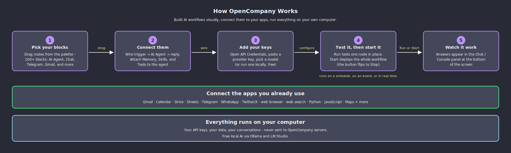
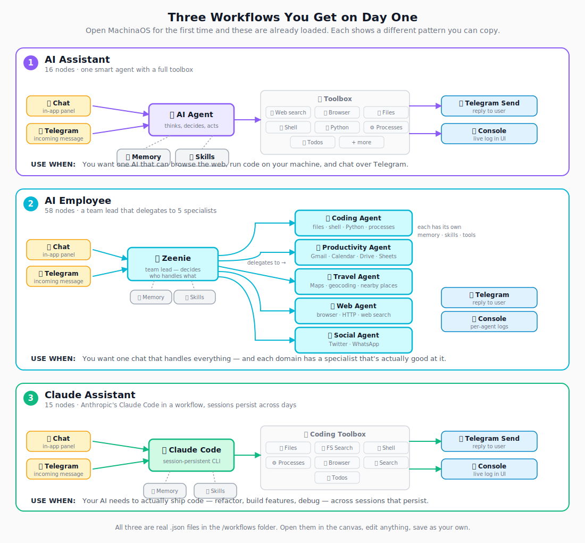

# OpenCompany

<a href="https://www.npmjs.com/package/@zeenie-ai/opencompany" target="_blank"></a>
<a href="https://opensource.org/licenses/MIT" target="_blank"></a>
<a href="https://discord.gg/c9pCJ7d8Ce" target="_blank"></a>
<a href="https://deepwiki.com/zeenie-ai/OpenCompany" target="_blank"></a>

Your own AI assistant that does real work. Drag, drop, and connect AI agents to your email, calendar, messages, phone, and 50+ other services. Runs on your own machine — your data stays with you.

No code required. No subscription. No usage limits. Bring your own API keys (or run models locally with Ollama / LM Studio for free).

**[Read the docs →](https://docs.zeenie.xyz)**

## Quick Start

**Prerequisites:** Node.js 22+, Python 3.12+

```bash
npm install -g @zeenie-ai/opencompany
company start
```

Or use the one-command installers, which set up Node and Python for you:

```bash
# macOS / Linux / WSL
curl -fsSL https://raw.githubusercontent.com/zeenie-ai/OpenCompany/main/install.sh | bash
```

```powershell
# Windows (PowerShell)
iwr -useb https://raw.githubusercontent.com/zeenie-ai/OpenCompany/main/install.ps1 | iex
```

The canonical npm package is `@zeenie-ai/opencompany`. The unscoped
`opencompany` package is unrelated to this project and is neither installed nor
removed by OpenCompany's tooling.

Open http://localhost:3000 and click **Credentials** to connect your first AI provider.

Upgrading from MachinaOS? Existing `~/.machina` and checkout-local `.machina`
state is detected when the new `.opencompany` location does not yet exist, so
databases and deployment state are not stranded. The `machina` command remains
available as a deprecated legacy alias; new scripts should use `company`.

<details>
<summary><b>Run from source (for contributors)</b></summary>

```bash
npm install -g pnpm
git clone https://github.com/zeenie-ai/OpenCompany.git OpenCompany
cd OpenCompany
pnpm run build
pnpm run dev
```

The `dev` task starts the Python backend, Vite client, WhatsApp service, and Temporal in parallel. See [SETUP.md](docs-internal/SETUP.md) and [SCRIPTS.md](docs-internal/SCRIPTS.md) for details, and [CONTRIBUTING.md](CONTRIBUTING.md) for the codebase map and contribution recipes.

</details>

## Quick Hello World Setup for OpenCompany ↓
https://github.com/user-attachments/assets/a5a5583f-bb5f-4d27-a387-8522c556e89e


## AI Building Itself For Complex Tasks, See It In Action ↓.
https://github.com/user-attachments/assets/035a2293-0837-4969-8b9d-8d680e023b89


## Multiple Specialized Loop Agents Orchestration ↓

https://github.com/user-attachments/assets/5798fe61-8d26-4d3a-90aa-189bf4eec79f

## How It Works

[](https://raw.githubusercontent.com/zeenie-ai/OpenCompany/main/docs/diagrams/how-it-works.svg)

Pick nodes from the palette, drag them onto a canvas, connect them with lines, give your AI agent some memory and skills, and hit Play. Or **deploy** the workflow so it runs forever in the background — waiting for emails, responding to messages, checking in on a schedule, doing the work you'd rather not.

## Three Example Workflows For Reference.

[](https://raw.githubusercontent.com/zeenie-ai/OpenCompany/main/docs/diagrams/default-workflows.svg)

The first time you open OpenCompany, three example workflows load automatically. Open them on the canvas to see exactly how the pieces fit together, then edit any node and save your own version.

## What You Can Build

### Personal AI assistants that remember
Build a chat assistant that knows your calendar, reads your inbox, and follows up on tasks. Conversations are saved as readable markdown so you can edit what your agent remembers. Long-term memory uses vector search so years of conversation stay accessible.

### Agent teams that delegate
Hire an **AI Employee** as a team lead. Connect specialized agents — a Coding Agent, a Web Agent, a Productivity Agent — and the team lead automatically figures out who to delegate which subtask to. Each agent has its own memory, tools, and skills.

### Task automations that run themselves
Schedule recurring jobs ("every weekday at 9 AM, summarize my unread emails"), respond to incoming events ("when a customer texts on WhatsApp, draft a reply"), or build complex multi-step pipelines that run in the background. Workflows run reliably even if your computer restarts.

### Email, calendar, and document workflows
- Send and search Gmail, schedule and update Calendar events
- Upload to Drive, edit Sheets, manage Tasks and Contacts
- Read inbox via IMAP from Gmail, Outlook, Yahoo, iCloud, ProtonMail, Fastmail, or any custom server
- Parse PDFs and documents into searchable knowledge bases

### Messaging across every platform
Send and receive on **WhatsApp** (with newsletter channels, groups, contacts), **Telegram** (with bot owner detection), **Twitter/X** (post, reply, search, look up users), and a unified social node that abstracts over Discord, Slack, Signal, SMS, Matrix, Teams, and more.

### Phone control from a workflow
Pair your Android phone via QR code and control it from any agent: read battery + network status, launch apps, toggle WiFi / Bluetooth / airplane mode, take photos, read environmental sensors, manage media playback. 16 device services available.

### Web automation & research
- **Interactive browser** with accessibility-tree navigation (click, type, screenshot) — your agent can use websites the way you do
- **Web scraping** with Crawlee (static + JavaScript-rendered pages) and Apify actors (Instagram, TikTok, LinkedIn, Facebook, YouTube, Google Search)
- **Search APIs**: DuckDuckGo (free), Brave, Serper (Google), Perplexity (AI answers with citations)
- **Residential proxies** with geo-targeting and automatic provider rotation

### Code execution that's actually safe
Run Python, JavaScript, and TypeScript code from any workflow. Each workflow gets its own isolated workspace folder — no chance of an agent touching files outside its sandbox. The **Process Manager** node owns long-running tasks like dev servers, builds, and watchers, with live output streaming to a Terminal tab in the UI.

### Pay bills, take payments
**Stripe** integration with action node (charge customers, manage subscriptions) and webhook receiver (react to payment events in real time). Same pattern works for any service with a CLI.

### Build your own knowledge base
RAG pipeline out of the box: parse PDFs and HTML, chunk into searchable pieces, embed locally or via OpenAI, store in ChromaDB / Qdrant / Pinecone, and query from any agent.

## AI Capabilities

### 12 providers (11 dedicated model nodes, plus xAI through the OpenAI-compatible path) — bring your own keys or run locally

| Provider     | Notes                                                                    |
|--------------|--------------------------------------------------------------------------|
| OpenAI       | GPT-5 family, GPT-4.1, o-series reasoning models, GPT-4o                 |
| Anthropic    | Claude Fable 5, Opus 4.x, Sonnet 4.6, Haiku 4.5 — with extended thinking |
| Google       | Gemini 3 Pro/Flash, 2.5 Pro/Flash — with reasoning budgets               |
| DeepSeek     | DeepSeek V4 (Flash/Pro); chat/reasoner legacy aliases                    |
| Kimi         | Kimi K2.6, K2.5, K2.7-Code                                               |
| Mistral      | Mistral Large/Medium/Small, Codestral                                   |
| Groq         | Llama 3.x, Qwen3, GPT-OSS (ultra-fast inference)                         |
| Cerebras     | GPT-OSS-120b, Qwen-3-235b, GLM-4.7 (custom AI hardware)                  |
| OpenRouter   | 200+ models via one unified API                                          |
| **Ollama**   | Run any local model on your machine — free, private, offline             |
| **LM Studio**| Run any local model with a desktop app — free, private, offline          |

Local providers (Ollama, LM Studio) are first-class — context length, vision support, and tool-use capability are detected automatically from your running server. No paid API needed.

### 16 specialized agent types

Pick the right agent for the job:

| Agent              | Specialized for                                                          |
|--------------------|--------------------------------------------------------------------------|
| **AI Employee** / **Orchestrator** | Team leads that coordinate other agents             |
| Android Agent      | Phone control                                                            |
| Web Agent          | Browser automation, scraping, search                                     |
| Coding Agent       | Writing and running code (Python / JS / TS)                              |
| Productivity Agent | Gmail, Calendar, Drive, Sheets, Tasks, Contacts                          |
| Social Agent       | WhatsApp, Telegram, Twitter messaging                                    |
| Task Agent         | Scheduling, reminders, cron jobs                                         |
| Travel Agent       | Maps, location lookup, planning                                          |
| Payments Agent     | Stripe + financial workflows                                             |
| Consumer Agent     | Customer support, order management                                       |
| Claude Code Agent  | Anthropic's Claude Code CLI for advanced coding sessions                 |
| Codex Agent        | OpenAI Codex CLI integration                                             |
| RLM Agent          | Recursive Language Model — write code that calls itself recursively      |
| Autonomous Agent   | Code-mode loops that reduce token usage 80-98%                           |
| Tool Agent         | General-purpose tool orchestration                                       |

Team leads automatically expose every connected agent as a `delegate_to_*` tool — the AI decides who to hand work off to based on the task.

### Skills you can edit yourself

Skills are short markdown files that teach an agent how to do something well — when to use which tool, what arguments to pass, common mistakes to avoid. Edit them in the UI; the changes apply immediately. Built-in skills cover Android control, Google Workspace, social messaging, web research, coding, terminal use (Bash, PowerShell, WSL, Nushell), and more.

### Memory that scales with your context window

Agents track token usage and automatically compact long conversations as you approach your model's context limit (80% by default, configurable). Compaction summarizes in five sections — Task Overview, Current State, Important Discoveries, Next Steps, Context to Preserve — so the agent picks up exactly where it left off. For Anthropic and OpenAI, native API compaction is used; everywhere else, the agent summarizes itself.

### Cost tracking, built in

Every LLM call and API request is tracked with USD cost. See per-provider spend in the Credentials panel. Configure your own pricing in `pricing.json` if you switch providers mid-flight.

## The Canvas

- **12 visual themes** — light, dark, Renaissance, Greek, Edo, Steampunk, Atomic, Cyber, Wasteland, Rot, Plague, Surveillance — each with its own icon set, sound pack, and decorative ornaments. Pick the vibe that matches your workflow.
- **Drag-to-map outputs** from one node's output directly onto another's input fields.
- **Live execution animations** — nodes glow while running, show iteration count for AI agents, and surface errors inline.
- **Multi-tab Console** — chat with trigger nodes, watch console logs, and view terminal output side by side.
- **Component palette** with search, categories, and a Normal/Dev mode toggle that hides advanced nodes when you don't need them.
- **5-step onboarding wizard** for first-time users, replayable any time from Settings.

## Quick Setup Tour

1. **Install** with `npm install -g @zeenie-ai/opencompany` (or run from source)
2. **Start** with `company start` — opens at http://localhost:3000
3. **Connect a provider** — click the **Credentials** button, paste an API key or click through OAuth
4. **Drag a node** from the left palette onto the canvas
5. **Connect** outputs to inputs by dragging between handles
6. **Run** by clicking the play button on any node, or **Deploy** the whole workflow to run on its own forever

If anything goes wrong, the [Discord](https://discord.gg/c9pCJ7d8Ce) community is the fastest way to get help.

## For Developers

Want to add a node, LLM provider, skill, or integration? One Python file = one node. The backend owns all the schemas; the frontend renders from them automatically. No frontend code required for most extensions.

- **[CONTRIBUTING.md](CONTRIBUTING.md)** — codebase map, architecture diagrams, contribution recipes
- **[server/nodes/README.md](server/nodes/README.md)** — 5-minute plugin recipe + folder map
- **[docs-internal/](docs-internal/)** — deep-dive architecture docs (execution engine, Temporal, LLM layer, credentials, event system, performance, build pipeline)
- **[CLAUDE.md](CLAUDE.md)** — comprehensive project memory (great for AI-assisted contributions)
- **Hosted docs:** https://docs.zeenie.xyz/
- **DeepWiki:** https://deepwiki.com/zeenie-ai/OpenCompany

## Community

[Discord](https://discord.gg/c9pCJ7d8Ce) — help, feature requests, and design discussions.

## License

MIT
