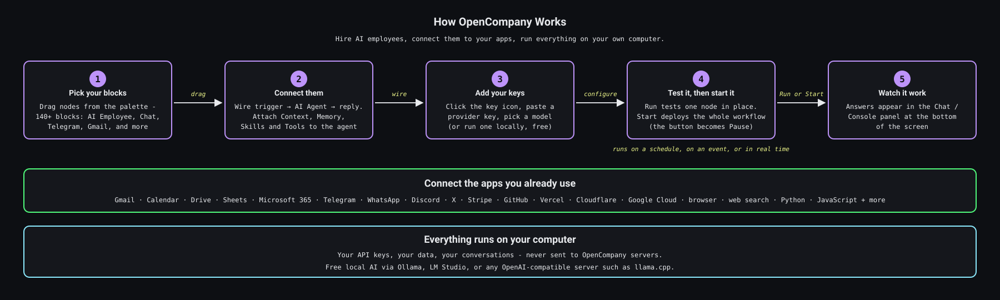
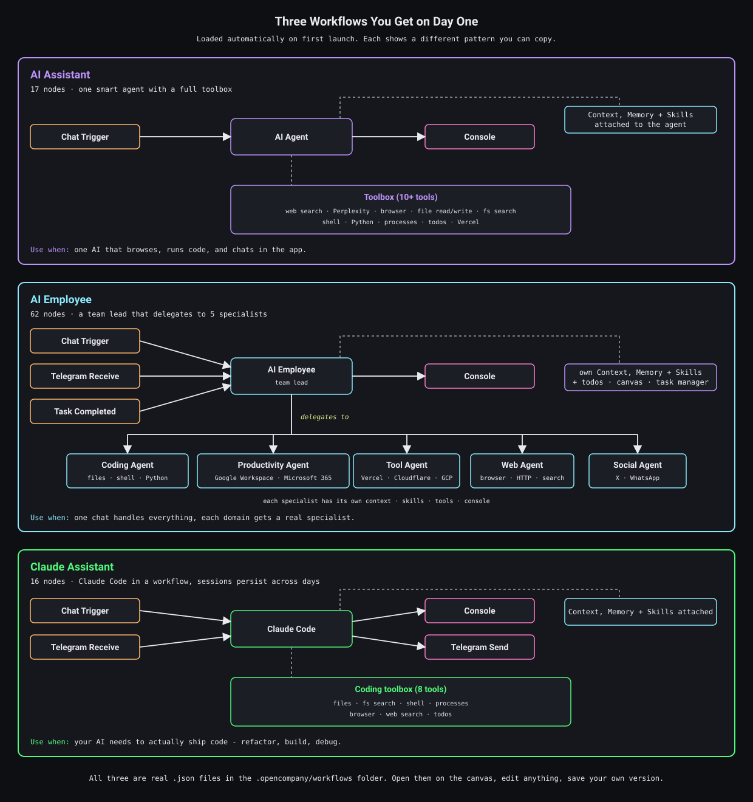

# OpenCompany

<a href="https://www.npmjs.com/package/@zeenie-ai/opencompany" target="_blank"></a>
<a href="https://opensource.org/licenses/MIT" target="_blank"></a>
<a href="https://discord.gg/c9pCJ7d8Ce" target="_blank"></a>
<a href="https://deepwiki.com/zeenie-ai/OpenCompany" target="_blank"></a>

**Self-improving AI employees, running on your own computer.**

OpenCompany is an open-source operating system for AI employees. You hire an employee for a job, a Builder, a Grower, a Chief of Staff, connect it to your email, calendar, messages, code, and the rest of your tools, and press Start. It works in the background, on your machine, for as long as you want. And it gets better at the job the longer it works.

An AI employee is not one chatbot. It is a small team: a lead who understands the job, and a few specialist agents who each do one part of it well. The lead hands out the work, checks the results, and reports back to you. You build the team by dragging the pieces onto a canvas and connecting them. No code.

Bring your own API keys, or run models locally for free. No subscription. No usage limits.

**[Read the docs →](https://docs.opencompany.sh)**

## Quick Start

Download the app for your computer and install it (these links always point at the [latest release](https://github.com/zeenie-ai/OpenCompany/releases/latest)):

- **Windows**: [OpenCompany-windows-x64.exe](https://github.com/zeenie-ai/OpenCompany/releases/latest/download/OpenCompany-windows-x64.exe)
- **macOS, Apple Silicon**: [OpenCompany-macos-arm64.dmg](https://github.com/zeenie-ai/OpenCompany/releases/latest/download/OpenCompany-macos-arm64.dmg)
- **macOS, Intel**: [OpenCompany-macos-x64.dmg](https://github.com/zeenie-ai/OpenCompany/releases/latest/download/OpenCompany-macos-x64.dmg)
- **Linux**: [OpenCompany-linux-x86_64.AppImage](https://github.com/zeenie-ai/OpenCompany/releases/latest/download/OpenCompany-linux-x86_64.AppImage), or [OpenCompany-linux-amd64.deb](https://github.com/zeenie-ai/OpenCompany/releases/latest/download/OpenCompany-linux-amd64.deb) on Debian and Ubuntu

Nothing else to install. On first launch the app sets itself up (a one-time download, a minute or two) and opens Home. Describe a job to hire your first employee; if no AI provider is connected yet, Home asks you to connect one, or you can add it yourself in Settings > Connectors. Switch to Dev mode for the workflow editor, where three example employees are already on the canvas; open one to see how it is put together.

The builds are not code-signed yet, so macOS asks you to allow the app under System Settings > Privacy & Security, and Windows SmartScreen needs "More info > Run anyway".

<details>
<summary><b>Terminal install (servers and headless machines)</b></summary>

```bash
curl -fsSL https://opencompany.sh/install.sh | bash    # macOS / Linux
iwr -useb https://opencompany.sh/install.ps1 | iex      # Windows PowerShell
company start
```

The script installs bun, Python and uv when they are missing, then the `@zeenie-ai/opencompany` package. Open http://localhost:5678. Data lives in `~/.opencompany`, shared with the desktop app. See [SETUP.md](docs-internal/SETUP.md).

</details>

<details>
<summary><b>Docker (self-hosting)</b></summary>

```bash
git clone https://github.com/zeenie-ai/OpenCompany.git
cd OpenCompany
docker compose up -d --build
```

Builds the image from source and starts one container, with all data in the `opencompany-selfhost_data` volume. Open http://localhost:5678 and register the owner account. The port is published on this machine only. See [docker.md](docs-internal/docker.md).

</details>

<details>
<summary><b>Run from source (contributors)</b></summary>

```bash
git clone https://github.com/zeenie-ai/OpenCompany.git
cd OpenCompany
bun run build
bun run dev
```

Needs bun 1.4+ and Python 3.12. See [SETUP.md](docs-internal/SETUP.md), [SCRIPTS.md](docs-internal/SCRIPTS.md) and [CONTRIBUTING.md](CONTRIBUTING.md).

</details>

## See it in action

**Hiring your first employee, end to end ↓**

https://github.com/user-attachments/assets/a5a5583f-bb5f-4d27-a387-8522c556e89e

**An employee adding the tools it needs, mid-task ↓**

https://github.com/user-attachments/assets/035a2293-0837-4969-8b9d-8d680e023b89

**A lead running its team ↓**

https://github.com/user-attachments/assets/3d25e9a3-f7b9-4760-8b9a-6de1e5a19cad

## How It Works

[](https://raw.githubusercontent.com/zeenie-ai/OpenCompany/main/docs/diagrams/how-it-works.svg)

1. **Hire.** Describe the job in plain words on the Home screen, or start from a ready-made bundle in Settings > Plugins. OpenCompany drafts the new employee's setup (the apps it uses, when it works, what it checks with you first); adjust it and press Hire. Or switch to Dev mode and drop an AI Employee onto the canvas.
2. **Build the team.** In Dev mode, connect a few specialist agents to it and give each one the tools for its part of the job: email, browser, code, messaging, payments, and so on.
3. **Start.** The team runs in the background and wakes up when something happens: a new email, a customer message, a scheduled time. If you ask it to, it shows you each reply to approve before it goes out.
4. **Review.** Watch it work from its card on Home or on the canvas, open its Workspace to see the things it has made, read what it remembers, and change how it does things by editing its skills in plain text.

[](https://raw.githubusercontent.com/zeenie-ai/OpenCompany/main/docs/diagrams/default-workflows.svg)

## The Employees

Each of these is a team you can assemble from the pieces in the box. Rename them, swap the specialists, or invent your own.

**Builder** — builds and ships things.
Writes and runs code, keeps dev servers alive, opens pull requests, deploys, and manages your cloud. The team: a lead, a coder, and a release specialist with GitHub, Vercel, Cloudflare, and Google Cloud.

**Grower** — grows the company.
Publishes to your channels, keeps your community alive, and watches the market. The team: a lead, a publisher for X, WhatsApp channels, Telegram, and Discord, and an analyst with social-media data and web search. Runs on a schedule so the cadence holds without you.

**Chief of Staff** — runs your day.
Reads and answers mail, keeps the calendar, files, sheets, tasks, and contacts in order, and hands you a summary each morning. The team: a lead and workspace specialists for Google Workspace and Microsoft 365. Wakes on every new email.

**Front Desk** — answers customers.
Replies on WhatsApp, WhatsApp Business, Telegram, and Discord, in the customer's language and in voice if you like, and escalates what it cannot resolve. The team: a lead, a support specialist, and a language specialist.

**Researcher** — finds things out.
Browses, searches, scrapes, reads documents and images, and files what it learned into a knowledge base the whole company can ask. The team: a lead, a scout with a browser and search, and a librarian who indexes.

**Treasurer** — handles payments.
Runs payment operations through Stripe and reacts the moment a payment event happens. The team: a lead and a payments specialist.

## How They Get Better

- **They remember.** An employee keeps facts, preferences, and decisions in a memory you can open and edit.
- **They pick up where they left off.** Every new message, task, or scheduled run continues the same conversation instead of starting from zero. When the conversation gets long, the employee writes itself a summary and carries on from it.
- **They add tools when they need them.** Mid-task, an employee can look at its own team, add a tool, attach a skill, or bring in another specialist, and the change stays.
- **They check their own work.** The lead reviews every result from the team and sends it back if it is not right, before it ever reaches you.
- **You coach them.** Skills are short plain-text playbooks. Edit one and the employee follows it on its next turn. Settings > Skills keeps your library of them, and every new hire starts with the ones you have switched on.

Nothing here is a black box. What an employee learns lives in its memory, its notes, its skills, and the pieces on its canvas, and you can read or change all of it. OpenCompany never retrains a model.

## What Is in the Box

- **Connections** to Gmail, Google Calendar, Drive, Sheets, Tasks, Contacts, Microsoft 365, any email account, WhatsApp, WhatsApp Business, Telegram, Discord, X, Stripe, GitHub, Vercel, Cloudflare, Google Cloud, your Android phone, a browser, web search, scrapers, and a knowledge base: 140+ tools in all.
- **Models** from OpenAI, Anthropic, Google, xAI, DeepSeek, Kimi, Mistral, Groq, Cerebras, Sarvam, and OpenRouter, or run local models for free with Ollama, LM Studio, or any OpenAI-compatible server such as llama.cpp or vLLM.
- **Speech and translation**, so employees can listen, talk, and work in other languages.
- **78 skills** that ship ready to use, and a place to drop your own.
- **Built to keep running.** Employees survive restarts, pause and resume from Home or the canvas, and catch up on missed schedules. Your API keys are stored encrypted on your machine. Add a login for shared or cloud use; one command deploys to Google Cloud.
- **A canvas you will want to look at**, with 12 visual themes.

## For Developers

Adding a tool, a model provider, a skill, or an integration is one plugin folder on the backend; the interface renders it automatically.

- **[CONTRIBUTING.md](CONTRIBUTING.md)** — codebase map, architecture diagrams, contribution recipes
- **[server/nodes/README.md](server/nodes/README.md)** — 5-minute plugin recipe
- **[docs-internal/](docs-internal/)** — architecture deep dives
- **[CLAUDE.md](CLAUDE.md)** — project memory for AI-assisted contributions
- **Hosted docs:** https://docs.opencompany.sh/
- **DeepWiki:** https://deepwiki.com/zeenie-ai/OpenCompany

## Contributing

Issues and pull requests are welcome. [CONTRIBUTING.md](CONTRIBUTING.md) has the fork/branch/PR workflow, the repository map, and recipes for adding a node, LLM provider, or skill.

One note on scope: connector and provider lists are kept deliberately narrow. The Apify node runs any actor through its `custom` option, the TikHub node calls any of its endpoints through `call`, and agents reach any OpenAI-compatible server once it is saved as a named endpoint under Credentials — so a new first-class preset needs a reason beyond "my service could be in the dropdown too."

## Community

[Discord](https://discord.gg/c9pCJ7d8Ce) — the fastest way to get help, request features, and follow design discussions.

## License

[MIT](LICENSE) — © 2026 OpenCompany contributors.
