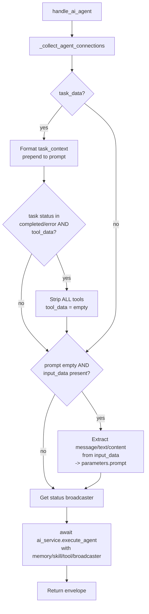

# AI Agent (`aiAgent`)

| Field | Value |
|------|-------|
| **Category** | ai_agents / agent |
| **Backend handler** | [`server/services/handlers/ai.py::handle_ai_agent`](../../../server/services/handlers/ai.py) |
| **Tests** | [`server/tests/nodes/test_ai_agents.py`](../../../server/tests/nodes/test_ai_agents.py) |
| **Skill (if any)** | n/a (the agent consumes skills via `input-skill`) |
| **Dual-purpose tool** | no |

## Purpose

`aiAgent` is the general-purpose tool-calling agent node. It reads a prompt
and system message, optionally merges conversation history from a connected
`simpleMemory`, loads instructions from connected skill nodes, binds tool nodes
via `chat_model.bind_tools`, and runs the tool-calling loop until the LLM produces a
final answer. All of the heavy lifting (LLM invocation, tool execution, memory
persistence) lives in `AIService.execute_agent`; the handler's job is purely
to gather the connected-node payloads via `_collect_agent_connections` and
forward them.

## Inputs (handles)

| Handle | Connection type | Required | Purpose |
|--------|-----------------|----------|---------|
| `input-main` | main | no | Upstream data. Used as auto-prompt when `prompt` is empty. |
| `input-skill` | main | no | Skill nodes (`masterSkill` is expanded into individual skills). |
| `input-memory` | main | no | A `simpleMemory` node whose `memoryContent` is parsed into LangChain messages. |
| `input-tools` | main | no | Tool nodes (search, calculator, HTTP, Android toolkit, child agents, etc.). |
| `input-task` | main | no | `taskTrigger` output - completed delegated-task payload. |

## Parameters

| Name | Type | Default | Required | displayOptions.show | Description |
|------|------|---------|----------|---------------------|-------------|
| `provider` | options | `openai` | no | - | AI provider (openai, anthropic, gemini, groq, cerebras, openrouter, deepseek, kimi, mistral, xai). |
| `model` | string | `""` | **yes** | - | Model id; loaded dynamically from the provider. |
| `prompt` | string | `{{ $json.chatInput }}` | **yes** | - | User prompt; may reference upstream node outputs via templates. |
| `systemMessage` | string | `You are a helpful assistant` | no | - | System prompt prepended to the conversation. |
| `options.temperature` | number | `0.7` | no | - | 0-2. |
| `options.maxTokens` | number | `4096` | no | - | 1-200000; clamped to model context in `AIService._resolve_max_tokens`. |
| `options.thinkingEnabled` | boolean | `false` | no | - | Enables extended thinking / reasoning. |
| `options.thinkingBudget` | number | `2048` | no | `thinkingEnabled=true` | Token budget (Claude, Gemini, Cerebras). |
| `options.reasoningEffort` | options | `medium` | no | `thinkingEnabled=true` | `low` / `medium` / `high` (OpenAI o-series, Groq). |

## Outputs (handles)

| Handle | Shape | Description |
|--------|-------|-------------|
| `output-main` | object | Envelope from `AIService.execute_agent`. |

### Output payload (shape returned by `execute_agent`)

```ts
{
  response: string;
  thinking?: string;       // when thinkingEnabled=true and provider supports it
  model: string;
  provider: string;
  finish_reason?: string;
  timestamp: string;
}
```

Wrapped in the standard envelope: `{ success: true, result: <payload>, execution_time: number }`.

## Logic Flow



## Decision Logic

- **`_collect_agent_connections`** scans `context.edges` for edges whose target
  is this node, then routes each by `targetHandle`:
  - `input-memory` + source type `simpleMemory` -> build `memory_data` dict.
    `session_id` is auto-set to the agent's `node_id` unless the memory node
    explicitly sets `sessionId` to a non-empty, non-`default` value.
  - `input-skill` -> append to `skill_data`. `masterSkill` is expanded into
    one entry per **enabled** skill in `skillsConfig`; instructions come from
    the DB-stored `instructions` first, with a skill-folder fallback.
  - `input-tools` -> append to `tool_data`. Two special expansions:
    - `androidTool` -> scans its own incoming edges for Android service nodes
      and attaches them under `connected_services`.
    - Any `AI_AGENT_TYPES` source (child agents) -> attaches `child_tools`
      describing the child's own `input-tools` neighbours.
  - `input-main` (or `input-chat`, or `None`) -> reads `context.outputs`
    for the source node and stores as `input_data`.
  - `input-task` -> reads `context.outputs` first, falling back to
    `context.get_output_fn(session_id, source_id, 'output_0')`. Unwraps
    `{ result: {...} }` when nested.
- **Task completion short-circuit**: if `task_data` exists, `_format_task_context`
  produces a plain-English wrapper which is prepended to the prompt. If the
  task status is `completed` or `error` and any tools are present, **all tools
  are stripped** to prevent the LLM from delegating again.
- **Auto-prompt fallback**: if `parameters.prompt` is empty after the task
  block, the handler extracts `input_data.message`, `input_data.text`, or
  `input_data.content` (first truthy wins) and assigns it to `prompt`. If the
  input is not a dict the whole value is stringified.
- **Delegation to AIService**: the handler always returns whatever
  `ai_service.execute_agent` returns; success/error envelope shape is
  owned by the service, not the handler.

## Side Effects

- **Database writes**: none directly in the handler. `AIService.execute_agent`
  writes `token_usage_metrics` rows (via `CompactionService.track`), and
  `memory_content` markdown changes persist back through the
  `simpleMemory` node's `save_node_parameters` path owned by the service.
- **Broadcasts**: `handle_ai_agent` acquires `StatusBroadcaster` and passes
  it into `execute_agent`. The service then emits `update_node_status`
  (`thinking`, `executing_tool`, `success`, ...) plus `token_usage_update`
  and potentially `compaction_starting` / `compaction_completed` events.
- **External API calls**: delegated to the native LLM provider SDKs (Anthropic,
  OpenAI, Gemini, OpenRouter, xAI, DeepSeek, Kimi, Mistral) or the LangChain
  fallback (Groq, Cerebras). Tool nodes may spawn their own HTTP or subprocess
  calls via `execute_tool`.
- **File I/O**: none in the handler. Filesystem tool nodes may read/write the
  per-workflow workspace (`context.workspace_dir`).
- **Subprocess**: none directly. Tool executors (shell, process manager,
  browser, code executors) spawn subprocesses.

## External Dependencies

- **Credentials**: provider API keys via `auth_service.get_api_key(<provider>)`,
  resolved inside `AIService`. Can be overridden by a provider proxy URL
  (`<provider>_proxy` API key) for Ollama-style local routing.
- **Services**: `AIService`, `Database`, `StatusBroadcaster`, `CompactionService`,
  `PricingService`, `SkillLoader` (for `masterSkill` expansion).
- **Python packages**: `langchain-core`, `langchain-openai`,
  `langchain-anthropic`, provider SDKs (`anthropic`, `openai`, `google-genai`).
- **Environment variables**: none read directly by the handler.

## Edge cases & known limits

- **Memory session auto-derivation**: two agents sharing the same `simpleMemory`
  will each get a **different** session (each uses its own `node_id`) unless
  the memory node's `sessionId` is set to a non-empty, non-`default` value.
- **`masterSkill` expansion swallows missing skills**: if a skill key has no
  `instructions` in DB and the skill loader raises, the skill entry is still
  appended with an empty instruction body (logged as a warning, not an error).
- **Task-completion tool strip is unconditional**: even unrelated tools (e.g.
  `writeTodos`) are removed when any task completes. This was introduced as a
  "CRITICAL FIX" because binding tools while instructing the LLM not to use
  them confused Gemini into returning empty tool call arrays.
- **No pre-flight token budget check**: `_collect_agent_connections` can
  produce an arbitrarily long prompt (task context + memory + skills). The
  handler does **not** trim before calling `execute_agent`; the provider may
  reject with `prompt_too_long`. See `docs-internal/memory_compaction.md`.
- **Input fallback is field-ordered**: `message > text > content > str(dict)`.
  An upstream node that outputs both `message` and `text` will never reach
  `text`.
- **Child-agent tool discovery is one level deep**: grandchildren are not
  traversed.

## Related

- **Shared collection helper**: `_collect_agent_connections` is used by every
  specialized-agent type (android_agent, coding_agent, web_agent, ...). See
  [`chatAgent.md`](./chatAgent.md) for the same contract with a different
  system prompt.
- **Memory node**: [`simpleMemory.md`](./simpleMemory.md)
- **Architecture docs**: [Agent Architecture](../../agent_architecture.md),
  [Agent Delegation](../../agent_delegation.md),
  [Native LLM SDK](../../native_llm_sdk.md),
  [Memory Compaction](../../memory_compaction.md)
