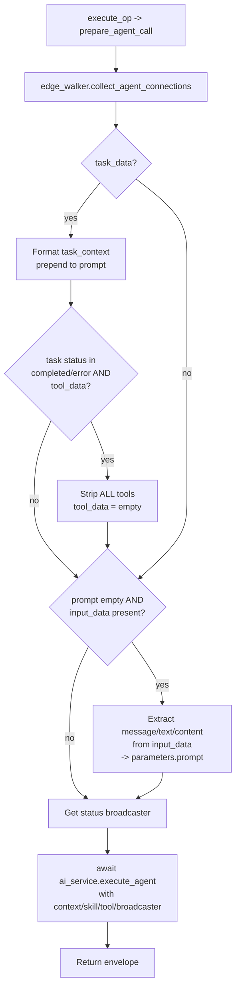

# AI Agent (`aiAgent`)

| Field | Value |
|------|-------|
| **Category** | ai_agents / agent |
| **Backend execution** | Temporal graph runs normally use [`AgentWorkflow`](../../../server/services/temporal/agent_workflow.py), with preparation in [`agent_activities.py`](../../../server/services/temporal/agent_activities.py). The node/Activity path uses [`AIAgentNode.execute_op`](../../../server/nodes/agent/ai_agent/__init__.py), [`prepare_agent_call`](../../../server/nodes/agent/_inline.py), and `AIService.execute_agent`. |
| **Tests** | [`server/tests/nodes/test_ai_agents.py`](../../../server/tests/nodes/test_ai_agents.py) |
| **Skill (if any)** | n/a (the agent consumes skills via `input-skill`) |
| **Dual-purpose tool** | no |

## Purpose

`aiAgent` is the general-purpose tool-calling agent node. It reads a prompt
and system message, continues its stored conversation when a Context node is
connected on `input-context` (RFC-0002), loads instructions from connected
skill nodes, binds tool nodes as provider-neutral `AgentToolSpec` values, and
runs until the LLM produces a final answer. The node/Activity path gathers
connected payloads through `edge_walker.collect_agent_connections` (context,
skill, tool, input, task) and calls `AIService.execute_agent` with
`run_native_agent_loop`. The default Temporal graph path uses the same native
provider boundary through durable `AgentWorkflow` scheduling: preparation,
each LLM step, and each ordinary tool call are regular Activities.

## Temporal execution and Stop/Resume

Routing is frozen in the graph run's input. `aiAgent` takes the child-Workflow
path when `TEMPORAL_AGENT_WORKFLOW_ENABLED` was captured as true; otherwise it
runs inside the ordinary node Activity. For new controlled generations with
`execution_control_version=1`, the child Workflow closes admission before each
model request, tool, refresh, compaction, and child start. Stop lets admitted
work and its result bookkeeping finish, including parallel admitted work.
Pending calls from a recorded model response remain in the live continuation.
Resume starts the next pending action with the same execution scope rather
than repeating the response or completed tools.

Attached agents are discovered through their parent's native child tree;
detached Task Manager runners enroll independently with the generation
controller. Version 1 continuation carries prepared configuration, resolved
tools and plugin Activity policies, transcript, thinking, usage, iteration,
execution identity, and control state. It restores this state at a clean turn
boundary and reports `AgentContinuationTooLarge` if the complete encoded input
cannot fit. It never falls back to the opening prompt. Existing generations
retain legacy paths and do not acquire this stronger acknowledgement contract.

Unlimited LLM retries can keep Stop in `pausing` during an outage. Tool effects
before recorded completion remain subject to retry/idempotency rules; a
heartbeat status string cannot checkpoint an opaque request. If child-Workflow
routing is disabled, the entire node Activity is the cooperative boundary.
See [Temporal workflow control](../../temporal-workflow-control.md) and
[Agent continuation](../../TEMPORAL_ARCHITECTURE.md#agent-continuation-under-history-pressure).

## Inputs (handles)

| Handle | Connection type | Required | Purpose |
|--------|-----------------|----------|---------|
| `input-main` | main | no | Upstream data. Used as auto-prompt when `prompt` is empty. |
| `input-skill` | main | no | Skill nodes (`masterSkill` is expanded into individual skills). |
| `input-context` | main | no | A Context node. The agent loads its stored conversation at run start and saves it after every turn, only in a started workflow. Legacy `simpleMemory` -> `input-memory` edges are rewritten on load into a Context node plus a Memory tool edge. |
| `input-tools` | main | no | Tool nodes (search, calculator, HTTP, Android service nodes, the Memory tool, child agents, etc.). |
| `input-task` | main | no | `taskTrigger` output - completed delegated-task payload. |

## Parameters

Source: `AIAgentParams` in [`ai_agent/__init__.py`](../../../server/nodes/agent/ai_agent/__init__.py).

| Name | Type | Default | Required | Group | Description |
|------|------|---------|----------|-------|-------------|
| `prompt` | string (textarea, rows 4) | `""` | no | - | User prompt; may reference upstream node outputs via templates. Empty -> auto-prompt fallback from `input-main`. |
| `provider` | string (`ProviderRef`) | `openai` | no | - | A provider reference: any registered provider id, or a saved named endpoint `openai_compatible:<slug>`. Options come from the `aiProviders` loader, so a new endpoint appears without a schema change; `nodes/agent/_provider.py` validates the value. |
| `model` | string | `""` | no | - | Model id; loaded dynamically from the provider. |
| `system_message` | string (rows 3) | `You are a helpful assistant` | no | - | System prompt prepended to the conversation. |
| `temperature` | number (optional) | `None` | no | options | 0-2, step 0.1. Unset falls through to `agent.default_temperature` in `llm_defaults.json`. |
| `max_tokens` | int (optional) | `None` | no | options | 1-200000. Unset falls through to the per-model default; clamped in `AIService._resolve_max_tokens`. |

> Note: `api_key` is **not** a declared field — credentials are auto-injected at execution time by `node_executor._inject_api_keys`. The thinking/reasoning controls are resolved by the LLM service layer from provider/model metadata, not exposed as `AIAgentParams` fields.

## Outputs (handles)

| Handle | Shape | Description |
|--------|-------|-------------|
| `output-main` | object | Envelope from `AIService.execute_agent`. |

### Output payload (shape returned by `execute_agent`)

```ts
{
  response: string;
  thinking?: string;       // when thinkingEnabled=true and provider supports it
  model: string;
  provider: string;
  finish_reason?: string;
  timestamp: string;
}
```

Wrapped in the standard envelope: `{ success: true, result: <payload>, execution_time: number }`.

## Logic Flow

This diagram describes the node/Activity entry point. The default Temporal
child-Workflow loop is documented in [Temporal architecture](../../TEMPORAL_ARCHITECTURE.md#agent-as-child-workflow-f4b).


```mermaid
flowchart TD
  A[execute_op -> prepare_agent_call] --> B[edge_walker.collect_agent_connections]
  B --> C{task_data?}
  C -- yes --> D[Format task_context<br/>prepend to prompt]
  D --> E{task status in<br/>completed/error AND<br/>tool_data?}
  E -- yes --> F[Strip ALL tools<br/>tool_data = empty]
  E -- no --> G
  F --> G
  C -- no --> G{prompt empty AND<br/>input_data present?}
  G -- yes --> H[Extract message/text/content<br/>from input_data<br/>-> parameters.prompt]
  G -- no --> I
  H --> I[Get status broadcaster]
  I --> J[await ai_service.execute_agent<br/>with context/skill/tool/broadcaster]
  J --> K[Return envelope]
```

## Decision Logic

- **`edge_walker.collect_agent_connections`** scans `context.edges` for edges whose target
  is this node, then routes each by `targetHandle`:
  - `input-context` -> the agent-context builder registered by the Context
    plugin returns the conversation descriptor (`context_data`). Legacy
    `input-memory` + `simpleMemory` edges in old graphs still yield their
    recorded Memory descriptor.
  - `input-skill` -> append to `skill_data`. `masterSkill` is expanded into
    one entry per **enabled** skill in `skillsConfig`; instructions come from
    the DB-stored `instructions` first, with a skill-folder fallback.
  - `input-tools` -> append to `tool_data`. Two special expansions:
    - Android service nodes are exposed directly as individual tools
      and attaches them under `connected_services`.
    - Any `AI_AGENT_TYPES` source (child agents) -> attaches `child_tools`
      describing the child's own `input-tools` neighbours.
  - `input-main` (or `input-chat`, or `None`) -> reads `context.outputs`
    for the source node and stores as `input_data`.
  - `input-task` -> reads `context.outputs` first, falling back to
    `context.get_output_fn(session_id, source_id, 'output_0')`. Unwraps
    `{ result: {...} }` when nested.
- **Task completion short-circuit**: if `task_data` exists, `_format_task_context`
  produces a plain-English wrapper which is prepended to the prompt. If the
  task status is `completed` or `error` and any tools are present, **all tools
  are stripped** to prevent the LLM from delegating again. (See
  `prepare_agent_call` in `_inline.py`.)
- **Auto-prompt fallback**: if `parameters.prompt` is empty after the task
  block, `prepare_agent_call` extracts `input_data.message`, `input_data.text`,
  or `input_data.content` (first truthy wins) and assigns it to `prompt`. If the
  input is not a dict the whole value is stringified.
- **Team-lead delegation**: for `orchestrator_agent` / `ai_employee`,
  teammates connected via `input-teammates` become Task Manager assignees
  (not applicable to `aiAgent` itself unless it is used as a teammate).
- **Delegation to AIService**: `execute_op` returns `response.get("result")`
  on success; a `success=False` envelope raises `RuntimeError`. Typed openai
  SDK failures surface as `NodeUserError` from inside `execute_agent`.

## Side Effects

- **Database writes**: none directly in `execute_op`. A memory-connected
  in-process `AIService.execute_agent` writes `token_usage_metrics` via
  `CompactionService.track`; Temporal aggregates usage in its result. With a
  Context node connected, the conversation is saved to `agent_conversations`
  after every turn of a started workflow; a manual node Run saves nothing.
- **Broadcasts**: `prepare_agent_call` resolves `StatusBroadcaster` and passes
  it into `execute_agent`. The service then emits `update_node_status`
  (`thinking`, `executing_tool`, `success`, ...) plus `token_usage_update`
  and potentially `compaction_starting` / `compaction_completed` events.
  `BaseNode.execute()` additionally wraps the body in a `node.aiAgent.execute`
  OpenTelemetry span + `log_context(node_id, node_type, workflow_id)`.
- **External API calls**: every registered provider runs through `ChatUnifier`
  and the native provider layer: Anthropic uses `anthropic`, Gemini uses
  `google-genai`, and OpenAI plus the OpenAI-compatible providers (OpenRouter,
  Groq, Cerebras, xAI, DeepSeek, Kimi, Mistral, Sarvam, Ollama, LM Studio and
  named endpoints) use `openai` with the configured or saved endpoint. Tool
  nodes may spawn their own HTTP or subprocess calls via `execute_tool`.
- **File I/O**: none in `execute_op`. Filesystem tool nodes may read/write the
  per-workflow workspace (`context.workspace_dir`).
- **Subprocess**: none directly. Tool executors (shell, process manager,
  browser, code executors) spawn subprocesses.

## External Dependencies

- **Credentials**: provider API keys via `auth_service.get_api_key(<provider>)`,
  resolved inside `AIService`. Can be overridden by a provider proxy URL
  (`<provider>_proxy` API key) for Ollama-style local routing.
- **Services**: `AIService`, `ChatUnifier`, `run_native_agent_loop`,
  `Database`, `StatusBroadcaster`, `CompactionService`, `PricingService`,
  `SkillLoader` (for `masterSkill` expansion).
- **Python packages**: native provider SDKs (`anthropic`, `openai`,
  `google-genai`).
- **Environment variables**: none read directly by `execute_op`.

## Edge cases & known limits

- **One conversation per agent**: the stored conversation is keyed by
  `(workflow_id, generation, agent_node_id)`, so every caller of a started
  workflow continues the same conversation. Reset admits a new generation and
  clears the stored conversations.
- **`masterSkill` expansion swallows missing skills**: if a skill key has no
  `instructions` in DB and the skill loader raises, the skill entry is still
  appended with an empty instruction body (logged as a warning, not an error).
- **Task-completion tool strip is unconditional**: even unrelated tools (e.g.
  `writeTodos`) are removed when any task completes. This was introduced as a
  "CRITICAL FIX" because binding tools while instructing the LLM not to use
  them confused Gemini into returning empty tool call arrays.
- **No pre-flight token budget check**: `collect_agent_connections` can
  produce an arbitrarily long prompt (task context + memory + skills).
  `prepare_agent_call` does **not** trim before calling `execute_agent`; the
  provider may reject with `prompt_too_long`. See
  [`../../memory_compaction.md`](../../memory_compaction.md).
- **Input fallback is field-ordered**: `message > text > content > str(dict)`.
  An upstream node that outputs both `message` and `text` will never reach
  `text`.
- **Child-agent tool discovery is one level deep**: grandchildren are not
  traversed.

## Related

- **Shared collection helper**: `edge_walker.collect_agent_connections` +
  `_inline.prepare_agent_call` are used by every specialized-agent type
  (android_agent, coding_agent, web_agent, ...). See
  [`chatAgent.md`](./chatAgent.md) for the same contract with a different
  system prompt.
- **Context node**: [`context.md`](./context.md); **Memory tool**: [`simpleMemory.md`](./simpleMemory.md)
- **Architecture docs**: [Agent Architecture](../../agent_architecture.md),
  [Agent Delegation](../../agent_delegation.md),
  [Native LLM SDK](../../native_llm_sdk.md),
  [Memory Compaction](../../memory_compaction.md)
