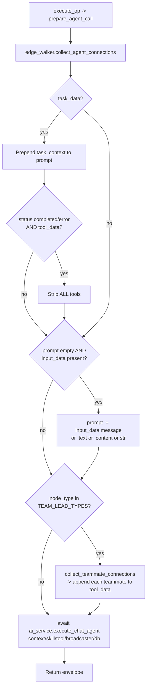

# Zeenie (`chatAgent`)

| Field | Value |
|------|-------|
| **Category** | ai_agents / agent |
| **Backend execution** | Default Temporal graph runs use [`AgentWorkflow`](../../../server/services/temporal/agent_workflow.py) and [`agent_activities.py`](../../../server/services/temporal/agent_activities.py). The node/Activity path uses [`ChatAgentNode.execute_op`](../../../server/nodes/agent/chat_agent/__init__.py), [`prepare_agent_call`](../../../server/nodes/agent/_inline.py), and `AIService.execute_chat_agent`. |
| **Tests** | [`server/tests/nodes/test_ai_agents.py`](../../../server/tests/nodes/test_ai_agents.py) |
| **Skill (if any)** | n/a (consumes skills via `input-skill`) |
| **Dual-purpose tool** | no |

## Purpose

`chatAgent` (display name **Zeenie**) is the conversational variant of
`aiAgent`. Same connection model, same `edge_walker.collect_agent_connections`
helper + `_inline.prepare_agent_call` pre-dispatch, same tool-calling stack -
it differs from `aiAgent` in the frontend icon / default system message and in
the service method it calls (`AIService.execute_chat_agent` instead of
`AIService.execute_agent`). Every **specialized agent** node
(`android_agent`, `coding_agent`, `web_agent`, `task_agent`, `social_agent`,
`travel_agent`, `tool_agent`, `productivity_agent`, `payments_agent`,
`consumer_agent`, `autonomous_agent`, `orchestrator_agent`, `ai_employee`)
takes the **same execution path** — they subclass
[`SpecializedAgentBase`](../../../server/nodes/agent/_specialized.py) whose
`execute_op` also runs `prepare_agent_call` + `execute_chat_agent`. Each is its
own plugin folder; there is no `functools.partial` wiring anymore. In a default
Temporal graph run these supported types route to the same `AgentWorkflow`
child path instead of executing the whole service loop as one node Activity.

## Temporal execution and Stop/Resume

`chatAgent` and supported specialized/team-lead agents use the same version 1
control and continuation contract as [`aiAgent`](aiAgent.md#temporal-execution-and-stopresume).
Stop lets each admitted model/tool Activity finish and retains its response or
tool result; pending actions wait in the existing continuation. Resume releases
those pending actions and preserves chat run/reply identity, partial output,
subscriptions, and lane occupancy. The controlled chat Stop request targets
the exact owning generation using `run_id`, `expected_revision`, and
`idempotency_key`. It does not terminalize that reply or trigger the legacy
grace-period cancellation behavior.

The version 1 agent carries prepared configuration, resolved plugin policies,
and transcript through clean continue-as-new boundaries. Legacy/uncontrolled
chat retains terminal Stop behavior, and a run routed as a whole node Activity
stops at that Activity's boundary. Unlimited LLM retries can delay complete
Stop acknowledgement. See [Chat protocol](../../chat_protocol.md),
[Temporal workflow control](../../temporal-workflow-control.md), and
[Agent context flow](../../agent_context_flow.md#stopped-turns-and-unanswered-calls).

## Inputs (handles)

| Handle | Connection type | Required | Purpose |
|--------|-----------------|----------|---------|
| `input-main` | main | no | Upstream data. Auto-prompt fallback when `prompt` is empty. |
| `input-skill` | main | no | Skill nodes (including `masterSkill` aggregation). |
| `input-context` | main | no | Context node: the stored conversation, loaded at run start and saved after every turn of a started workflow. Legacy `simpleMemory` -> `input-memory` edges are rewritten on load into a Context node plus a Memory tool edge. |
| `input-tools` | main | no | Tool nodes compiled into provider-neutral `AgentToolSpec` / `ToolDef` values for each native LLM step. |
| `input-task` | main | no | `taskTrigger` output - formatted and prepended to the prompt. |
| `input-teammates` | main | no | **Team-lead only** (`orchestrator_agent`, `ai_employee`). Agents on this handle become authorized Task Manager assignees. |

## Parameters

`ChatAgentParams` mirrors [`aiAgent`](./aiAgent.md)'s `AIAgentParams`
(`provider` as the loader-driven `ProviderRef`, `model`, `prompt`,
`system_message`, `temperature` / `max_tokens` in the `options` group).
Differences:

- `prompt` default `""` (empty) — Zeenie relies on the auto-prompt fallback
  when wired to a chat trigger (placeholder: "Optional: leave empty to use
  connected input").
- `system_message` default `""` (vs `aiAgent`'s "You are a helpful assistant")
  — the Zeenie persona is layered on top by connected skills.

## Outputs (handles)

| Handle | Shape | Description |
|--------|-------|-------------|
| `output-main` | object | `{ response, thinking?, model, provider, timestamp, ... }` envelope from `execute_chat_agent`. |

## Logic Flow

This diagram describes the node/Activity entry point; the Temporal child path
uses the [durable agent loop](../../TEMPORAL_ARCHITECTURE.md#agent-as-child-workflow-f4b).

```mermaid
flowchart TD
  A[execute_op -> prepare_agent_call] --> B[edge_walker.collect_agent_connections]
  B --> C{task_data?}
  C -- yes --> D[Prepend task_context to prompt]
  D --> E{status completed/error<br/>AND tool_data?}
  E -- yes --> F[Strip ALL tools]
  E -- no --> G
  F --> G
  C -- no --> G{prompt empty AND<br/>input_data present?}
  G -- yes --> H[prompt := input_data.message<br/>or .text or .content or str]
  G -- no --> I
  H --> I{node_type in<br/>TEAM_LEAD_TYPES?}
  I -- yes --> J[collect_teammate_connections<br/>-> append each teammate to tool_data]
  I -- no --> K
  J --> K[await ai_service.execute_chat_agent<br/>context/skill/tool/broadcaster/db]
  K --> L[Return envelope]
```

## Decision Logic

- **Connection collection** is delegated to
  `edge_walker.collect_agent_connections`; same rules as `aiAgent` (see that doc
  for the Context descriptor, `masterSkill` expansion, Android service tools,
  child-agent tool discovery).
- **Native provider boundary**: current executions use `ChatUnifier` with
  `run_native_llm_step`; the in-process path owns `run_native_agent_loop`,
  while Temporal owns the durable scheduling loop. There is one current wire
  standard. Pre-cutover deployment recovery uses Reset; control version gates
  preserve compatible legacy command paths rather than upgrading them in place.
- **Task context injection** mirrors `aiAgent`: `format_task_context` wraps
  the task result as a plain-English instruction that the LLM must "report
  naturally", then all tools are stripped if the task has already completed
  or errored. (In `_inline.prepare_agent_call`.)
- **Auto-prompt fallback** is identical to `aiAgent` - `message` wins over
  `text` which wins over `content`, falling back to `str(input_data)`.
- **Team mode** (`orchestrator_agent`, `ai_employee`): after collection,
  `prepare_agent_call` calls `collect_teammate_connections(node_id, context,
  database)` to find nodes wired to `input-teammates`. Each teammate is
  appended to `tool_data` as a synthetic entry (with `child_tools` describing
  its own `input-tools` neighbours). The AIService then exposes them to the LLM
  as durable Task Manager assignees (see [Agent Teams](../../agent_teams.md)).

## Side Effects

- **Database writes**: none directly. With a Context node connected, the
  conversation is saved to `agent_conversations` after every turn of a started
  workflow (a manual node Run saves nothing), and in-process execution records
  compaction usage; the Temporal workflow accumulates normalized usage in its
  result envelope. Executions without a connected Context do not persist a
  token metric here.
- **Broadcasts**: `StatusBroadcaster` is fetched and passed down, enabling
  `update_node_status` events (`thinking`, `executing_tool`, `success`), plus
  `token_usage_update` from the compaction tracker.
- **External API calls**: provider LLM SDKs, plus whatever tools the LLM
  decides to call.
- **File I/O / subprocess**: only via tool nodes (filesystem, shell, process
  manager, browser, code executors).

## External Dependencies

- **Credentials**: provider API keys via `auth_service.get_api_key`.
- **Services**: `AIService`, `Database`, `StatusBroadcaster`,
  `CompactionService`, `PricingService`, `SkillLoader`.
- **Python packages**: same as `aiAgent`.
- **Environment variables**: none read directly.

## Edge cases & known limits

- **Specialized agents inherit every quirk**: any bug in `prepare_agent_call`
  or `execute_chat_agent` (e.g. the blanket tool-strip on task completion)
  affects all 13 `SpecializedAgentBase` subclasses (11 domain agents + the 2 team leads).
- **Team-lead teammates are appended after existing tools**: if a parent
  wires both regular tool nodes and teammates, tool order depends on edge
  scan order (not stable across clients).
- **Teammate tool entries carry `parameters`**: the teammate's saved node
  parameters are included so `AIService` can resolve provider/model for
  delegation. An unconfigured teammate (no `model`) will surface the failure
  at delegate-time, not at collection-time.
- **Input fallback field order is identical** to `aiAgent`: `message` >
  `text` > `content` > `str(dict)`.
- **Empty `teammates` on a team-lead is benign** - `prepare_agent_call` simply
  runs without delegation tools, so an `orchestrator_agent` with nothing wired
  to `input-teammates` behaves exactly like `chatAgent`.
- **`rlm_agent`, `claude_code_agent`, `codex_agent` do NOT take this path** -
  they have their own plugin execute methods (RLMService / CLI agent runtime).
  The other 13 specialized agents share `execute_chat_agent`.

## Related

- **Twin node**: [`aiAgent`](./aiAgent.md) (same collection helper,
  different service method).
- **Context node**: [`context`](./context.md); **Memory tool**: [`simpleMemory`](./simpleMemory.md)
- **Architecture docs**: [Agent Architecture](../../agent_architecture.md),
  [Agent Delegation](../../agent_delegation.md),
  [Agent Teams](../../agent_teams.md),
  [Memory Compaction](../../memory_compaction.md)
