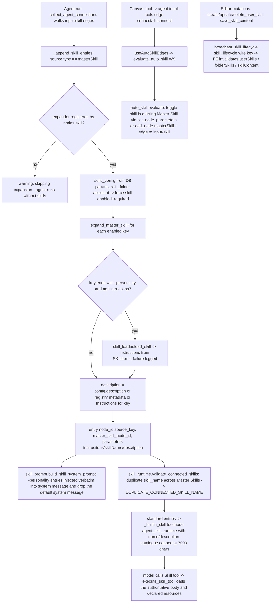

# Master Skill (`masterSkill`)

| Field | Value |
|------|-------|
| **Category** | ai_agents (config aggregator; palette group `tool`, `SKILL_NODE_TYPES` / `CONFIG_NODE_TYPES` in `constants.py`) |
| **Backend handler** | [`server/nodes/skill/master_skill/__init__.py::MasterSkillNode.noop`](../../../server/nodes/skill/master_skill/__init__.py) (passive; the real consumer is [`services/plugin/edge_walker.py::_append_skill_entries`](../../../server/services/plugin/edge_walker.py) -> the expander registered by [`nodes/skill/__init__.py`](../../../server/nodes/skill/__init__.py) from [`nodes/skill/_expander.py::expand_master_skill`](../../../server/nodes/skill/_expander.py)); lifecycle events in [`master_skill/_events.py`](../../../server/nodes/skill/master_skill/_events.py) |
| **WS handlers** | 13 skill handlers in [`services/skills/handlers.py`](../../../server/services/skills/handlers.py) (self-registered via `ws_handler_registry`): `get_skill_content`, `save_skill_content`, `scan_skill_folder`, `list_skill_folders`, `lookup_skill_metadata`, `evaluate_auto_skill`, `get_user_skills`, `get_user_skill`, `create_user_skill`, `update_user_skill`, `delete_user_skill`, `clear_memory`, `reset_skill` |
| **Tests** | [`server/tests/test_auto_skill.py`](../../../server/tests/test_auto_skill.py), [`server/tests/services/test_skill_runtime.py`](../../../server/tests/services/test_skill_runtime.py), uiHint/spec invariants in [`server/tests/test_node_spec.py`](../../../server/tests/test_node_spec.py) and [`server/tests/test_plugin_contract.py`](../../../server/tests/test_plugin_contract.py) |
| **Skill (if any)** | n/a — this node IS the aggregator of `server/skills/<folder>/*/SKILL.md` |
| **Dual-purpose tool** | no - `component_kind = "tool"` but `uiHints.isMasterSkillEditor` excludes it from `iter_tool_node_classes` and from the `_metadata_dict` invokable-tool check; the LLM never calls it, it uses the connected skills instead |

## Purpose

Aggregates multiple skills into one canvas node with per-skill
enable/disable toggles and inline instruction editing, and connects to an
agent's `input-skill` handle. The node itself never executes anything
meaningful: the connected agent reads the node's persisted `skills_config`
during connection collection, expands every enabled entry into a per-skill
descriptor, injects personality skills into the system prompt, and exposes
standard skills through the dynamically bound `Skill` tool (progressive
disclosure). The `isMasterSkillEditor` uiHint is what makes the frontend
render the `MasterSkillEditor` split panel instead of a plain parameter
list, route the canvas component to `ToolkitNode`, and recognise the node
in the auto-add-skill edge dispatcher.

## Inputs (handles)

| Handle | Connection type | Required | Purpose |
|--------|-----------------|----------|---------|
| `output-tool` (source, top, label "Skill", role `skill`) | skill | yes (only handle) | Connect to an agent's `input-skill` |

No `input-main`, no `main` output. uiHints:
`isMasterSkillEditor`, `hideRunButton`, `hideInputSection`,
`hideOutputSection`; `isConfigNode` auto-derived from the `tool` group
(the executor excludes it from execution layers).

## Parameters

Params model `MasterSkillParams` (`extra="ignore"`):

| Name | Type | Default | Required | displayOptions.show | Description |
|------|------|---------|----------|---------------------|-------------|
| `skill_folder` | string | `assistant` | no | - | Folder under `server/skills/` shown in the editor dropdown (`list_skill_folders` / `scan_skill_folder`). At runtime only one rule reads it: when it is `assistant` (or absent) the edge walker forces the `skill` entry to `enabled: true, required: true` |
| `skills_config` | object `{ <skill_key>: { enabled: boolean; instructions: string; isCustomized: boolean; required: boolean; description?: string } }` | `{"skill": {enabled: true, instructions: "", isCustomized: false, required: true}}` | no | - | Per-skill state. `enabled` gates expansion; `instructions` overrides the skill body; `description` overrides the registry description |

Persisted under the snake_case key `skills_config` (the walker reads
`skill_params.get("skills_config")`); the auto-skill evaluator writes the
same key through `set_node_parameters`.

## Outputs (handles)

| Handle | Shape | Description |
|--------|-------|-------------|
| (no main output) | - | `noop` returns `MasterSkillOutput`; nothing downstream consumes it |

### Output payload (TypeScript shape)

```ts
// noop echo (only if executed directly; run button hidden)
{ skills_active: number }   // count of skills_config entries whose value is a dict with truthy `enabled`

// what the agent actually receives per enabled skill (expander entry)
{
  node_id: `${masterSkillNodeId}_${skill_key}`;
  master_skill_node_id: string;
  node_type: 'masterSkill';
  skill_name: string;
  description: string;
  parameters: { instructions: string; skillName: string; description: string };
  label: string;
}
```

## Logic Flow



## Decision Logic

- **Enabled gate**: only entries with `enabled: true` expand; `required` is a UI/auto-skill concern except for the assistant `skill` forcing rule.
- **Personality vs standard**: a `skill_name` ending in `-personality` is eager (full instructions into the system prompt; `has_personality` drops the agent's default system message); every other entry is lazy (catalogued on the `Skill` tool, body loaded on demand).
- **Duplicate names**: `validate_connected_skills` raises `SkillRuntimeError("DUPLICATE_CONNECTED_SKILL_NAME")` when the same `skill_name` reaches an agent from more than one Master Skill node.
- **Missing expander**: `get_master_skill_expander()` is `None` only when `nodes.skill` was never imported; the walker logs a warning and the agent runs without the node's skills. Re-registering a *different* callable raises `ValueError`.
- **Auto-skill** (`services/auto_skill.evaluate`, driven by the `auto_add_skill_for_tools` user setting): connecting a tool that has a paired skill to an agent returns a workflow-ops batch that either toggles the skill in the agent's existing Master Skill (`set_node_parameters(master_skill_id, {skills_config})`, preserving customised `instructions` / `isCustomized`) or adds a new `masterSkill` node with that config plus an edge to `input-skill`.
- **Hire** (`services/employees/builder.py`): a new employee gets one `masterSkill` node built from the owner's skill library, the user skills that are on. It holds the `skill` entry plus one entry per library skill with its `instructions` and `description` copied in, so a later library edit never changes an employee already hired. Names that would take over the Skill tool or the system message (`skill`, `*-personality`) are left out. The editor keeps those extra keys when it toggles, edits or resets an entry, and does not send `is_active: true` on save, which would switch a library skill back on for new hires.
- **Error paths**: `noop` cannot fail; `load_skill` failures for personality skills are logged (`warning`) and the entry proceeds with empty instructions.

## Side Effects

- **Database reads**: `get_node_parameters(<master skill id>)` per agent run (edge walker); skill registry scan (`skill_loader.scan_skills`) per expansion.
- **Database writes**: none by the node. WS handlers write user skills (`create/update/delete_user_skill`) and SKILL.md content (`save_skill_content`); auto-skill writes `skills_config` through the workflow-ops applier.
- **Broadcasts**: `skill_lifecycle` wire key carrying a CloudEvents envelope (`source: opencompany://nodes/master_skill`, `type: com.opencompany.skill.{created|updated|deleted|content_saved}`, `subject: <skill name>`, `data`: full record for created/updated, `{name}` (+ `is_builtin` for content_saved) otherwise); agent-side `agent.skill.*` capability events from `skill_runtime` reference the Master Skill node via `master_skill_node_id` as the canvas badge target.
- **External API calls / File I/O / Subprocess**: none by the node; `save_skill_content` writes SKILL.md files under `server/skills/`.

## External Dependencies

- **Credentials**: none.
- **Services**: `services.plugin.edge_walker` (`register_master_skill_expander` / `get_master_skill_expander`), `services.skill_loader`, `services.skill_prompt`, `services.skill_runtime`, `services.auto_skill`, `services.workflow_ops`, `services.events.envelope.WorkflowEvent`.
- **Frontend**: [`client/src/components/parameterPanel/MasterSkillEditor.tsx`](../../../client/src/components/parameterPanel/MasterSkillEditor.tsx) (dispatched by `MiddleSection` on `uiHints.isMasterSkillEditor`), `Dashboard.tsx` component dispatch to `ToolkitNode`, [`client/src/hooks/useAutoSkillEdges.ts`](../../../client/src/hooks/useAutoSkillEdges.ts), and the skill queries it shares with Home's Settings > Skills ([`useUserSkills.ts`](../../../client/src/hooks/useUserSkills.ts), [`useFolderSkills.ts`](../../../client/src/hooks/useFolderSkills.ts)).
- **Task queue**: `TaskQueue.DEFAULT` (never dispatched in practice). Annotations: `readonly`.

## Edge cases & known limits

- `skill_folder` does not scope expansion: `skills_config` keys are looked up in the whole scanned registry, so a config can enable skills from any folder regardless of the dropdown value.
- Zero enabled entries -> no skill context at all; the agent still runs (see `_pattern.md`).
- With `skill_folder = "assistant"` the `skill` entry cannot be disabled at runtime even if the editor shows it off — the walker re-enables it.
- `noop.skills_active` counts any dict entry with a truthy `enabled`, independent of whether the key exists in the registry.
- `input-skill` handles exist on agents that ignore skill data (e.g. `vertex_managed_agent` discards the tuple slot); the node connects but contributes nothing there.
- `-personality` keys with custom `instructions` in the config skip the SKILL.md load entirely — the customised text is what gets injected.
- The wire types `hideInputSection` / `hideOutputSection` mean the panel shows only the editor; there is no way to inspect the expanded entries from the node itself (use the agent's Connected Skills view).

## Related

- **Consumers**: [`aiAgent`](./aiAgent.md), [`chatAgent`](./chatAgent.md), the specialized agents in [`../specialized_agents/_pattern.md`](../specialized_agents/_pattern.md).
- **Auto-skill pairing**: tool nodes with a `visuals.json` skill alias (e.g. the search / android / location tools).
- **Architecture docs**: [agent_architecture.md](../../agent_architecture.md), [workflow_ops_protocol.md](../../workflow_ops_protocol.md), [frontend_architecture.md](../../frontend_architecture.md) (uiHints table), [Skill Creation Guide](../../../server/skills/GUIDE.md).
