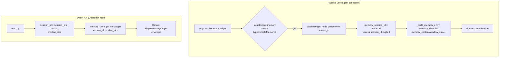

# Simple Memory (`simpleMemory`)

| Field | Value |
|------|-------|
| **Category** | ai_agents / memory (group: `('tool', 'memory')`, `component_kind = "model"`) |
| **Backend handler** | [`server/nodes/skill/simple_memory/__init__.py`](../../../server/nodes/skill/simple_memory/__init__.py) — dispatched via `BaseNode.execute()` + the `@Operation("read")` method (`read`). Agent-side consumption via [`edge_walker.py::collect_agent_connections`](../../../server/services/plugin/edge_walker.py) / `_build_memory_entry`. |
| **Tests** | [`server/tests/nodes/test_ai_agents.py`](../../../server/tests/nodes/test_ai_agents.py) |
| **Skill (if any)** | n/a |
| **Dual-purpose tool** | no |

## Purpose

`simpleMemory` is a **passive configuration node** that holds conversation
history for connected agents. It has no inputs and is not meant to be run on
its own — `ui_hints.hideRunButton` is set. When an `aiAgent` / `chatAgent`
(or any specialized agent) executes, `edge_walker.collect_agent_connections`
reads this node's saved parameters (`memory_content`, `window_size`,
`long_term_enabled`, etc.) via `_build_memory_entry` and forwards them to
`AIService.execute_agent` / `execute_chat_agent`. The service parses the
markdown, feeds the messages to the LLM, appends the new exchange, trims to
window, and saves the updated markdown back to the memory node via
`database.save_node_parameters`.

The plugin's own `@Operation("read")` method is only invoked when a user
explicitly hits Run (or via direct dispatch); it returns an inspector-style
snapshot of the `services.memory_store` in-memory session, **which is a
separate store from the markdown `memory_content` pipeline used by the
agents**. See "Edge cases" below.

## Workflow Reset semantics

`simpleMemory` configuration is durable, but its conversation state follows the
workflow generation. Resetting the Temporal workflow:

- archives the current memory parameters under the old generation;
- resets `memory_content`, `memory_jsonl`, `last_session_id`, and provider
  continuation identifiers while preserving configuration such as window size;
- clears connected agent sessions, long-term vector caches, direct memory-store
  sessions, conversation rows, and token/compaction counters;
- broadcasts the cleared node parameters so the open panel updates immediately;
- makes the next workflow generation start from an empty conversation.

The explicit **Clear Memory** action remains available for clearing memory
without resetting the whole workflow. Workflow Reset invokes the same
cross-store clear contract only after its archival write succeeds.

Implementation is plugin-owned: `SimpleMemoryNode.reset_execution_state`
implements the generic `BaseNode` lifecycle hook. The deployment/reset service
does not recognize the `simpleMemory` type or know its session topology.

## Inputs (handles)

_None._ `simpleMemory` has no incoming handles.

## Parameters

Source: `SimpleMemoryParams` in
[`simple_memory/__init__.py`](../../../server/nodes/skill/simple_memory/__init__.py).
All field names are snake_case (Pydantic params are the post-Wave-11 source of
truth; the old `memoryType` / `clearOnRun` / buffer-vs-window split was removed
— trimming is always windowed and the UI exposes a manual "Clear Memory"
button).

| Name | Type | Default | Required | displayOptions.show | Description |
|------|------|---------|----------|---------------------|-------------|
| `session_id` | string | `""` | no | - | Session override. Empty -> agent node_id is used by the agent-side collection; the `read` op resolves empty to `"default"`. |
| `window_size` | int | `100` | no | - | Message *pairs* to keep in short-term memory; 1-100. |
| `memory_content` | string (code editor, markdown, rows 15) | `# Conversation History\n\n*No messages yet.*\n` | no | - | Markdown body (`### **Human** (ts)` / `### **Assistant** (ts)` blocks). Edited in-place in the UI. |
| `long_term_enabled` | boolean | `false` | no | - | When true, trimmed messages are archived to an `InMemoryVectorStore`. |
| `retrieval_count` | int | `3` | no | `long_term_enabled=[true]` | Relevant messages to retrieve at query time (1-10). |
| `last_session_id` | string (optional, **hidden**) | `None` | no | - | Internal/display-only: last Claude session UUID. `claude_code_agent` no longer reads it; cleared when memory is wiped. |

Parameters consumed when an agent pulls the memory:

| Name | Where it comes from | Where it is read |
|------|---------------------|------------------|
| `memory_content`, `window_size`, `long_term_enabled`, `retrieval_count`, `last_session_id` | `database.get_node_parameters(source_node_id)` inside `edge_walker._build_memory_entry` | Packed into the `memory_data` dict and forwarded to `AIService`. |

Parameters consumed when the node is run directly (`@Operation("read")`):

| Name | Default | Description |
|------|---------|-------------|
| `session_id` | resolves to `"default"` when empty | Session key used for `services.memory_store.get_messages`. |
| `window_size` | `100` | Windowing applied to the message log. |

## Outputs (handles)

| Handle | Shape | Description |
|--------|-------|-------------|
| `output-memory` (output, top, role `memory`) | object | Snapshot of the in-memory session (see below). |

### Output payload (`SimpleMemoryOutput` from the `read` op)

```ts
{
  memory_content?: string;   // echoes the editable markdown param
  message_count?: number;
  session_id?: string;
  messages?: any[];          // from services.memory_store.get_messages
  window_size?: number;
  // model_config extra="allow"
}
```

Serialized through `BaseNode._serialize_result` and wrapped in the standard
envelope: `{ success: true, result: <payload>, execution_time }`.

## Logic Flow



## Decision Logic

- **Passive collection session key**: if the memory node's `session_id` is
  empty (or `"default"`), the agent's own `node_id` is used as the session key.
  This is what makes two agents wired to the same memory node keep **separate**
  histories unless the user explicitly overrides `session_id`.
- **Instruction source of truth**: `memory_content` in the DB is authoritative.
  UI edits persist there via `save_node_parameters`. The agent side
  re-serialises after each turn through
  `services.memory.append_to_memory_markdown` + `trim_markdown_window`.
- **Window semantics**: `window_size` counts *pairs* (Human + Assistant), so
  `trim_markdown_window` keeps `window_size * 2` blocks. Trimmed blocks are
  returned as raw text for optional vector-store archival.
- **Long-term retrieval**: `services.memory.get_memory_vector_store(session_id)`
  lazily creates an `InMemoryVectorStore` with
  `HuggingFaceEmbeddings(BAAI/bge-small-en-v1.5)` the first time it is requested
  for that session. On `ImportError` (e.g. `langchain_huggingface` missing) the
  function returns `None` and the agent silently skips archival - **no error is
  surfaced**.
- **Direct-run memory store is different**: the `read` op pulls from
  `services.memory_store` (via `get_messages`), **not** from the markdown
  `memory_content`. A user who clicks Run on a `simpleMemory` node actively
  used by an agent sees the `memory_store` view, which may be empty even though
  `memory_content` contains history.

## Side Effects

- **Database writes**: none in the `read` op. The agent pipeline writes the
  updated markdown back to this node's `node_parameters` row via
  `database.save_node_parameters` after each turn.
- **Broadcasts**: none. The node is passive.
- **External API calls**: none in the `read` op. When `long_term_enabled` is set
  and the agent archives, `HuggingFaceEmbeddings` loads the
  `BAAI/bge-small-en-v1.5` model locally (no network once cached).
- **File I/O**: none. The vector store is `InMemoryVectorStore` - not
  persisted to disk; it is lost on process restart.
- **Subprocess**: none.

## External Dependencies

- **Credentials**: none.
- **Services**: `services.memory_store` (direct-run path), `AIService` (via
  agents), `Database` (for parameter persistence).
- **Python packages**: `langchain-core` (messages), `langchain_huggingface`
  + `sentence-transformers` (long-term vector store only, optional).
- **Environment variables**: none.

## Edge cases & known limits

- **Two storage systems for one node**. The markdown `memory_content` (used
  by agents) and the `services.memory_store` session log (used by the
  `read` op) are **independent**. Clicking Run on the node does not
  reflect what the agents see, and vice-versa. This is a known architectural
  seam noted in the CLAUDE.md overview.
- **Vector store is in-memory only**. The per-session cache in
  `services.memory.vector_store` is a module-global dict keyed by session id.
  A server restart empties it; long-term memory is not actually durable
  without external persistence.
- **`HuggingFaceEmbeddings` import is silent-catch**. If the dependency is
  missing at runtime, `get_memory_vector_store` logs a warning and returns
  `None`; the agent continues without archival and the user never learns.
- **No token budgeting**. `window_size` is a message-pair count, not a token
  count. A long history below the window threshold can still exceed the
  model's context window; see the "Prompt Too Long" note in CLAUDE.md.
- **Markdown parser is regex-based**. `parse_memory_markdown` matches
  `### **Human**` / `### **Assistant**` exactly. If a user edits the UI
  content to a non-conforming header the messages will silently be dropped.
- **`window_size` is Pydantic-clamped 1-100** by the field constraint; the
  agent-side `trim_markdown_window` trusts whatever value is passed.
- **Passive node, no envelope on read paths**. When consumed by an agent,
  this node never produces its own envelope - it only supplies parameters.

## Related

- **Consumer nodes**: [`aiAgent`](./aiAgent.md), [`chatAgent`](./chatAgent.md),
  every specialized agent that routes through `execute_chat_agent`.
- **Architecture docs**: [Memory Compaction](../../memory_compaction.md),
  [Agent Architecture](../../agent_architecture.md)
