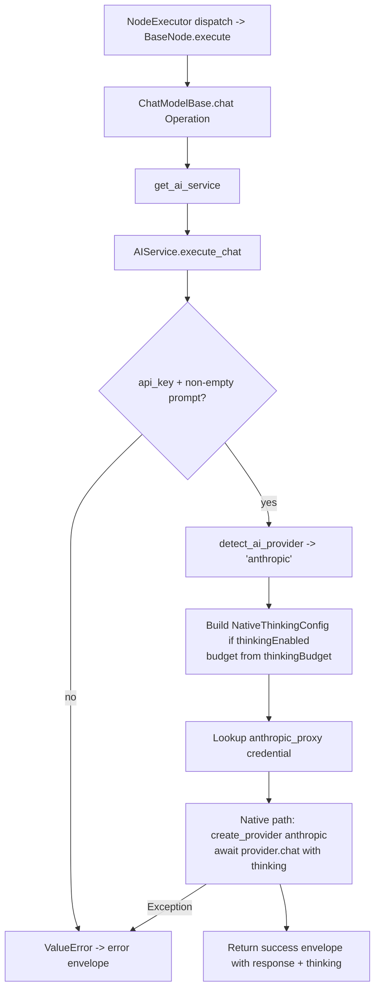

# Anthropic Chat Model (`anthropicChatModel`)

| Field | Value |
|------|-------|
| **Category** | ai_chat_models |
| **Backend handler** | [`server/nodes/model/anthropic_chat_model/__init__.py`](../../../server/nodes/model/anthropic_chat_model/__init__.py) (dispatch via `BaseNode.execute()` -> `@Operation("chat")` in [`server/nodes/model/_base.py`](../../../server/nodes/model/_base.py)) |
| **AI service** | [`server/services/ai.py::AIService.execute_chat`](../../../server/services/ai.py) |
| **Tests** | [`server/tests/nodes/test_ai_chat_models.py`](../../../server/tests/nodes/test_ai_chat_models.py) |
| **Skill (if any)** | n/a |
| **Dual-purpose tool** | yes - tool name `anthropic_chat_model` (advisor; `usable_as_tool = True`, group `('model', 'tool')`) |

## Purpose

Single-turn chat completion against the Anthropic Messages API (Claude family). The `ChatModelBase.chat` operation (in `_base.py`) calls `AIService.execute_chat` for every chat-model node; provider-specific branching lives inside `execute_chat` and the native `services/llm/providers/anthropic.py`. Also wired as an AI-agent advisor tool (`usable_as_tool = True`) so an agent can consult a stronger model mid-task.

## Inputs (handles)

| Handle | Connection type | Required | Purpose |
|--------|-----------------|----------|---------|
| `input-main` | main | no | Upstream data; not consumed directly |

## Parameters

| Name | Type | Default | Required | displayOptions.show | Description |
|------|------|---------|----------|---------------------|-------------|
| `prompt` | string | `""` | yes (non-empty) | - | User message |
| `system_prompt` | string | `""` | no | - | System prompt |
| `model` | string | `""` (injected from stored models) | no | - | Anthropic model ID - **hyphenated** form (e.g. `claude-sonnet-4-6`, NOT `claude-sonnet-4.6`) |
| `temperature` | number\|null | `null` -> falls through to `agent.default_temperature` | no | - | Clamped to 0-1 for Claude; forced to 1 when thinking is enabled |
| `max_tokens` | number\|null | `null` -> per-model default | no | - | 1-200000. **Must be greater than `thinking_budget`** when thinking is enabled |
| `top_p` | number\|null | `1.0` | no | - | Nucleus sampling (0-1) |
| `top_k` | number\|null | `40` | no | - | 1-100; Anthropic-specific |
| `thinking_enabled` | boolean | `false` | no | - | Enable extended thinking |
| `thinking_budget` | number\|null | `2048` | no | `thinking_enabled=[true]` | 1024-16000 tokens allocated to internal reasoning |
| `api_key` | string\|null | `null` (injected) | no | - | `auth_service.get_api_key('anthropic', 'default')` |

(Field names are snake_case on the `AnthropicChatModelParams` Pydantic model; `model_config = ConfigDict(extra="ignore")` drops unknown keys.)

## Outputs (handles)

| Handle | Shape | Description |
|--------|-------|-------------|
| `output-model` | object | Model output (also feeds an agent's `input-model` handle); standard envelope payload |

### Output payload

```ts
{
  response: string;
  thinking: string | null;     // Claude extended thinking content, if enabled
  thinking_enabled: boolean;
  model: string;
  provider: 'anthropic';
  finish_reason: string;
  timestamp: string;
  input: { prompt: string; system_prompt: string };
}
```

Wrapped in `{ success, node_id, node_type, result, execution_time }`.

## Logic Flow



## Decision Logic

- **Validation**: missing api_key or empty prompt -> error envelope.
- **Provider routing**: `detect_ai_provider` matches `'anthropic'` on `'anthropic' in node_type.lower()` branch.
- **Native provider**: `is_native_provider('anthropic')` is True - uses the `anthropic` Python SDK.
- **Model ID scrubbing**: strips `[FREE] ` prefix; strips `owner/` prefix for non-OpenRouter providers.
- **Temperature override**: when `thinkingEnabled=true`, temperature is auto-forced to 1 by `native_resolve_temperature`.
- **Thinking config**: `NativeThinkingConfig(enabled=True, budget=int(thinkingBudget))` forwarded to the SDK, which maps to Anthropic's `thinking={type: "enabled", budget_tokens: N}`.

## Side Effects

- **Database writes**: none on the bare chat path.
- **Broadcasts**: none.
- **External API calls**: `POST https://api.anthropic.com/v1/messages` via `anthropic` SDK; base URL configurable in `llm_defaults.json`, overridable via `anthropic_proxy` credential.
- **File I/O**: none.
- **Subprocess**: none.

## External Dependencies

- **Credentials**: `auth_service.get_api_key('anthropic', 'default')` plus optional `anthropic_proxy`.
- **Services**: `services/llm/providers/anthropic.py`, `AIService`.
- **Python packages**: `anthropic`.
- **Environment variables**: none.

## Edge cases & known limits

- **Model ID format**: Anthropic API uses hyphens (`claude-sonnet-4-6`), NOT dots. Dotted IDs (as used by OpenRouter or Gemini) will 404. The frontend model list already uses the correct form, but template-substituted or hand-entered IDs with dots will fail.
- **`maxTokens > thinkingBudget` required**: if thinking is enabled and `maxTokens <= thinkingBudget`, the Anthropic API rejects the request. The handler does not pre-validate this; the resulting error becomes the envelope's `error` field.
- **Temperature forced to 1 when thinking enabled**: regardless of user input.
- **1M context**: current Claude models (Fable 5, Opus 4.x, Sonnet 4.6) support a 1M context window; configured in `llm_defaults.json` rather than the node.
- **Errors swallowed into envelope**: handler never raises; all failures surface as `success=false`.
- **No streaming** / **no pricing tracking** on standalone chat nodes.

## Related

- **Peer nodes**: [`openaiChatModel`](./openaiChatModel.md), [`geminiChatModel`](./geminiChatModel.md), [`openrouterChatModel`](./openrouterChatModel.md), [`groqChatModel`](./groqChatModel.md), [`cerebrasChatModel`](./cerebrasChatModel.md), [`deepseekChatModel`](./deepseekChatModel.md), [`kimiChatModel`](./kimiChatModel.md), [`mistralChatModel`](./mistralChatModel.md).
- **Architecture docs**: [Native LLM SDK](../../native_llm_sdk.md), [Memory Compaction](../../memory_compaction.md).
