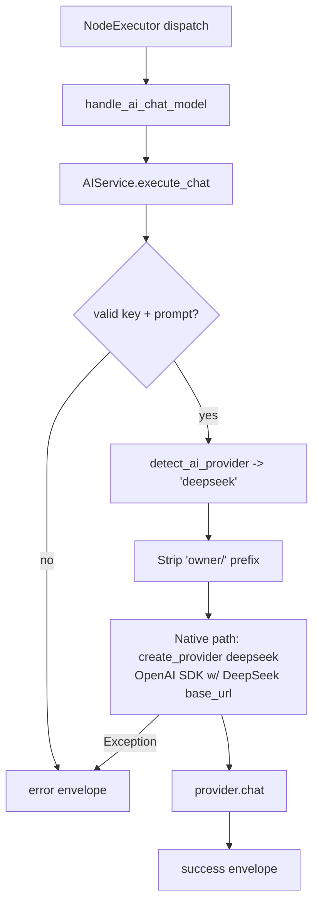

# DeepSeek Chat Model (`deepseekChatModel`)

| Field | Value |
|------|-------|
| **Category** | ai_chat_models |
| **Backend handler** | [`server/services/handlers/ai.py::handle_ai_chat_model`](../../../server/services/handlers/ai.py) |
| **AI service** | [`server/services/ai.py::AIService.execute_chat`](../../../server/services/ai.py) |
| **Tests** | [`server/tests/nodes/test_ai_chat_models.py`](../../../server/tests/nodes/test_ai_chat_models.py) |
| **Skill (if any)** | n/a |
| **Dual-purpose tool** | no |

## Purpose

DeepSeek V4 models (`deepseek-v4-flash`, `deepseek-v4-pro`); `deepseek-chat` / `deepseek-reasoner` remain as legacy aliases (deprecate 2026-07-24). Uses the OpenAI-compatible DeepSeek endpoint via the `services/llm/providers` layer (native path). Shares `handle_ai_chat_model`.

## Inputs (handles)

| Handle | Connection type | Required | Purpose |
|--------|-----------------|----------|---------|
| `input-main` | main | no | Upstream data; not consumed directly |

## Parameters

| Name | Type | Default | Required | displayOptions.show | Description |
|------|------|---------|----------|---------------------|-------------|
| `prompt` | string | `""` | yes | - | User message |
| `systemMessage` | string | `""` | no | - | System prompt |
| `model` | string | injected | no | - | `deepseek-v4-flash` / `deepseek-v4-pro`; `deepseek-chat` / `deepseek-reasoner` legacy aliases (reasoner = always-on CoT) |
| `temperature` | number | 0-2 | no | - | |
| `maxTokens` | number | 8-64K | no | - | |
| `topP` | number | - | no | - | |
| `apiKey` | string | injected | no | - | `auth_service.get_api_key('deepseek', 'default')` |

## Outputs (handles)

| Handle | Shape | Description |
|--------|-------|-------------|
| `output-main` | object | Standard envelope payload |

### Output payload

```ts
{
  response: string;
  thinking: string | null;   // reasoning_content from deepseek-reasoner; null for deepseek-chat
  thinking_enabled: boolean;
  model: string;
  provider: 'deepseek';
  finish_reason: string;
  timestamp: string;
  input: { prompt: string; system_prompt: string };
}
```

## Logic Flow



## Decision Logic

- **Validation**: missing api_key / empty prompt -> error envelope.
- **Provider routing**: `detect_ai_provider` matches `'deepseek' in node_type.lower()` **first** (before kimi/mistral/cerebras/groq/openrouter/anthropic/gemini), so routing is unambiguous.
- **Native path**: uses the OpenAI SDK with DeepSeek's base URL from `llm_defaults.json`. OpenAI-compatible `max_tokens` is passed via `extra_body` to bypass LangChain's `max_completion_tokens` translation (not relevant on the native path but documented for the LangChain-agent path).
- **`deepseek-reasoner` always-on CoT**: reasoning_content is ALWAYS produced, regardless of `thinkingEnabled`. The native provider extracts it into `LLMResponse.thinking`.

## Side Effects

- **Database writes**: none on bare chat path.
- **Broadcasts**: none.
- **External API calls**: `POST https://api.deepseek.com/v1/chat/completions` (via OpenAI SDK with overridden base URL).
- **File I/O**: none.
- **Subprocess**: none.

## External Dependencies

- **Credentials**: `auth_service.get_api_key('deepseek', 'default')` plus optional `deepseek_proxy`.
- **Services**: `services/llm/providers/openai.py` (reused w/ DeepSeek base_url).
- **Python packages**: `openai`.
- **Environment variables**: none.

## Edge cases & known limits

- **`deepseek-reasoner` always thinks**: `thinkingEnabled=false` does NOT disable the reasoning trace; it just means the UI won't highlight it. The response still contains `reasoning_content`.
- **`thinkingBudget` has no effect**: DeepSeek reasoning is not budget-configurable; the field is silently ignored.
- **128K context, up to 64K output**.
- **OpenAI-compatible but not OpenAI**: features like `response_format: json_object` have subtly different behavior.
- **Errors swallowed into envelope**.

## Related

- **Peer nodes**: see the other chat-model docs in this folder.
- **Architecture docs**: [Native LLM SDK](../../native_llm_sdk.md).
