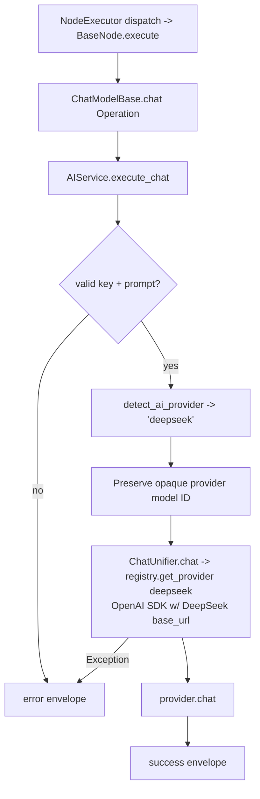

# DeepSeek Chat Model (`deepseekChatModel`)

| Field | Value |
|------|-------|
| **Category** | ai_chat_models |
| **Backend handler** | [`server/nodes/model/deepseek_chat_model/__init__.py`](../../../server/nodes/model/deepseek_chat_model/__init__.py) (dispatch via `BaseNode.execute()` -> `@Operation("chat")` in [`server/nodes/model/_base.py`](../../../server/nodes/model/_base.py)) |
| **AI service** | [`server/services/ai.py::AIService.execute_chat`](../../../server/services/ai.py) |
| **Tests** | [`server/tests/nodes/test_ai_chat_models.py`](../../../server/tests/nodes/test_ai_chat_models.py) |
| **Skill (if any)** | n/a |
| **Dual-purpose tool** | no (group `('model',)`) |

## Purpose

DeepSeek V4 models: `deepseek-v4.1-flash` (the default), `deepseek-v4-pro` and the earlier `deepseek-v4-flash`. Uses the OpenAI-compatible DeepSeek endpoint via the `services/llm/providers` layer (native path). The `ChatModelBase.chat` operation calls `AIService.execute_chat`. `llm_defaults.json` holds the curated ids, which follow the OpenRouter snapshot (`model_registry.json`); `deepseek-flash`, another name DeepSeek's API accepts for V4.1-Flash, left the list on 2026-09-26 because the snapshot does not list it.

## Inputs (handles)

| Handle | Connection type | Required | Purpose |
|--------|-----------------|----------|---------|
| `input-main` | main | no | Upstream data; not consumed directly |

## Parameters

| Name | Type | Default | Required | displayOptions.show | Description |
|------|------|---------|----------|---------------------|-------------|
| `prompt` | string | `""` | yes | - | User message |
| `system_prompt` | string | `""` | no | - | System prompt |
| `model` | string | `""` (injected) | no | - | `deepseek-v4.1-flash` (default) / `deepseek-v4-pro` / `deepseek-v4-flash` |
| `temperature` | number\|null | `null` | no | - | 0-2 |
| `max_tokens` | number\|null | `null` (8-64K) | no | - | 1-200000 |
| `top_p` | number\|null | `1.0` | no | - | |
| `frequency_penalty` | number\|null | `0.0` | no | - | -2.0 to 2.0 (DeepSeek-specific) |
| `presence_penalty` | number\|null | `0.0` | no | - | -2.0 to 2.0 (DeepSeek-specific) |
| `api_key` | string\|null | `null` (injected) | no | - | `auth_service.get_api_key('deepseek', 'default')` |

(Field names are snake_case on `DeepseekChatModelParams`; unknown keys ignored.)

## Outputs (handles)

| Handle | Shape | Description |
|--------|-------|-------------|
| `output-model` | object | Model output; standard envelope payload |

### Output payload

```ts
{
  response: string;
  thinking: string | null;   // reasoning_content when the model emits one; null otherwise
  thinking_enabled: boolean;
  model: string;
  provider: 'deepseek';
  finish_reason: string;
  timestamp: string;
  input: { prompt: string; system_prompt: string };
}
```

## Logic Flow


```mermaid
flowchart TD
  A[NodeExecutor dispatch -> BaseNode.execute] --> B[ChatModelBase.chat Operation]
  B --> C[AIService.execute_chat]
  C --> D{valid key + prompt?}
  D -- no --> X[error envelope]
  D -- yes --> E[detect_ai_provider -> 'deepseek']
  E --> F[Preserve opaque provider model ID]
  F --> G[ChatUnifier.chat -> registry.get_provider deepseek<br/>OpenAI SDK w/ DeepSeek base_url]
  G --> H[provider.chat]
  H --> I[success envelope]
  G -- Exception --> X
```

## Decision Logic

- **Validation**: missing api_key / empty prompt -> error envelope.
- **Provider routing**: `detect_ai_provider` matches `'deepseek' in node_type.lower()` **first** (before kimi/mistral/cerebras/groq/openrouter/anthropic/gemini), so routing is unambiguous.
- **Native path**: uses the OpenAI SDK with DeepSeek's base URL from `llm_defaults.json`. The compatible provider sends `max_tokens` directly in the Chat Completions request; there is no LangChain parameter translation on current chat or agent executions.
- **Model ID handling**: only the UI-only `[FREE] ` decoration is stripped. The remaining model ID is preserved.
- **Reasoning trace**: when DeepSeek returns `reasoning_content` the native provider extracts it into `LLMResponse.thinking`, regardless of `thinkingEnabled`. (The always-on-CoT `deepseek-reasoner` this rule was written for was discontinued in July 2026; the extraction still applies to any model that emits the field.)

## Side Effects

- **Database writes**: none on bare chat path.
- **Broadcasts**: none.
- **External API calls**: `POST https://api.deepseek.com/v1/chat/completions` (via OpenAI SDK with overridden base URL).
- **File I/O**: none.
- **Subprocess**: none.

## External Dependencies

- **Credentials**: `auth_service.get_api_key('deepseek', 'default')` plus optional `deepseek_proxy`.
- **Services**: `services/llm/providers/openai.py` (reused w/ DeepSeek base_url).
- **Python packages**: `openai`.
- **Environment variables**: none.

## Edge cases & known limits

- **`thinkingEnabled=false` does not suppress a trace**: it only means the UI will not highlight one. If the model returns `reasoning_content`, the response still carries it.
- **`thinkingBudget` has no effect**: DeepSeek reasoning is not budget-configurable; the field is silently ignored.
- **Context and output**: all three curated models have a 1,048,576-token context window. The output ceiling is 131,072 tokens for `deepseek-v4.1-flash` and 384,000 for `deepseek-v4-pro` and `deepseek-v4-flash` (OpenRouter snapshot, 2026-09-26).
- **OpenAI-compatible but not OpenAI**: features like `response_format: json_object` have subtly different behavior.
- **Error boundary**: typed OpenAI SDK failures become user-safe `NodeUserError` values in `ChatUnifier` and are re-raised to `BaseNode.execute()`, which produces the standard failure envelope. Unexpected failures are logged and returned by `execute_chat`.

## Related

- **Peer nodes**: see the other chat-model docs in this folder.
- **Architecture docs**: [Native LLM SDK](../../native_llm_sdk.md).
