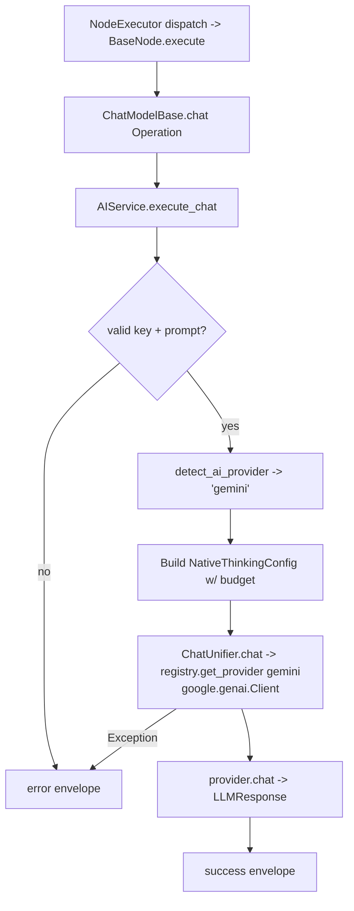

# Gemini Chat Model (`geminiChatModel`)

| Field | Value |
|------|-------|
| **Category** | ai_chat_models |
| **Backend handler** | [`server/nodes/model/gemini_chat_model/__init__.py`](../../../server/nodes/model/gemini_chat_model/__init__.py) (dispatch via `BaseNode.execute()` -> `@Operation("chat")` in [`server/nodes/model/_base.py`](../../../server/nodes/model/_base.py)) |
| **AI service** | [`server/services/ai.py::AIService.execute_chat`](../../../server/services/ai.py) |
| **Tests** | [`server/tests/nodes/test_ai_chat_models.py`](../../../server/tests/nodes/test_ai_chat_models.py) |
| **Skill (if any)** | n/a |
| **Dual-purpose tool** | yes - tool name `gemini_chat_model` (advisor; `usable_as_tool = True`, group `('model', 'tool')`) |

## Purpose

Single-turn chat completion against Google's Gemini API (google-genai native SDK). The `ChatModelBase.chat` operation calls `AIService.execute_chat`. Also wired as an AI-agent advisor tool (`usable_as_tool = True`) so an agent can consult Gemini mid-task.

## Inputs (handles)

| Handle | Connection type | Required | Purpose |
|--------|-----------------|----------|---------|
| `input-main` | main | no | Upstream data; not consumed directly |

## Parameters

| Name | Type | Default | Required | displayOptions.show | Description |
|------|------|---------|----------|---------------------|-------------|
| `prompt` | string | `""` | yes (non-empty) | - | User message |
| `system_prompt` | string | `""` | no | - | System prompt |
| `model` | string | `""` (injected) | no | - | e.g. `gemini-2.5-pro`, `gemini-2.5-flash`, `gemini-3-pro` |
| `temperature` | number\|null | `null` | no | - | 0-2 range |
| `max_tokens` | number\|null | `null` (clamped to ceiling) | no | - | 1-200000; up to 65K output |
| `top_p` | number\|null | `1.0` | no | - | |
| `top_k` | number\|null | `40` | no | - | 1-100; Gemini-specific |
| `thinking_enabled` | boolean | `false` | no | - | Enable thinking (2.5 Pro/Flash, 3.x) |
| `thinking_budget` | number\|null | `2048` | no | `thinking_enabled=[true]` | 1024-16000 token budget for internal reasoning |
| `safety_settings` | enum | `default` | no | - | `default` / `strict` / `permissive` |
| `api_key` | string\|null | `null` (injected) | no | - | `auth_service.get_api_key('gemini', 'default')` |

(Field names are snake_case on `GeminiChatModelParams`; unknown keys ignored.)

## Outputs (handles)

| Handle | Shape | Description |
|--------|-------|-------------|
| `output-model` | object | Model output; standard envelope payload |

### Output payload

```ts
{
  response: string;
  thinking: string | null;
  thinking_enabled: boolean;
  model: string;
  provider: 'gemini';
  finish_reason: string;
  timestamp: string;
  input: { prompt: string; system_prompt: string };
}
```

## Logic Flow



## Decision Logic

- **Validation**: missing api_key / empty prompt -> error envelope.
- **Provider routing**: matches `'gemini' in node_type.lower()`.
- **Native SDK**: uses `google.genai.Client` (NOT LangChain's `langchain_google_genai`) to dodge the Windows/Python 3.13 gRPC import hang.
- **Thinking budget**: `thinkingBudget` -> `NativeThinkingConfig.budget` -> Gemini `thinking_budget` API parameter.
- **Model string scrubbing**: `[FREE] ` prefix stripped; `owner/model` prefix stripped (non-OpenRouter).

## Side Effects

- **Database writes**: none on bare chat path.
- **Broadcasts**: none.
- **External API calls**: `POST https://generativelanguage.googleapis.com/v1beta/...` via `google-genai` SDK; base URL from `llm_defaults.json`.
- **File I/O**: none.
- **Subprocess**: none.

## External Dependencies

- **Credentials**: `auth_service.get_api_key('gemini', 'default')` plus optional `gemini_proxy`.
- **Services**: `services/llm/providers/gemini.py`.
- **Python packages**: `google-genai` (native).
- **Environment variables**: none.

## Edge cases & known limits

- **Windows/Python 3.13 quirk**: importing `langchain_google_genai` hangs due to a gRPC deadlock. The native path bypasses this entirely. The LangChain fallback is NEVER used for Gemini on `execute_chat` - it is only lazy-imported for agent execution.
- **Thinking budget units**: expressed as token count, not low/medium/high effort levels. Defaults to 2048.
- **Safety settings**: forwarded via the SDK; malformed values surface as `success=false` in the envelope.
- **`maxTokens` clamp**: capped at the model's ceiling (65K for 2.5/3.x).
- **Errors swallowed into envelope** - handler never raises.

## Related

- **Peer nodes**: [`openaiChatModel`](./openaiChatModel.md), [`anthropicChatModel`](./anthropicChatModel.md), [`openrouterChatModel`](./openrouterChatModel.md), [`groqChatModel`](./groqChatModel.md), [`cerebrasChatModel`](./cerebrasChatModel.md), [`deepseekChatModel`](./deepseekChatModel.md), [`kimiChatModel`](./kimiChatModel.md), [`mistralChatModel`](./mistralChatModel.md).
- **Architecture docs**: [Native LLM SDK](../../native_llm_sdk.md).
