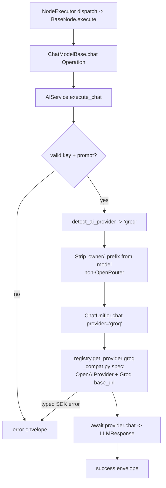

# Groq Chat Model (`groqChatModel`)

| Field | Value |
|------|-------|
| **Category** | ai_chat_models |
| **Backend handler** | [`server/nodes/model/groq_chat_model/__init__.py`](../../../server/nodes/model/groq_chat_model/__init__.py) (dispatch via `BaseNode.execute()` -> `@Operation("chat")` in [`server/nodes/model/_base.py`](../../../server/nodes/model/_base.py)) |
| **AI service** | [`server/services/ai.py::AIService.execute_chat`](../../../server/services/ai.py) |
| **Tests** | [`server/tests/nodes/test_ai_chat_models.py`](../../../server/tests/nodes/test_ai_chat_models.py) |
| **Skill (if any)** | n/a |
| **Dual-purpose tool** | no (group `('model',)`) |

## Purpose

Ultra-fast inference via Groq's LPU hardware. Models include Llama 3.x / 4,
Qwen3-32b, GPT-OSS. The `ChatModelBase.chat` operation calls
`AIService.execute_chat`, which routes through `ChatUnifier`; Groq is one of
the eight OpenAI-compatible providers registered in `providers/_compat.py`.
Bare chat and current agent executions share this native provider path.

## Inputs (handles)

| Handle | Connection type | Required | Purpose |
|--------|-----------------|----------|---------|
| `input-main` | main | no | Upstream data; not consumed directly |

## Parameters

| Name | Type | Default | Required | displayOptions.show | Description |
|------|------|---------|----------|---------------------|-------------|
| `prompt` | string | `""` | yes | - | User message |
| `system_prompt` | string | `""` | no | - | System prompt |
| `model` | string | `""` (injected) | no | - | e.g. `llama-3.1-70b-versatile`, `qwen/qwen3-32b`, `groq/compound-beta` |
| `temperature` | number\|null | `null` | no | - | 0-2 |
| `max_tokens` | number\|null | `null` (8-131K per model) | no | - | 1-200000 |
| `top_p` | number\|null | `1.0` | no | - | |
| `thinking_enabled` | boolean | `false` | no | - | Only Qwen3-32b supports reasoning |
| `reasoning_format` | enum | `parsed` | no | `thinking_enabled=[true]` | `parsed` (returns reasoning) or `hidden` (suppresses it) |
| `api_key` | string\|null | `null` (injected) | no | - | `auth_service.get_api_key('groq', 'default')` |

(Field names are snake_case on `GroqChatModelParams`; unknown keys ignored.)

## Outputs (handles)

| Handle | Shape | Description |
|--------|-------|-------------|
| `output-model` | object | Model output; standard envelope payload |

### Output payload

```ts
{
  response: string;
  thinking: string | null;   // only populated for Qwen3 with reasoningFormat=parsed
  thinking_enabled: boolean;
  model: string;
  provider: 'groq';
  finish_reason: string;
  timestamp: string;
  input: { prompt: string; system_prompt: string };
}
```

## Logic Flow



## Decision Logic

- **Validation**: missing api_key / empty prompt -> error envelope.
- **Provider routing**: matches `'groq' in node_type.lower()`. Note the ordering in `detect_ai_provider`: deepseek/kimi/mistral/cerebras checked first, so none of those accidentally resolve to groq.
- **Native OpenAI-compatible path**: `ChatUnifier` resolves the `groq` spec
  registered in `providers/_compat.py` (reuses `OpenAIProvider` with the
  `base_url` from `llm_defaults.json`) for both chat and agent requests.
- **Reasoning**: only Qwen3-32b actually honors `reasoningFormat`. Non-Qwen models ignore the flag.
- **Model string scrubbing**: `[FREE] ` prefix stripped; `owner/` prefix stripped (non-OpenRouter).

## Side Effects

- **Database writes**: none on bare chat path.
- **Broadcasts**: none.
- **External API calls**: `POST https://api.groq.com/openai/v1/chat/completions` via the native `openai` SDK with `base_url` override.
- **File I/O**: none.
- **Subprocess**: none.

## External Dependencies

- **Credentials**: `auth_service.get_api_key('groq', 'default')` plus optional `groq_proxy`.
- **Services**: `ChatUnifier` + `OpenAIProvider` with the Groq `base_url`.
- **Python packages**: `openai`.
- **Environment variables**: none.

## Edge cases & known limits

- **Reasoning only on Qwen3-32b**: QwQ has been removed from Groq. Other models ignore `reasoningFormat`.
- **`reasoningFormat=hidden` suppresses `thinking`**: response contains only the final answer.
- **Finish reason**: passed through from the API response (`"stop"` fallback when absent).
- **Errors swallowed into envelope**.

## Related

- **Peer nodes**: see the other chat-model docs in this folder.
- **Architecture docs**: [Native LLM SDK](../../native_llm_sdk.md).
