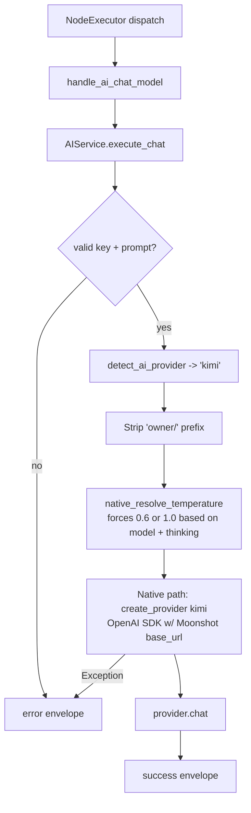

# Kimi Chat Model (`kimiChatModel`)

| Field | Value |
|------|-------|
| **Category** | ai_chat_models |
| **Backend handler** | [`server/services/handlers/ai.py::handle_ai_chat_model`](../../../server/services/handlers/ai.py) |
| **AI service** | [`server/services/ai.py::AIService.execute_chat`](../../../server/services/ai.py) |
| **Tests** | [`server/tests/nodes/test_ai_chat_models.py`](../../../server/tests/nodes/test_ai_chat_models.py) |
| **Skill (if any)** | n/a |
| **Dual-purpose tool** | no |

## Purpose

Kimi K2 models by Moonshot AI (`kimi-k2.5`, `kimi-k2-thinking`). 256K context, 96K output. Uses OpenAI-compatible Moonshot endpoint via the native path. Shares `handle_ai_chat_model`.

## Inputs (handles)

| Handle | Connection type | Required | Purpose |
|--------|-----------------|----------|---------|
| `input-main` | main | no | Upstream data; not consumed directly |

## Parameters

| Name | Type | Default | Required | displayOptions.show | Description |
|------|------|---------|----------|---------------------|-------------|
| `prompt` | string | `""` | yes | - | User message |
| `systemMessage` | string | `""` | no | - | System prompt |
| `model` | string | injected | no | - | `kimi-k2.5` (instant) or `kimi-k2-thinking` |
| `temperature` | number | **fixed** | no | - | Fixed at 0.6 (instant) or 1.0 (thinking). Input is ignored. |
| `maxTokens` | number | up to 96K | no | - | |
| `thinkingEnabled` | boolean | true for k2.5 | no | - | ON by default for k2.5; explicitly disabled for tool-calling agents |
| `apiKey` | string | injected | no | - | `auth_service.get_api_key('kimi', 'default')` |

## Outputs (handles)

| Handle | Shape | Description |
|--------|-------|-------------|
| `output-main` | object | Standard envelope payload |

### Output payload

```ts
{
  response: string;
  thinking: string | null;
  thinking_enabled: boolean;
  model: string;
  provider: 'kimi';
  finish_reason: string;
  timestamp: string;
  input: { prompt: string; system_prompt: string };
}
```

## Logic Flow



## Decision Logic

- **Validation**: missing api_key / empty prompt -> error envelope.
- **Provider routing**: `detect_ai_provider` matches `'kimi' in node_type.lower()`. Ordering guarantees it lands in the kimi lane before groq / openrouter / anthropic / gemini.
- **Fixed temperature**: `native_resolve_temperature` ignores user input for Kimi and forces 0.6 (instant) or 1.0 (thinking).
- **Thinking default-on for k2.5**: if user leaves `thinkingEnabled` unset, k2.5 still thinks. To disable, must pass `thinkingEnabled=false`. This is done explicitly for the tool-calling agent integration (where thinking streams break tool-call parsing).
- **Native path**: uses the OpenAI SDK with Moonshot base_url from `llm_defaults.json`.

## Side Effects

- **Database writes**: none on bare chat path.
- **Broadcasts**: none.
- **External API calls**: `POST https://api.moonshot.ai/v1/chat/completions` (via OpenAI SDK with override).
- **File I/O**: none.
- **Subprocess**: none.

## External Dependencies

- **Credentials**: `auth_service.get_api_key('kimi', 'default')` plus optional `kimi_proxy`.
- **Services**: `services/llm/providers/openai.py` (reused).
- **Python packages**: `openai`.
- **Environment variables**: none.

## Edge cases & known limits

- **Temperature is non-configurable**: any user-supplied `temperature` is overridden. Documented in the prompt help text but easy to miss.
- **Thinking default is ON** for k2.5: contrast with every other chat model, which defaults thinking OFF.
- **Agent compatibility quirk**: when Kimi is used as a tool-calling agent model, `thinkingEnabled` is explicitly forced False because streamed thinking tokens corrupt tool-call JSON. This is handled in the agent path, not here.
- **256K context / 96K output**: largest of the native providers.
- **Errors swallowed into envelope**.

## Related

- **Peer nodes**: see the other chat-model docs in this folder.
- **Architecture docs**: [Native LLM SDK](../../native_llm_sdk.md).
