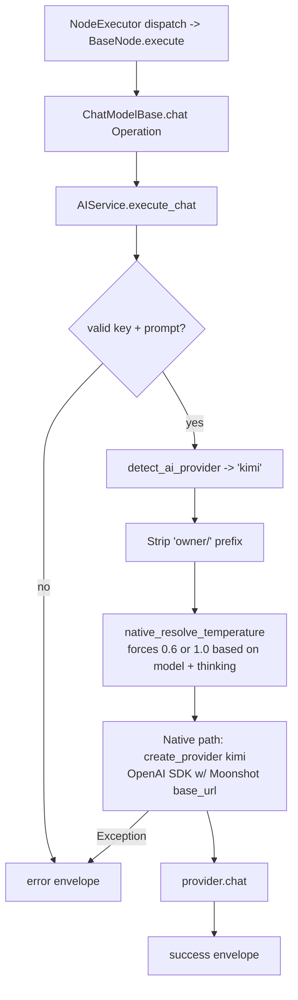

# Kimi Chat Model (`kimiChatModel`)

| Field | Value |
|------|-------|
| **Category** | ai_chat_models |
| **Backend handler** | [`server/nodes/model/kimi_chat_model/__init__.py`](../../../server/nodes/model/kimi_chat_model/__init__.py) (dispatch via `BaseNode.execute()` -> `@Operation("chat")` in [`server/nodes/model/_base.py`](../../../server/nodes/model/_base.py)) |
| **AI service** | [`server/services/ai.py::AIService.execute_chat`](../../../server/services/ai.py) |
| **Tests** | [`server/tests/nodes/test_ai_chat_models.py`](../../../server/tests/nodes/test_ai_chat_models.py) |
| **Skill (if any)** | n/a |
| **Dual-purpose tool** | no (group `('model',)`) |

## Purpose

Kimi models by Moonshot AI (`kimi-k2.6`, `kimi-k2.5`, `kimi-k2.7-code`). 256K context, 96K output. Uses OpenAI-compatible Moonshot endpoint via the native path. `KimiChatModelNode` uses the shared `ChatModelParams` unchanged (no provider override). The `ChatModelBase.chat` operation calls `AIService.execute_chat`.

## Inputs (handles)

| Handle | Connection type | Required | Purpose |
|--------|-----------------|----------|---------|
| `input-main` | main | no | Upstream data; not consumed directly |

## Parameters

| Name | Type | Default | Required | displayOptions.show | Description |
|------|------|---------|----------|---------------------|-------------|
| `prompt` | string | `""` | yes | - | User message |
| `system_prompt` | string | `""` | no | - | System prompt |
| `model` | string | `""` (injected) | no | - | `kimi-k2.6`, `kimi-k2.5`, or `kimi-k2.7-code` |
| `temperature` | number\|null | `null` (**ignored**) | no | - | Provider forces 0.6 (instant) or 1.0 (thinking); user input ignored |
| `max_tokens` | number\|null | `null` (up to 96K) | no | - | 1-200000 |
| `top_p` | number\|null | `1.0` | no | - | |
| `thinking_enabled` | boolean | `false` (Params default) | no | - | Base default is `false`; the provider treats k2.5 as thinking-on unless explicitly disabled |
| `api_key` | string\|null | `null` (injected) | no | - | `auth_service.get_api_key('kimi', 'default')` |

(Kimi uses the shared `ChatModelParams` unchanged; field names are snake_case, unknown keys ignored.)

## Outputs (handles)

| Handle | Shape | Description |
|--------|-------|-------------|
| `output-model` | object | Model output; standard envelope payload |

### Output payload

```ts
{
  response: string;
  thinking: string | null;
  thinking_enabled: boolean;
  model: string;
  provider: 'kimi';
  finish_reason: string;
  timestamp: string;
  input: { prompt: string; system_prompt: string };
}
```

## Logic Flow



## Decision Logic

- **Validation**: missing api_key / empty prompt -> error envelope.
- **Provider routing**: `detect_ai_provider` matches `'kimi' in node_type.lower()`. Ordering guarantees it lands in the kimi lane before groq / openrouter / anthropic / gemini.
- **Fixed temperature**: `native_resolve_temperature` ignores user input for Kimi and forces 0.6 (instant) or 1.0 (thinking).
- **Thinking default-on for k2.5**: if user leaves `thinkingEnabled` unset, k2.5 still thinks. To disable, must pass `thinkingEnabled=false`. This is done explicitly for the tool-calling agent integration (where thinking streams break tool-call parsing).
- **Native path**: uses the OpenAI SDK with Moonshot base_url from `llm_defaults.json`.

## Side Effects

- **Database writes**: none on bare chat path.
- **Broadcasts**: none.
- **External API calls**: `POST https://api.moonshot.ai/v1/chat/completions` (via OpenAI SDK with override).
- **File I/O**: none.
- **Subprocess**: none.

## External Dependencies

- **Credentials**: `auth_service.get_api_key('kimi', 'default')` plus optional `kimi_proxy`.
- **Services**: `services/llm/providers/openai.py` (reused).
- **Python packages**: `openai`.
- **Environment variables**: none.

## Edge cases & known limits

- **Temperature is non-configurable**: any user-supplied `temperature` is overridden. Documented in the prompt help text but easy to miss.
- **Thinking default is ON** for k2.5: contrast with every other chat model, which defaults thinking OFF.
- **Agent compatibility quirk**: when Kimi is used as a tool-calling agent model, `thinkingEnabled` is explicitly forced False because streamed thinking tokens corrupt tool-call JSON. This is handled in the agent path, not here.
- **256K context / 96K output**: largest of the native providers.
- **Errors swallowed into envelope**.

## Related

- **Peer nodes**: see the other chat-model docs in this folder.
- **Architecture docs**: [Native LLM SDK](../../native_llm_sdk.md).
