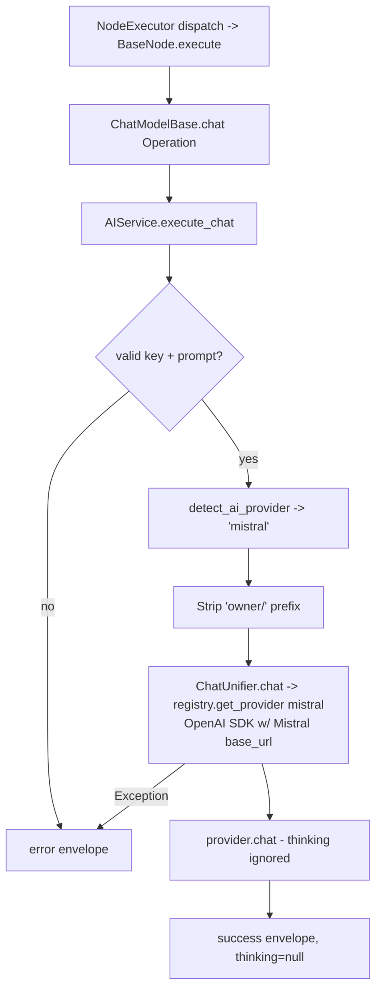

# Mistral Chat Model (`mistralChatModel`)

| Field | Value |
|------|-------|
| **Category** | ai_chat_models |
| **Backend handler** | [`server/nodes/model/mistral_chat_model/__init__.py`](../../../server/nodes/model/mistral_chat_model/__init__.py) (dispatch via `BaseNode.execute()` -> `@Operation("chat")` in [`server/nodes/model/_base.py`](../../../server/nodes/model/_base.py)) |
| **AI service** | [`server/services/ai.py::AIService.execute_chat`](../../../server/services/ai.py) |
| **Tests** | [`server/tests/nodes/test_ai_chat_models.py`](../../../server/tests/nodes/test_ai_chat_models.py) |
| **Skill (if any)** | n/a |
| **Dual-purpose tool** | no (group `('model',)`) |

## Purpose

Mistral AI models (`mistral-large-latest`, `mistral-medium-latest`, `mistral-small-latest`, `codestral-latest`). Up to 256K context, 131K output. No thinking/reasoning support. Uses OpenAI-compatible Mistral endpoint via native path. `MistralChatModelNode` uses the shared `ChatModelParams` unchanged. The `ChatModelBase.chat` operation calls `AIService.execute_chat`.

## Inputs (handles)

| Handle | Connection type | Required | Purpose |
|--------|-----------------|----------|---------|
| `input-main` | main | no | Upstream data; not consumed directly |

## Parameters

| Name | Type | Default | Required | displayOptions.show | Description |
|------|------|---------|----------|---------------------|-------------|
| `prompt` | string | `""` | yes | - | User message |
| `system_prompt` | string | `""` | no | - | System prompt |
| `model` | string | `""` (injected) | no | - | `mistral-large-latest`, `mistral-medium-latest`, `mistral-small-latest`, `codestral-latest` |
| `temperature` | number\|null | `null` | no | - | Narrower range than OpenAI (0-1.5) |
| `max_tokens` | number\|null | `null` (up to 131K) | no | - | 1-200000 |
| `top_p` | number\|null | `1.0` | no | - | |
| `api_key` | string\|null | `null` (injected) | no | - | `auth_service.get_api_key('mistral', 'default')` |

(Mistral uses the shared `ChatModelParams` unchanged; field names are snake_case, unknown keys ignored.)

## Outputs (handles)

| Handle | Shape | Description |
|--------|-------|-------------|
| `output-model` | object | Model output; standard envelope payload |

### Output payload

```ts
{
  response: string;
  thinking: null;            // Mistral does not support thinking
  thinking_enabled: false;
  model: string;
  provider: 'mistral';
  finish_reason: string;
  timestamp: string;
  input: { prompt: string; system_prompt: string };
}
```

## Logic Flow



## Decision Logic

- **Validation**: missing api_key / empty prompt -> error envelope.
- **Provider routing**: `detect_ai_provider` matches `'mistral' in node_type.lower()` early, before other providers.
- **Temperature clamp**: 0-1.5 (narrower than OpenAI).
- **No thinking**: `thinkingEnabled` is silently ignored (Mistral API has no equivalent parameter). `thinking` always returns null.
- **Native path**: uses OpenAI SDK with Mistral base_url from `llm_defaults.json`.

## Side Effects

- **Database writes**: none on bare chat path.
- **Broadcasts**: none.
- **External API calls**: `POST https://api.mistral.ai/v1/chat/completions` (via OpenAI SDK w/ override).
- **File I/O**: none.
- **Subprocess**: none.

## External Dependencies

- **Credentials**: `auth_service.get_api_key('mistral', 'default')` plus optional `mistral_proxy`.
- **Services**: `services/llm/providers/openai.py` (reused).
- **Python packages**: `openai`.
- **Environment variables**: none.

## Edge cases & known limits

- **No reasoning support**: `thinkingEnabled` / `thinkingBudget` / `reasoningEffort` / `reasoningFormat` are all silently ignored. The UI may still surface these fields because the parameter factory is shared.
- **Temperature capped at 1.5** (not 2).
- **Codestral is code-specialized**: prompts that assume chat behavior may produce different output patterns.
- **Errors swallowed into envelope**.

## Related

- **Peer nodes**: see the other chat-model docs in this folder.
- **Architecture docs**: [Native LLM SDK](../../native_llm_sdk.md).
