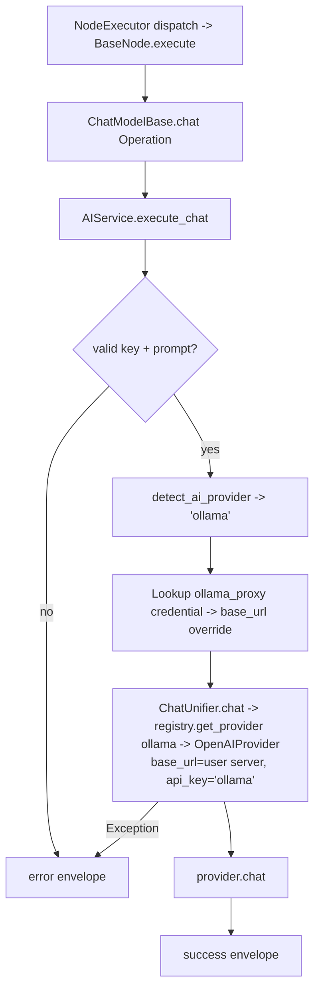

# Ollama Chat Model (`ollamaChatModel`)

| Field | Value |
|------|-------|
| **Category** | ai_chat_models |
| **Backend handler** | [`server/nodes/model/ollama_chat_model/__init__.py`](../../../server/nodes/model/ollama_chat_model/__init__.py) (dispatch via `BaseNode.execute()` -> `@Operation("chat")` in [`server/nodes/model/_base.py`](../../../server/nodes/model/_base.py)) |
| **AI service** | [`server/services/ai.py::AIService.execute_chat`](../../../server/services/ai.py) |
| **Tests** | [`server/tests/nodes/test_ai_chat_models.py`](../../../server/tests/nodes/test_ai_chat_models.py) |
| **Skill (if any)** | n/a |
| **Dual-purpose tool** | no (group `('model',)`) |

## Purpose

Run local LLMs (llama, mistral, qwen, deepseek-r1, ...) through a locally-running Ollama server. Ollama exposes an OpenAI-shaped `/v1` endpoint, so the OpenAI-compatible spec registered in `services/llm/providers/_compat.py` hands it to `OpenAIProvider` with `base_url` from `llm_defaults.json` — same path as deepseek/kimi/mistral. The user's custom server URL (if not localhost) is stored as the `ollama_proxy` credential and flows through the same `proxy_url` parameter cloud providers already use for Ollama-style auth delegation. `OllamaChatModelNode` uses the shared `ChatModelParams` unchanged. The `ChatModelBase.chat` operation calls `AIService.execute_chat`.

## Inputs (handles)

| Handle | Connection type | Required | Purpose |
|--------|-----------------|----------|---------|
| `input-main` | main | no | Upstream data; not consumed directly |

## Parameters

| Name | Type | Default | Required | displayOptions.show | Description |
|------|------|---------|----------|---------------------|-------------|
| `prompt` | string | `""` | yes | - | User message |
| `system_prompt` | string | `""` | no | - | System prompt |
| `model` | string | `""` (injected) | no | - | Whatever the user has pulled, e.g. `qwen2.5`, `llama3.x`, `deepseek-r1`. Open-world: name not pattern-checked by `is_model_valid_for_provider` |
| `temperature` | number\|null | `null` | no | - | 0-2 |
| `max_tokens` | number\|null | `null` | no | - | 1-200000; default per-loaded-model ctx ÷ 4 (capped 4096) |
| `top_p` | number\|null | `1.0` | no | - | |
| `api_key` | string\|null | `null` -> placeholder `"ollama"` | no | - | Optional; local servers usually run with no auth. `OllamaCredential.resolve()` returns `"ollama"` when none stored |

(Ollama uses the shared `ChatModelParams` unchanged; field names are snake_case, unknown keys ignored.)

## Outputs (handles)

| Handle | Shape | Description |
|--------|-------|-------------|
| `output-model` | object | Model output (also feeds an agent's `input-model` handle); standard envelope payload |

### Output payload

```ts
{
  response: string;
  thinking: string | null;   // per-model; Ollama has no generic thinking knob
  thinking_enabled: boolean;
  model: string;
  provider: 'ollama';
  finish_reason: string;
  timestamp: string;
  input: { prompt: string; system_prompt: string };
}
```

Wrapped in `{ success, node_id, node_type, result, execution_time }`.

## Logic Flow



## Decision Logic

- **Validation**: empty prompt -> error envelope. `api_key` is never the blocker — `OllamaCredential.resolve()` returns the placeholder `"ollama"` when no key is stored, so the central "API key required" check in `execute_chat` passes.
- **Provider routing**: `detect_ai_provider` MUST list `ollama` (in `server/constants.py`) or the node falls through to `'openai'` and `execute_chat` hits api.openai.com with the placeholder key.
- **Open-world model name**: `is_model_valid_for_provider` returns `True` for `ollama` so local model names like `qwen/qwen3.6-27b` are not rejected by the cloud-style pattern check.
- **Base URL routing**: `ollama_proxy` credential carries the user's server URL into `OpenAIProvider.base_url`; traffic stays on `localhost`.
- **No thinking knob**: the shared `thinking_enabled` field is present but generic Ollama has no per-call thinking parameter; reasoning is per-model.

## Side Effects

- **Database writes**: per-model context params persist in `EncryptedAPIKey.models["model_params"]` and `model_registry.json` at credential-validation time (via `_local_validator.py` + `model_registry.register_local_model()`), not on the bare chat path.
- **Broadcasts**: none on the bare chat path.
- **External API calls**: `POST {user_server}/v1/chat/completions` via the `openai` SDK with overridden `base_url` (default `http://localhost:11434/v1`).
- **File I/O**: none.
- **Subprocess**: none.

## External Dependencies

- **Credentials**: optional `auth_service.get_api_key('ollama')`; user server URL stored as `ollama_proxy`.
- **Services**: `services/llm/providers/openai.py` (reused with Ollama base_url); `nodes/model/_local_validator.py` (SDK probe via `ollama.AsyncClient.ps()`).
- **Python packages**: `openai`, `ollama>=0.6.0` (validation only).
- **Environment variables**: none.

## Edge cases & known limits

- **Server must be running**: requests go to the user's local Ollama server; if it is down the request surfaces as a connection error in the envelope.
- **Provider routing dependency**: `ollama` must be present in `detect_ai_provider` AND in each agent's `provider` Literal, or the node silently falls back to OpenAI cloud.
- **Max output default**: ctx ÷ 4, capped at 4096, unless the user overrides `max_tokens`.
- **Per-model params survive restart**: written through to `model_registry.json` so context length is known without re-clicking Fetch.
- **Errors swallowed into envelope** on the chat path.

## Related

- **Peer nodes**: [`lmstudioChatModel`](./lmstudioChatModel.md) (other local-server provider), and the cloud chat-model docs in this folder.
- **Architecture docs**: [Native LLM SDK](../../native_llm_sdk.md).
