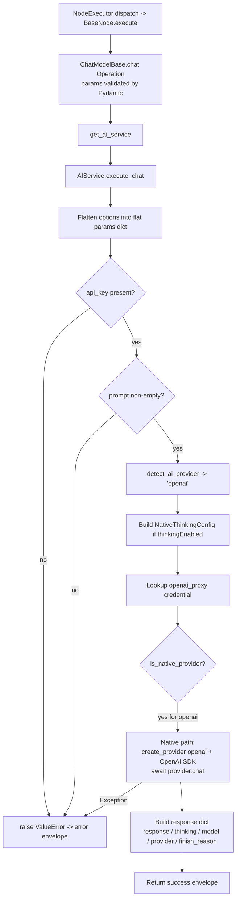

# OpenAI Chat Model (`openaiChatModel`)

| Field | Value |
|------|-------|
| **Category** | ai_chat_models |
| **Backend handler** | [`server/nodes/model/openai_chat_model/__init__.py`](../../../server/nodes/model/openai_chat_model/__init__.py) (dispatch via `BaseNode.execute()` -> `@Operation("chat")` in [`server/nodes/model/_base.py`](../../../server/nodes/model/_base.py)) |
| **AI service** | [`server/services/ai.py::AIService.execute_chat`](../../../server/services/ai.py) |
| **Tests** | [`server/tests/nodes/test_ai_chat_models.py`](../../../server/tests/nodes/test_ai_chat_models.py) |
| **Skill (if any)** | n/a |
| **Dual-purpose tool** | yes - tool name `openai_chat_model` (advisor; `usable_as_tool = True`, group `('model', 'tool')`) |

## Purpose

Single-turn chat completion against the OpenAI REST API. Used either as a standalone workflow node (user enters a prompt, the node produces a response), wired into an AI Agent via the `input-model` handle, or connected as an advisor tool (`usable_as_tool = True`). Every chat-model node runs through the shared `ChatModelBase.chat` operation (in `_base.py`), which calls `AIService.execute_chat`; per-provider differences live inside `execute_chat` (native SDK for OpenAI) and in the clamp / temperature helpers.

## Inputs (handles)

| Handle | Connection type | Required | Purpose |
|--------|-----------------|----------|---------|
| `input-main` | main | no | Upstream data; not consumed directly by the handler - prompt must be passed via `parameters` or template-resolved upstream |

## Parameters

| Name | Type | Default | Required | displayOptions.show | Description |
|------|------|---------|----------|---------------------|-------------|
| `prompt` | string | `""` | yes (non-empty) | - | User message content sent to the model |
| `system_prompt` | string | `""` | no | - | System prompt |
| `model` | string | `""` (injected from stored models) | no | - | Model ID. `[FREE] ` prefix is stripped before the API call |
| `temperature` | number\|null | `null` -> `agent.default_temperature` | no | - | 0-2 for most OpenAI models; o-series (o1/o3/o4) force temperature=1 |
| `max_tokens` | number\|null | `null` -> per-model default | no | - | 1-200000; clamped via `_resolve_max_tokens` to the model's actual ceiling |
| `top_p` | number\|null | `1.0` | no | - | Nucleus sampling |
| `frequency_penalty` | number\|null | `0.0` | no | - | -2.0 to 2.0 |
| `presence_penalty` | number\|null | `0.0` | no | - | -2.0 to 2.0 |
| `response_format` | enum | `text` | no | - | `text` or `json_object` |
| `thinking_enabled` | boolean | `false` | no | - | Turn on extended reasoning (GPT-5 hybrid / o-series) |
| `reasoning_effort` | enum | `medium` | no | `thinking_enabled=[true]` | `minimal` / `low` / `medium` / `high` (OpenAI override adds `minimal`) |
| `api_key` | string\|null | `null` (injected) | no | - | `auth_service.get_api_key('openai', 'default')` |

(Field names are snake_case on `OpenAIChatModelParams`; `model_config = ConfigDict(extra="ignore")` drops unknown keys.)

## Outputs (handles)

| Handle | Shape | Description |
|--------|-------|-------------|
| `output-model` | object | Model output (also feeds an agent's `input-model` handle); standard envelope payload (see below) |

### Output payload

```ts
{
  response: string;
  thinking: string | null;
  thinking_enabled: boolean;
  model: string;
  provider: 'openai';
  finish_reason: string;
  timestamp: string;  // ISO 8601
  input: { prompt: string; system_prompt: string };
}
```

Wrapped in the standard envelope: `{ success: true, node_id, node_type, result: <payload>, execution_time: number }`.

## Logic Flow



## Decision Logic

- **Validation**: missing `api_key` -> ValueError; empty/whitespace `prompt` (via `is_valid_message_content`) -> ValueError. Both produce a `success=false` envelope.
- **Provider routing**: `detect_ai_provider(node_type)` returns `'openai'` for this node; falls through the else branch in `constants.detect_ai_provider`.
- **Native vs LangChain**: `is_native_provider('openai')` is True, so the native `openai` SDK is used via `create_provider('openai', api_key, proxy_url=...)`.
- **Model string scrubbing**: strips `[FREE] ` prefix if present. For non-OpenRouter providers (like this one), any `provider/model` slash prefix is stripped so the OpenAI API sees a flat ID.
- **Thinking config**: only built when `thinkingEnabled` is truthy; passed through to the provider's `chat()` method.
- **System prompt**: accepts `system_prompt`, `systemMessage`, or `systemPrompt`. Only prepended as a `SystemMessage` when non-empty (`is_valid_message_content`).
- **Error path**: any exception in the chat flow is caught, logged, and returned as `success=false` with `error: <str>`.

## Side Effects

- **Database writes**: none directly in the happy path. `_track_token_usage` (invoked elsewhere in the AI service when memory is attached) writes `TokenUsageMetric` rows; for a bare chat model node with no memory this path is typically not exercised from `execute_chat`.
- **Broadcasts**: none from `execute_chat` itself.
- **External API calls**: one HTTPS call to `https://api.openai.com/v1/chat/completions` via the `openai` Python SDK (base URL configured in `server/config/llm_defaults.json`; overridable via `{provider}_proxy` credential for Ollama-style routing).
- **File I/O**: none.
- **Subprocess**: none.

## External Dependencies

- **Credentials**: `auth_service.get_api_key('openai', 'default')` (API key); optional `auth_service.get_api_key('openai_proxy')` for proxy URL override.
- **Services**: `AIService` (wired via `NodeExecutor.__init__`), `services/llm/providers/openai.py` (native provider).
- **Python packages**: `openai` (native SDK).
- **Environment variables**: none (keys are DB-stored).

## Edge cases & known limits

- **O-series fixed temperature**: `o1`, `o3`, `o3-mini`, `o4-mini` accept only `temperature=1`; `_resolve_temperature` (and its native counterpart) clamps regardless of input.
- **GPT-5 hybrid reasoning**: `reasoningEffort` (`minimal` / `low` / `medium` / `high`) is consumed via `NativeThinkingConfig.effort` and forwarded to the provider SDK. Without `thinkingEnabled=true` the effort value is ignored.
- **Reasoning summary availability**: the content of `thinking` for o-series models is gated on OpenAI org verification - unverified orgs get `thinking=null` even with `reasoningEffort` set.
- **`maxTokens` clamp**: clamped to the model's actual output ceiling by `native_resolve_max_tokens`. Exceeding the limit silently caps without error.
- **All errors are swallowed into the envelope**: any exception (HTTP, timeout, auth, JSON parse) becomes `success=false, error=str(e)`. The handler never raises.
- **No streaming**: `execute_chat` is single-shot; the full response is awaited before returning.
- **Pricing / token tracking**: standalone chat model nodes do NOT trigger `_track_token_usage` - that lives on the agent code paths. Cost attribution for bare chat-model executions is therefore not recorded.

## Related

- **Peer nodes** (same handler): [`anthropicChatModel`](./anthropicChatModel.md), [`geminiChatModel`](./geminiChatModel.md), [`openrouterChatModel`](./openrouterChatModel.md), [`groqChatModel`](./groqChatModel.md), [`cerebrasChatModel`](./cerebrasChatModel.md), [`deepseekChatModel`](./deepseekChatModel.md), [`kimiChatModel`](./kimiChatModel.md), [`mistralChatModel`](./mistralChatModel.md).
- **Architecture docs**: [Native LLM SDK](../../native_llm_sdk.md), [Credentials Encryption](../../credentials_encryption.md), [Pricing Service](../../pricing_service.md).
