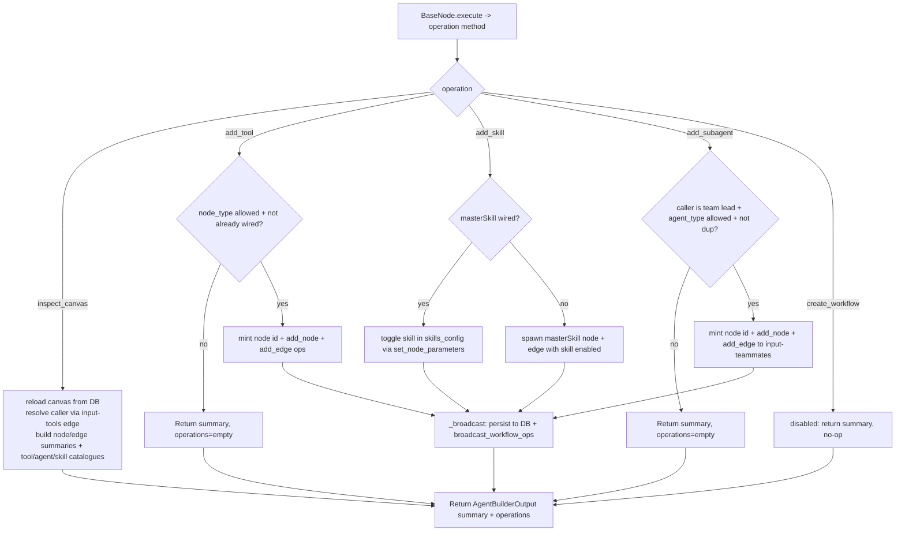

# Agent Builder (`agentBuilder`)

| Field | Value |
|------|-------|
| **Category** | ai_tools (dedicated AI tool, group `("tool", "ai")`) |
| **Backend handler** | [`server/nodes/tool/agent_builder/__init__.py`](../../../server/nodes/tool/agent_builder/__init__.py) — `AgentBuilderNode`, dispatched via `BaseNode.execute()` + one `@Operation` per canvas mutation (`inspect_canvas` / `add_tool` / `add_skill` / `add_subagent` / `create_workflow`) |
| **Tests** | [`server/tests/nodes/test_ai_tools.py`](../../../server/tests/nodes/test_ai_tools.py) |
| **Skill (if any)** | [`server/skills/assistant/agent-builder-skill/SKILL.md`](../../../server/skills/assistant/agent-builder-skill/SKILL.md) |
| **Dual-purpose tool** | tool-only — `ToolNode` exposed to the LLM as `agent_builder` (`tool_name` class attr) |

## Purpose

Runtime canvas-mutation tool. Wired to an AI agent's `input-tools` handle, it
lets the LLM inspect the live workflow canvas and grow its own toolset mid-run:
spawn tool nodes, enable skills on a Master Skill, add delegate agents (team
leads only), or create a fresh workflow. One node, one `Params` model with an
`operation: Literal[...]` discriminator, five `@Operation` methods — the LLM
sees ONE tool with a select-style `operation` field. Each mutation persists to
the DB and pushes a `workflow_ops_apply` event so the React Flow canvas updates
live.

## Inputs (handles)

| Handle | Connection type | Required | Purpose |
|--------|-----------------|----------|---------|
| `input-main` | main | no | Passive node - connect `output-tool` to an AI Agent's `input-tools`. Operations walk `ctx.edges` (via `needs_canvas = True`) to resolve the calling agent and mutate the canvas. |

## Parameters

The `AgentBuilderParams` model fields ARE the LLM-provided tool args (no
separate `toolName` / `toolDescription` node params — those live on the class
as `tool_name` / `tool_description`). `model_config = ConfigDict(extra="ignore")`.

| Name | Type | Default | Required | displayOptions.show | Description |
|------|------|---------|----------|---------------------|-------------|
| `operation` | enum | `inspect_canvas` | no | - | One of `inspect_canvas`, `add_tool`, `add_skill`, `add_subagent`, `create_workflow` |
| `node_type` | string | `""` | no | `operation == add_tool` | Tool node type to spawn (must be a registered `component_kind="tool"` or `usable_as_tool=True` node, minus the allowlist blocklist) |
| `skill_folder` | string | `""` | no | `operation == add_skill` | Skill folder name under `server/skills/**` |
| `agent_type` | string | `""` | no | `operation == add_subagent` | Agent node type to spawn as a teammate (caller must be a team lead) |
| `workflow_name` | string | `""` | no | `operation == create_workflow` | Display name (create_workflow is currently disabled) |
| `workflow_description` | string | `""` | no | `operation == create_workflow` | Optional one-line description |

## Outputs (handles)

| Handle | Shape | Description |
|--------|-------|-------------|
| `output-tool` | object | `AgentBuilderOutput` model (`extra="allow"`), serialized per `BaseNode._serialize_result` |

### Output payload (TypeScript shape)

```ts
{
  operation?: string;
  summary?: string;
  operations?: Array<Record<string, unknown>>;  // workflow-ops batch applied
  // inspect_canvas extras:
  nodes?: Array<{ id; type; label; key_params }>;
  edges?: Array<{ source; target; source_handle; target_handle }>;
  you?: { node_id: string; incoming: unknown[]; outgoing: unknown[] };
  available_tools?: Array<{ type; display_name; description }>;
  available_agents?: Array<{ type; display_name; description }>;
  available_skills?: Array<{ folder; name; description }>;
  // create_workflow extras:
  workflow_id?: string;
}
```

## Logic Flow



## Decision Logic

- **Caller resolution**: walks edges for `source == self_id && targetHandle == input-tools`; falls back to self as caller (standalone Run).
- **Live canvas reload**: `_load_live_canvas` re-reads `workflow.data` from the DB so successive ops in the same run see each other's mutations (the per-tool `ctx` snapshot is frozen at MachinaWorkflow start).
- **Allowlist gating**: `_allowed_tool_types` / `_allowed_subagent_types` honor `node_allowlist.json` (`disabled_nodes` / `disabled_groups`); `_DENIED_TOOL_TYPES` (`agentBuilder`, `masterSkill`) are never spawnable (recursion guard).
- **Idempotency**: `add_tool` / `add_subagent` / `add_skill` are no-ops (empty `operations`) when the target is already wired/enabled, surfacing the existing node id in the summary.
- **add_subagent gate**: only team leads (`orchestrator_agent`, `ai_employee`) may spawn delegates; cannot spawn another team lead.
- **create_workflow disabled**: `_CREATE_WORKFLOW_ENABLED = False` short-circuits with a "temporarily disabled" summary; the implementation body is intact for one-line re-enable.
- **Summary suffix**: depends on `ctx.raw["auto_rebind_tools"]` (UserSettings) — "Available immediately" when auto-rebind is on, else "Available on your next turn" (the agent loop binds tools at turn start, so a mid-run mutation is callable next turn unless auto-rebind rebinds it in place).

## Side Effects

- **Database writes**: `_persist_canvas_mutation` applies `add_node` / `add_edge` / `set_node_parameters` ops to `workflow.data` via `database.get_workflow` + `database.save_workflow` (adopts the BE-minted `minted_id` so FE/BE node ids align). `create_workflow` (when enabled) persists a fresh workflow row.
- **Broadcasts**: `broadcast_workflow_ops` (in `_events.py`) emits a flat `workflow_ops_apply` WS frame consumed by the frontend `useWorkflowOpsListener` hook. NOT a `dispatch.emit` event (no Temporal/event_waiter consumer for canvas mutations). A `WorkflowEvent` envelope (`com.machinaos.workflow.ops.applied`) is constructed for parity but not put on the wire today.
- **External API calls**: none.
- **File I/O**: reads `server/skills/**` to validate skill folders (`_skill_folder_exists`) and catalogue skills.
- **Subprocess**: none.

## External Dependencies

- **Credentials**: none.
- **Services**: `database` (via `services.plugin.deps.get_database`), `NodeAllowlistService`, `SkillLoader`, `services.node_registry.registered_node_classes`, `services.workflow_ops`, `services.workflow_naming`.
- **Python packages**: stdlib only.
- **Environment variables**: none.

## Edge cases & known limits

- `create_workflow` is disabled behind `_CREATE_WORKFLOW_ENABLED`; the operation returns a guidance summary and performs no mutation.
- Mid-run mutations are not callable in the SAME turn unless the user's "Auto-Rebind Tools After Canvas Changes" toggle is on (default) — otherwise the LLM must wait for its next turn.
- `inspect_canvas` is read-only and emits no `operations`.
- Persist failures are logged at WARN (`exc_info=True`) and do not abort the broadcast — the canvas may diverge from the DB if persistence fails mid-mutation.
- The `workflow_ops_apply` wire format is flat (`{workflow_id, caller_node_id, operations}`) for FE back-compat, not the CloudEvents envelope.

## Related

- **Sibling tools**: [`calculatorTool`](./calculatorTool.md), [`currentTimeTool`](./currentTimeTool.md), [`duckduckgoSearch`](./duckduckgoSearch.md), [`taskManager`](./taskManager.md), [`writeTodos`](./writeTodos.md)
- **Skill using this tool**: [`agent-builder-skill/SKILL.md`](../../../server/skills/assistant/agent-builder-skill/SKILL.md)
- **Architecture docs**: [Workflow Ops Protocol](../../workflow_ops_protocol.md), [Agent Architecture](../../agent_architecture.md), [Node Creation Guide](../../node_creation.md)
