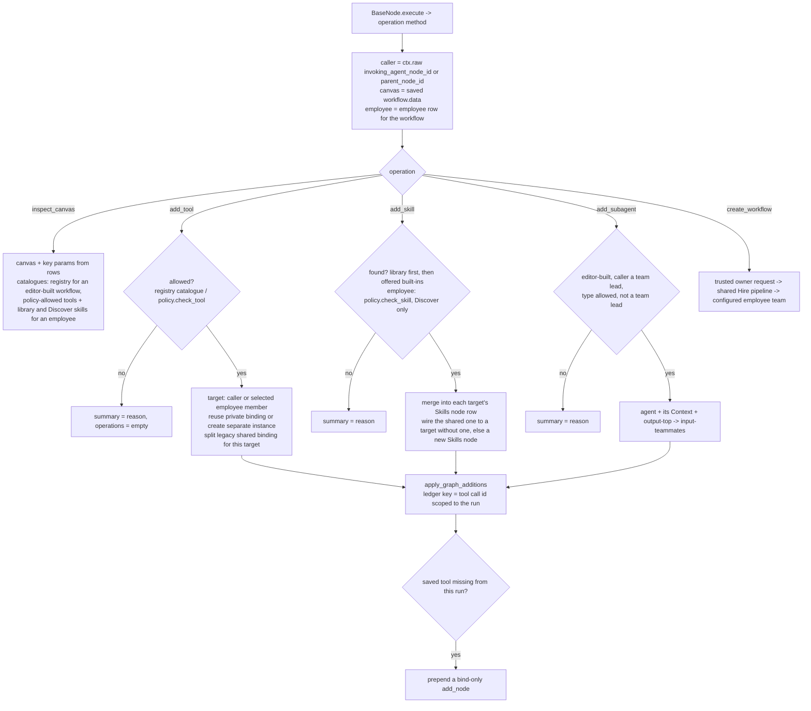

# Agent Builder (`agentBuilder`)

| Field | Value |
|------|-------|
| **Category** | ai_tools (dedicated AI tool, group `("tool", "ai")`) |
| **Backend handler** | [`server/nodes/tool/agent_builder/__init__.py`](../../../server/nodes/tool/agent_builder/__init__.py) — `AgentBuilderNode`, dispatched via `BaseNode.execute()` + one `@Operation` per action (`inspect_canvas` / `add_tool` / `add_skill` / `add_subagent` / `create_workflow`) |
| **Tests** | [`test_agent_builder.py`](../../../server/tests/nodes/test_agent_builder.py) (editor-built workflows), [`test_agent_builder_employee.py`](../../../server/tests/nodes/test_agent_builder_employee.py) (hired employees), [`test_agent_builder_atomic_ops.py`](../../../server/tests/nodes/test_agent_builder_atomic_ops.py) (ledger, retries), [`test_rebind_filters.py`](../../../server/tests/services/test_rebind_filters.py) |
| **Skill (if any)** | [`server/skills/assistant/agent-builder-skill/SKILL.md`](../../../server/skills/assistant/agent-builder-skill/SKILL.md) |
| **Dual-purpose tool** | tool-only — `ToolNode` exposed to the LLM as `agent_builder` (`tool_name` class attr) |

## Purpose

Lets the agent it is wired to inspect the workflow canvas and add to it while
it runs: tools, skills, and (team leads only) teammates. One node, one
`Params` model with an `operation: Literal[...]` discriminator, multiple
`@Operation` methods; the LLM sees one tool with a select-style `operation`
field.

Read-only `inspect_node`, `search_docs`, and `read_doc` operations expose
current plugin contracts and a manifest of shipped project Markdown.
Inspection includes live parameter/output schemas, handles, credential IDs,
locked fields, availability and related documents, without stored secrets.
Search is capped at 50 results; reads at 24000 characters with continuation
offsets. Relative document links resolve within the manifest; arbitrary paths
cannot be read. Archived documents are marked and ranked after current docs.
Live schemas take precedence over conflicting prose. The distribution bundle
is generated by `server/services/builder_documentation.py` into
`server/resources/builder_documentation.json`.

Tool/member reuse is checked again inside the graph mutation transaction.
Concurrent requests cannot bind duplicate same-type callable identities;
intentional custom `aiAgent` teammates remain repeatable. Added specialists
inherit the lead's model and receive purpose, private Context, validated scoped
tools and selected skills. Use the intrinsic Task Manager for durable mission,
context, dependencies, acceptance criteria, and lead review.

Every change is saved through
[`services/workflow_storage/mutate.py`](../../../server/services/workflow_storage/mutate.py)
`apply_graph_additions`, the server's one path for growing a saved workflow
(Turn on Talk uses it too): one transaction, canonical ids, labels unique
against the graph, the edge handles of
[`services/graph_build.py`](../../../server/services/graph_build.py), real
`NodeParameter` rows, and a `workflow_ops_apply` push with `persisted: true`
so an open editor adopts the change without saving it.

On a hired employee (the workflow has an employee row) it applies the rule
Hire applies, [`services/employees/policy.py`](../../../server/services/employees/policy.py),
which is how an employee extends itself from Talk.

## Inputs (handles)

| Handle | Connection type | Required | Purpose |
|--------|-----------------|----------|---------|
| `input-main` | main | no | Passive node — connect `output-tool` to an AI agent's `input-tools`. `needs_canvas = True` hands the run's canvas to the tool call, which `add_tool` compares with the saved graph. |

## Parameters

The `AgentBuilderParams` model fields ARE the LLM-provided tool args.
`model_config = ConfigDict(extra="ignore")`.

| Name | Type | Default | Required | displayOptions.show | Description |
|------|------|---------|----------|---------------------|-------------|
| `operation` | enum | `inspect_canvas` | no | - | `inspect_canvas`, `inspect_node`, `search_docs`, `read_doc`, `plan_update`, `apply_update`, `add_tool`, `add_skill`, `add_subagent`, `create_workflow` |
| `node_type` | string | `""` | no | `operation == add_tool` | Tool node type, from `available_tools` |
| `app_id` | string | `""` | no | `operation == add_tool` | The tool's app, when its `available_tools` entry names one: required for a type several apps share (each custom connector is its own app) |
| `target_member_id` | string | `""` | no | - | Employee member receiving the tool; defaults to the caller. Must belong to this employee, including legacy employees. |
| `skill_name` | string | `""` | no | `operation == add_skill` | Skill name (SKILL.md frontmatter `name`, or a library skill's name), from `available_skills` |
| `agent_type` | string | `""` | no | `operation == add_subagent` | Agent node type to add as a teammate (caller must be a team lead) |
| `workflow_name` | string | `""` | no | `operation == create_workflow` | Employee display name for the shared Hire pipeline |
| `workflow_description` | string | `""` | no | `operation == create_workflow` | Optional one-line description |

## Outputs (handles)

| Handle | Shape | Description |
|--------|-------|-------------|
| `output-tool` | object | `AgentBuilderOutput` model (`extra="allow"`), serialized per `BaseNode._serialize_result` |

### Output payload (TypeScript shape)

```ts
{
  operation?: string;
  // One plain sentence on an employee refusal: the agent passes it on.
  summary?: string;
  // add_tool / add_subagent: the ops this call saved (as announced), plus a
  // saved tool the calling agent's run lacks. The agent loop binds every tool
  // add_node here. Empty for add_skill.
  operations?: Array<Record<string, unknown>>;
  // inspect_canvas extras:
  nodes?: Array<{ id; type; label; key_params }>;
  edges?: Array<{ source; target; source_handle; target_handle }>;
  you?: { node_id: string; incoming: unknown[]; outgoing: unknown[] } | null;
  employee?: { asks_first: boolean; agents: string[] };   // hired employees only
  available_tools?: Array<{ type; display_name; description; app?; connected?; read_only? }>;
  available_agents?: Array<{ type; display_name; description }>;
  available_skills?: Array<{ name; description }>;
  // create_workflow extras:
  workflow_id?: string;
}
```

## Logic Flow


```mermaid
flowchart TD
  A[BaseNode.execute -> operation method] --> C[caller = ctx.raw invoking_agent_node_id or parent_node_id<br/>canvas = saved workflow.data<br/>employee = employee row for the workflow]
  C --> R{operation}
  R -- inspect_canvas --> I[canvas + key params from rows<br/>catalogues: registry for an editor-built workflow,<br/>policy-allowed tools + library and Discover skills for an employee]
  R -- add_tool --> T{allowed?<br/>registry catalogue / policy.check_tool}
  T -- no --> Tn[summary = reason, operations = empty]
  T -- yes --> Tp[target: caller or selected employee member<br/>reuse private binding or create separate instance<br/>split legacy shared binding for this target]
  Tp --> S[apply_graph_additions<br/>ledger key = tool call id scoped to the run]
  S --> Tb{saved tool missing from this run?}
  Tb -- yes --> Tbo[prepend a bind-only add_node]
  R -- add_skill --> K{found? library first, then offered built-ins<br/>employee: policy.check_skill, Discover only}
  K -- no --> Kn[summary = reason]
  K -- yes --> Kp[merge into each target's Skills node row<br/>wire the shared one to a target without one, else a new Skills node]
  Kp --> S
  R -- add_subagent --> G{editor-built, caller a team lead,<br/>type allowed, not a team lead}
  G -- no --> Gn[summary = reason]
  G -- yes --> Gp[agent + its Context + output-top -> input-teammates]
  Gp --> S
  R -- create_workflow --> W[trusted owner request -> shared Hire pipeline -> configured employee team]
```

## Decision Logic

- **Caller**: `ctx.raw["invoking_agent_node_id"]` (Temporal) or
  `ctx.raw["parent_node_id"]` (every path), never guessed from edges: one
  Agent Builder node can serve several agents. In an editor-built workflow
  the caller is the target, so with none nothing is added ("Only an agent can
  ask me to add things."); an employee's tool target is `target_member_id`
  or the caller, validated against its `node_roles` for both legacy and team
  employees. Membership is checked again during the mutation transaction.
- **Saved graph**: operations read `workflow.data` fresh, so calls in one run
  see each other. A workflow that is not saved, or whose caller is not in the
  saved graph yet, gets "Save the workflow first".
- **Ledger**: the mutation id is `agent-builder:<execution_id>:<tool_call_id>`
  (the request's hash when the runtime passes no call id). Every mutating call
  goes through `apply_graph_additions`, even with nothing to add, so a retried
  call replays the first attempt's result (and announces it again) instead of
  adding twice.
- **Editor-built workflow**: tools from `_allowed_tool_types()` (ToolNodes and
  `usable_as_tool` plugins, no chat models, minus `agentBuilder` /
  `masterSkill` / `taskManager` and the allowlist's `disabled_nodes` /
  `disabled_groups`); skills from the SkillLoader registry outside
  `disabled_skill_folders`, plus the owner's library. The target is the
  caller.
- **Hired employee**: tools go to one selected member, with no fanout to
  other workers or Talk. `check_tool` decides tools
  (the apps' tools, the registry's and the owner's own through
  `Connections.apps`, and the tools every hire gets; nothing that sends or
  spends while asking first, the browser read-only then; hire allowlist;
  connected apps); the Clock gets the owner's `profile_timezone`. A type
  whose app a parameter names (`app_field`: the Custom Connector) is listed
  once per app with its `app_id`, needs it in `add_tool`, and counts as the
  target's tool only on a node naming the same app.
  `check_skill` refuses `skill` and `*-personality`; skills come from the
  library (all of it, on or off for new hires) and the Discover folder
  (`server/skills/employee/`), text copied in. `add_subagent` is refused.
- **One concrete tool owner**: a same-type tool on another member is never
  attached to this target. The target reuses its private node or receives a
  fresh node. Ownership and parameter rows are read inside the mutation
  transaction. A legacy shared binding is replaced only for this target with
  a separate configured instance; the old node, settings and other targets'
  edges remain intact. Different agents may have independent same-type nodes.
  An active snapshot retaining the shared callable receives no new binding
  during repair, avoiding duplicate names; the result reports saved access
  with `available_in_run: false` until Apply or a clean run.
- **Bind-only**: a deployed run starts from the generation's frozen snapshot.
  A tool saved earlier (an earlier message) but missing from this run's canvas
  comes back as an `add_node` op with the saved id and row, and nothing is
  saved or announced, so the agent can call it now instead of hearing
  "already wired".
- **Skills**: each target's Skills node gets the entry; a target without one
  is wired to the shared node (never a second: two on one agent collide on
  the Skill tool's own entry), else a new Skills node (`Skills` for an
  employee, `Master Skill` otherwise). An enabled skill changes nothing. A
  built-in keeps no text in an editor-built workflow (edits to its SKILL.md
  apply); a library skill always carries its text (the runtime's fallback
  reads files only).
- **When it works**: a tool is bound for the rest of the calling agent's run
  (`auto_rebind_tools`, on by default; summary "Available immediately" / "You
  can use it now", else "Available on your next turn"). A skill merged into an
  existing Skills node applies from the next run; a new node or edge after a
  restart (Apply, on an employee's page).
- **add_subagent**: team leads only (`orchestrator_agent`, `ai_employee`),
  never another team lead; one teammate per type except repeatable `aiAgent`.
  The new agent gets its own Context (`context_of`) and an `output-top` →
  `input-teammates` edge.
- **create_workflow**: independently switchable with `_CREATE_WORKFLOW_ENABLED`;
  enabled creation calls the shared owner-verified Hire pipeline and saves a
  configured team, never a Start-only placeholder.
- **Authority**: employee changes require reusable owner grants scoped to the
  target member and complete configuration. Grant scope and revocation are
  rechecked inside the graph mutation transaction. Public app messages cannot
  authorize expansion. `plan_update` validates without a graph mutation;
  `apply_update` repeats validation and authority before saving, or safely
  activates saved capabilities after admitted work finishes.

## Side Effects

- **Database writes**: `apply_graph_additions` — `workflow.data` gains nodes
  and edges, new nodes get fresh `NodeParameter` rows, Skills rows are merged,
  and a `RuntimeMutation` ledger row is written, all in one transaction.
- **Broadcasts**: `workflow_ops_apply` with `persisted: true`
  (`services.workflow_ops.broadcast_workflow_ops`), then the graph-changed
  listeners (`notify_graph_changed`: Home's employee summary, with its
  pending-changes notice). A bind-only result announces nothing.
- **External API calls**: none. Connection state is read for employees
  (`services.employees.connections`).
- **File I/O**: reads SKILL.md files through the SkillLoader.

## External Dependencies

- **Services**: `database`, `services.workflow_storage.mutate`,
  `services.graph_build`, `services.employees` (`store`, `policy`, `apps`,
  `connections`), `NodeAllowlistService`, `SkillLoader`,
  `services.node_registry`.
- **Python packages**: stdlib only.

## Edge cases & known limits

- A saved change reaches the current run only through the rebind (tools),
  and other runs of a deployed workflow only after a restart; skills merged
  into an existing Skills node apply from the next run.
- Both native and Temporal paths deduplicate existing node IDs before tool
  name checks. Specialist-scoped tools are excluded from the caller's rebind.
- Managed team members, tools, skills and Context roles are refreshed in the
  same transaction as graph additions. Results distinguish saved revision,
  current-run bindings and deployment activation.
- A Dev canvas Run with unsaved edits cannot be changed ("Save the workflow
  first").

## Related

- **Sibling tools**: [`calculatorTool`](./calculatorTool.md), [`currentTimeTool`](./currentTimeTool.md), [`duckduckgoSearch`](./duckduckgoSearch.md), [`taskManager`](./taskManager.md), [`writeTodos`](./writeTodos.md)
- **Skill using this tool**: [`agent-builder-skill/SKILL.md`](../../../server/skills/assistant/agent-builder-skill/SKILL.md)
- **Architecture docs**: [Workflow Ops Protocol](../../workflow_ops_protocol.md), [Agent Architecture](../../agent_architecture.md), [Normal Mode](../../normal_mode.md), [Node Creation Guide](../../node_creation.md)
