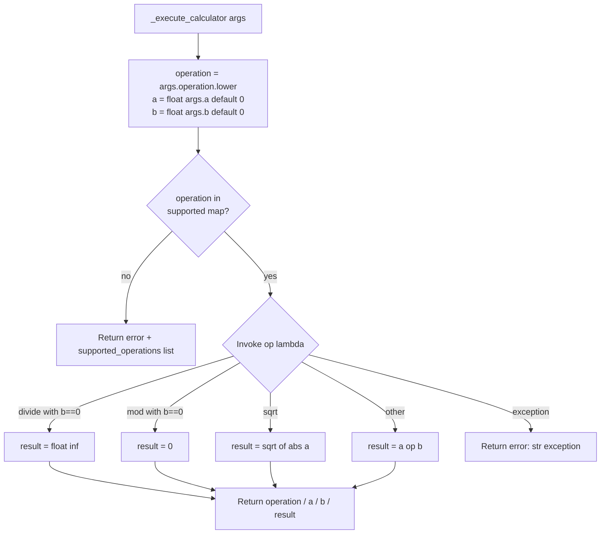

# Calculator Tool (`calculatorTool`)

| Field | Value |
|------|-------|
| **Category** | ai_tools (dedicated AI tool) |
| **Backend handler** | [`server/services/handlers/tools.py::_execute_calculator`](../../../server/services/handlers/tools.py) |
| **Tests** | [`server/tests/nodes/test_ai_tools.py`](../../../server/tests/nodes/test_ai_tools.py) |
| **Skill (if any)** | None (referenced directly by AI agents via tool-calling) |
| **Dual-purpose tool** | tool-only - LLM invokes as `calculator` (configurable via `toolName` param) |

## Purpose

Exposes basic arithmetic as a structured tool that an AI Agent can call during
reasoning. The LLM fills the `operation` + operand arguments and the handler
returns the numeric result. Supports the eight operations listed below; no
external calls, no state.

## Inputs (handles)

| Handle | Connection type | Required | Purpose |
|--------|-----------------|----------|---------|
| (none) | - | - | Passive node - connect `output-tool` to an AI Agent's `input-tools` |

## Parameters

| Name | Type | Default | Required | displayOptions.show | Description |
|------|------|---------|----------|---------------------|-------------|
| `toolName` | string | `calculator` | yes | - | Name the LLM uses to invoke the tool |
| `toolDescription` | string | (see frontend) | no | - | LLM-visible tool description |

### LLM-provided tool args (at invocation time)

| Arg | Type | Description |
|-----|------|-------------|
| `operation` | string | One of `add`, `subtract`, `multiply`, `divide`, `power`, `sqrt`, `mod`, `abs` |
| `a` | number | First operand (defaults to `0` if missing) |
| `b` | number | Second operand (defaults to `0`; unused for `sqrt` / `abs`) |

## Outputs (handles)

| Handle | Shape | Description |
|--------|-------|-------------|
| `output-tool` | object | Raw dict returned to the LLM (no envelope wrapper at the tool level) |

### Output payload (TypeScript shape)

On success:
```ts
{
  operation: string;
  a: number;
  b: number;
  result: number;  // float('inf') for x/0, 0 for x mod 0
}
```

On unsupported operation:
```ts
{
  error: string;                      // "Unknown operation: <op>"
  supported_operations: string[];
}
```

On any raised exception inside the op lambda:
```ts
{ error: string }  // str(exception)
```

## Logic Flow



## Decision Logic

- **Unknown operation**: returns `{error, supported_operations}` and does not
  raise. `operations.keys()` is the authoritative supported list.
- **Division by zero** (`divide`): returns `float('inf')` instead of erroring.
- **Mod by zero** (`mod`): returns `0` instead of erroring.
- **Negative sqrt**: handler silently calls `math.sqrt(abs(a))`, so `sqrt(-9)`
  returns `3.0` (not an error).
- **`power` overflow**: raised as `OverflowError` by `math.pow`, caught by the
  outer `except Exception` and returned as `{error: str}`.
- **Tool mode only**: when dropped on the canvas and run directly, the node
  type is not registered in `NodeExecutor._handlers`, so the executor falls
  through to the generic success fallback. The real contract is the tool
  invocation path via `execute_tool`.

## Side Effects

- **Database writes**: none.
- **Broadcasts**: none.
- **External API calls**: none.
- **File I/O**: none.
- **Subprocess**: none.

## External Dependencies

- **Credentials**: none.
- **Services**: none.
- **Python packages**: `math` (stdlib only).
- **Environment variables**: none.

## Edge cases & known limits

- `divide` returns `float('inf')` for division by zero - downstream JSON
  serializers may choke on `Infinity` (not strict JSON).
- `mod` returns `0` for modulo-by-zero, which is mathematically wrong but
  matches the handler. Document this for agents that might reason about it.
- `sqrt` of a negative number silently returns the sqrt of the absolute value
  rather than erroring or returning NaN.
- `float(args.get('a', 0))` will raise `ValueError` if the LLM returns
  non-numeric strings; that error is caught and returned as `{error: ...}`.
- Operation names are case-insensitive (`.lower()` applied).

## Related

- **Sibling tools**: [`currentTimeTool`](./currentTimeTool.md), [`duckduckgoSearch`](./duckduckgoSearch.md), [`taskManager`](./taskManager.md), [`writeTodos`](./writeTodos.md)
- **Architecture docs**: [Agent Architecture](../../agent_architecture.md), [Tool Building Pipeline](../../tool_building_pipeline.md), [Node Creation Guide](../../node_creation.md)
