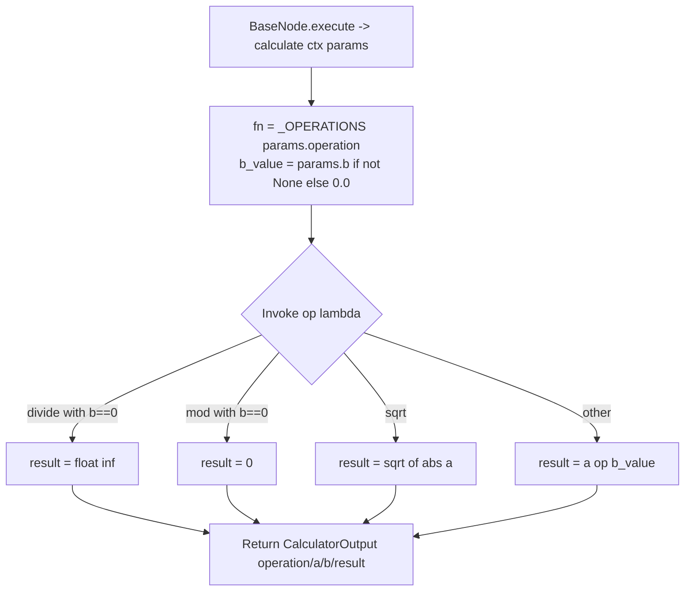

# Calculator Tool (`calculatorTool`)

| Field | Value |
|------|-------|
| **Category** | ai_tools (dedicated AI tool, group `("tool", "ai")`) |
| **Backend handler** | [`server/nodes/tool/calculator_tool/__init__.py`](../../../server/nodes/tool/calculator_tool/__init__.py) — `CalculatorToolNode`, dispatched via `BaseNode.execute()` + the `@Operation("calculate")` method |
| **Tests** | [`server/tests/nodes/test_ai_tools.py`](../../../server/tests/nodes/test_ai_tools.py) |
| **Skill (if any)** | None (referenced directly by AI agents via tool-calling) |
| **Dual-purpose tool** | tool-only — `ToolNode` exposed to the LLM as `calculator` (`tool_name` class attr) |

## Purpose

Exposes basic arithmetic as a structured tool that an AI Agent can call during
reasoning. The LLM fills the `operation` + operand arguments and the operation
returns the numeric result. Supports the eight operations listed below; no
external calls, no state. The `CalculatorParams` Pydantic model is the
LLM-visible tool schema (via `ToolNode.as_tool_schema()`).

## Inputs (handles)

| Handle | Connection type | Required | Purpose |
|--------|-----------------|----------|---------|
| `input-main` | main | no | Passive node - connect `output-tool` to an AI Agent's `input-tools` |

## Parameters

The `CalculatorParams` model fields ARE the LLM-provided tool args (no separate
`toolName` / `toolDescription` node params — those live on the class as
`tool_name` / `tool_description`).

| Name | Type | Default | Required | displayOptions.show | Description |
|------|------|---------|----------|---------------------|-------------|
| `operation` | enum | (required) | yes | - | One of `add`, `subtract`, `multiply`, `divide`, `power`, `sqrt`, `mod`, `abs` |
| `a` | float | (required) | yes | - | First operand (or the sole input for `sqrt` / `abs`) |
| `b` | float? | `None` | no | - | Second operand; required for add/subtract/multiply/divide/power/mod, unused for `sqrt` / `abs` |

## Outputs (handles)

| Handle | Shape | Description |
|--------|-------|-------------|
| `output-tool` | object | `CalculatorOutput` model, serialized per `BaseNode._serialize_result` |

### Output payload (TypeScript shape)

On success (matches the `CalculatorOutput` model):
```ts
{
  operation: string;
  a: number;
  b: number | null;
  result: number;  // float('inf') for x/0, 0 for x mod 0
}
```

Errors are not produced inside the op (the `Literal` schema rejects unknown
operations at Pydantic validation before the op runs; a validation failure
surfaces as the framework's standard error envelope from `BaseNode.execute()`).

## Logic Flow



## Decision Logic

- **Unknown operation**: cannot occur — `operation` is a `Literal[...]` so an
  out-of-set value fails Pydantic validation before the op runs.
- **Division by zero** (`divide`): returns `float('inf')` instead of erroring.
- **Mod by zero** (`mod`): returns `0` instead of erroring.
- **Negative sqrt**: silently calls `math.sqrt(abs(a))`, so `sqrt(-9)` returns
  `3.0` (not an error).
- **Missing `b`**: when `params.b is None`, `b_value` defaults to `0.0` before
  the lambda runs (so `add`/`multiply`/etc. with no `b` operate against 0).
- **`power` overflow**: raised as `OverflowError` by `math.pow`; bubbles up to
  `BaseNode.execute()`'s generic exception path (full traceback envelope).

## Side Effects

- **Database writes**: none.
- **Broadcasts**: none.
- **External API calls**: none.
- **File I/O**: none.
- **Subprocess**: none.

## External Dependencies

- **Credentials**: none.
- **Services**: none.
- **Python packages**: `math` (stdlib only).
- **Environment variables**: none.

## Edge cases & known limits

- `divide` returns `float('inf')` for division by zero - downstream JSON
  serializers may choke on `Infinity` (not strict JSON).
- `mod` returns `0` for modulo-by-zero, which is mathematically wrong but
  matches the op lambda. Document this for agents that might reason about it.
- `sqrt` of a negative number silently returns the sqrt of the absolute value
  rather than erroring or returning NaN.
- `a` is typed `float` (required) — a non-numeric LLM argument fails Pydantic
  coercion and produces a validation error the LLM can correct.
- Operation names are case-sensitive (`Literal` exact match; no `.lower()`).

## Related

- **Sibling tools**: [`currentTimeTool`](./currentTimeTool.md), [`duckduckgoSearch`](./duckduckgoSearch.md), [`taskManager`](./taskManager.md), [`writeTodos`](./writeTodos.md), [`agentBuilder`](./agentBuilder.md)
- **Architecture docs**: [Agent Architecture](../../agent_architecture.md), [Tool Building Pipeline](../../tool_building_pipeline.md), [Node Creation Guide](../../node_creation.md)
