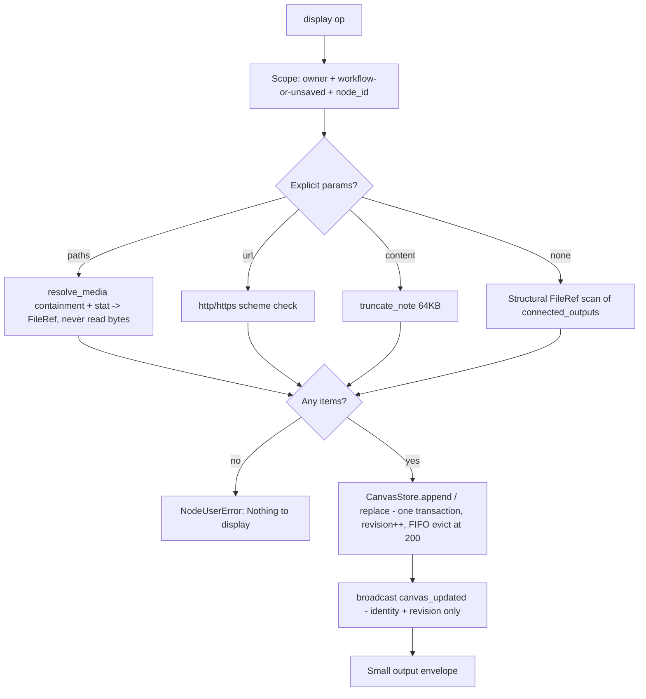

# Canvas (`canvas`)

| Field | Value |
|------|-------|
| **Category** | tool / ai |
| **Backend** | [`server/nodes/tool/canvas/__init__.py::CanvasNode.display`](../../../server/nodes/tool/canvas/__init__.py) (plugin folder: `_store.py` durable board, `_handlers.py` panel WS API, `_events.py` broadcast) |
| **WS handlers** | `canvas_list` / `canvas_remove` / `canvas_clear` (self-registered; simple_memory security preamble: external socket + owner + graph-ownership checks) |
| **Tests** | [`server/tests/nodes/test_canvas_node.py`](../../../server/tests/nodes/test_canvas_node.py) |
| **Skill (if any)** | none |
| **Dual-purpose tool** | ToolNode - tool name `canvas` (`tool_schema_locked = True`) |

## Purpose

A display board workflows and agents push content onto — the platform's
Claude/ChatGPT-Canvas-style viewing surface. Agents call the `canvas` tool
after producing something the user should see (a screenshot, a chart, a
report, a URL); workflow edges push upstream file outputs automatically. The
board renders in three hosts sharing one component: the node's full-height
parameter panel (`uiHints.isCanvasPanel`), the docked right-side canvas
sidebar (auto-opens on push, resizable, ephemeral click-to-preview mode),
and the Canvas tab of Home's Workspace dock, which shows one employee's
board. Hire gives every new employee a Canvas node, and its instructions ask
it to put finished work there.
Items are *references* (serialized `FileRef`s, URLs) and small markdown
notes — never file bytes (media-transport contract).

## Inputs (handles)

| Handle | Connection type | Required | Purpose |
|--------|-----------------|----------|---------|
| `input-main` | main | no | Upstream output to display. Explicit params win; otherwise a structural FileRef scan of `connected_outputs` collects up to 20 refs (`tts -> canvas` works zero-config). |
| `output-tool` (source, top) | tools | no | Connect to an agent's `input-tools` so the model can call `canvas(...)` mid-run. |

## Parameters

| Name | Type | Default | Required | displayOptions.show | Description |
|------|------|---------|----------|---------------------|-------------|
| `title` | string | `null` | no | - | Caption for the first item added by the call |
| `paths` | string[] | `null` | no | - | Workspace-relative file paths (max 20/call). Coercions: JSON-string array, bare string, ref dicts -> their `path` |
| `url` | string | `null` | no | - | External http(s) URL (scheme-validated) |
| `content` | string | `null` | no | - | Markdown note, truncated at 64KB with a visible marker |
| `language` | string | `null` | no | - | Syntax-highlight hint when `content` is code |
| `mode` | `append` \| `replace` | `append` | no | - | `replace` clears the board first |

## Outputs (handles)

| Handle | Shape | Description |
|--------|-------|-------------|
| (tool result / node result) | object | Small by contract: ids and counts only, never bodies or refs — node results are persisted 3x, broadcast, and replayed into LLM context |

### Output payload (TypeScript shape)

```ts
{
  message: string;
  count: number;      // board size after the call (FIFO cap 200)
  revision: number;
  added: Array<{ id: string; kind: 'file' | 'url' | 'note'; title: string | null }>;
}
```

## Logic Flow



## Decision Logic

- **Validation**: >20 paths -> `NodeUserError`; non-http(s) url -> `NodeUserError`; empty call (no params, no scanned refs) -> `NodeUserError`; unknown item kind -> `CanvasStoreError` -> `NodeUserError`.
- **Branches**: explicit params vs connected-outputs scan (scan runs only when no explicit item was produced); `mode=replace` deletes the board's rows in the same transaction.
- **Fallbacks**: `workflow_id or "unsaved"` scope; note truncation degrades instead of failing; `source` labeled `agent` iff `_tool_config` is on ctx.raw (the `execute_as_tool` marker), else `workflow`.
- **Error paths**: containment failure inside `resolve_media` and missing files surface as one-WARN-line `NodeUserError`s naming the path.

## Side Effects

- **Database writes**: `canvas_boards` (revision head) + `canvas_items` rows — plugin-owned tables (mount_store mechanism: import-time SQLModel registration + `ensure_schema(checkfirst=True)`), no `core/database.py` edits.
- **Broadcasts**: `canvas_updated` CloudEvents envelope (`com.opencompany.canvas.updated`, subject = node_id, data = `{workflow_id, node_id, revision}` only) via `get_status_broadcaster().broadcast` directly — no canary consumer, so `dispatch.emit` would run a guaranteed-empty Visibility query.
- **External API calls**: none.
- **File I/O**: stat-only on displayed paths; never reads content to register a pointer.

## External Dependencies

- **Credentials**: none.
- **Services**: `services.media` (`resolve_media`, `workspace_file_url`), `services.plugin.deps.get_database`.
- **Frontend**: `client/src/components/parameterPanel/CanvasPanel.tsx` (panel host), `client/src/components/ui/CanvasDock.tsx` (docked sidebar + ephemeral preview), `client/src/features/home/workspace/WorkspaceCanvas.tsx` (Home's Workspace dock, loaded lazily), shared `parameterPanel/canvas/CanvasContent.tsx` (carousel, follow-latest image poll, markdown/code/JSON/text via capped client fetch, sandboxed iframes for external URLs + workspace HTML, inline PDF).

## Edge cases & known limits

- Board caps at 200 items (FIFO eviction) and notes at 64KB (visible truncation marker).
- Panel handlers require a **saved** workflow (graph-ownership check needs the DB row); an unsaved canvas can push to the `unsaved` scope but the panel reads it only after save — same trade-off as simpleMemory.
- `connected_outputs` is keyed by source node *type* (engine behavior): two same-type upstreams collide and the scan sees one output.
- The viewer node is in `_NEEDS_CONNECTED_OUTPUTS` (`services/node_executor.py`) — the one core edit, sanctioned by that frozenset's own comment.
- Removing an item never deletes the underlying workspace file.
- Workspace HTML renders only in a `sandbox="allow-scripts"` srcDoc iframe (opaque origin, no cookies); `NEVER_INLINE` on the workspace route is untouched. `application/pdf` joined `INLINE_EXACT` in `services/media/preview.py` for the inline PDF surface.

## Related

- **Skills using this as a tool**: none yet (a paired skill would need a `visuals.json` alias for tool name `canvas`).
- **Other nodes that consume this output**: none — the board is a sink; the Browser node's screenshot operation persists workspace `FileRef`s (`nodes/browser/_screenshots.py`) so this node can display them. Live browser viewing and control use the separate Browser tab, not Canvas screenshot items.
- **Architecture docs**: [browser.md](../../browser.md), [browser_workspace.md](../../browser_workspace.md), [media_transport.md](../../media_transport.md), [plugin_system.md](../../plugin_system.md), [status_broadcaster.md](../../status_broadcaster.md).
