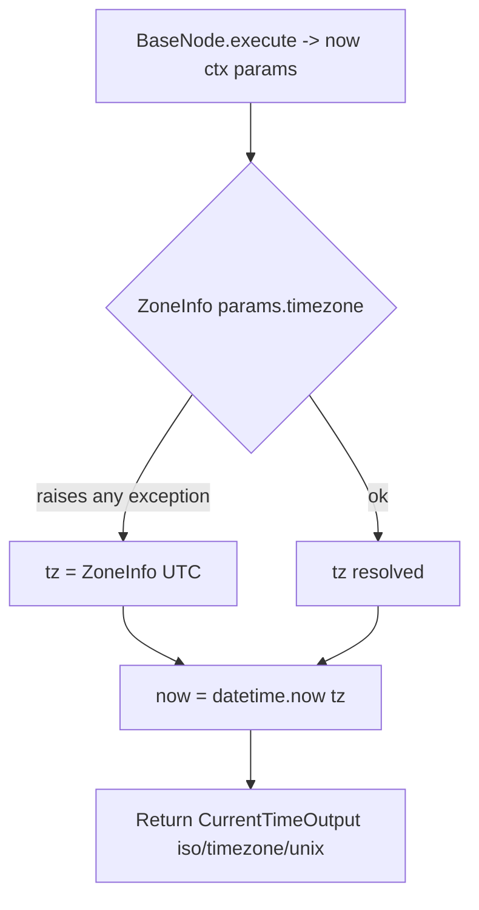

# Current Time Tool (`currentTimeTool`)

| Field | Value |
|------|-------|
| **Category** | ai_tools (dedicated AI tool, group `("tool", "ai")`) |
| **Backend handler** | [`server/nodes/tool/current_time_tool/__init__.py`](../../../server/nodes/tool/current_time_tool/__init__.py) — `CurrentTimeToolNode`, dispatched via `BaseNode.execute()` + the `@Operation("now")` method |
| **Tests** | [`server/tests/nodes/test_ai_tools.py`](../../../server/tests/nodes/test_ai_tools.py) |
| **Skill (if any)** | None |
| **Dual-purpose tool** | tool-only — `ToolNode` exposed to the LLM as `get_current_time` (`tool_name` class attr) |

## Purpose

Provides the current ISO timestamp and unix epoch in a caller-specified
timezone. Intended for AI Agents that need temporal grounding (e.g., "what day
is it today?" before scheduling something). Pure wrapper around
`datetime.now(tz)` with `zoneinfo.ZoneInfo` for tz resolution.

## Inputs (handles)

| Handle | Connection type | Required | Purpose |
|--------|-----------------|----------|---------|
| `input-main` | main | no | Passive node - connect `output-tool` to an AI Agent's `input-tools` |

## Parameters

The `CurrentTimeParams` model field IS the LLM-provided tool arg (no separate
`toolName` / `toolDescription` node params — those live on the class as
`tool_name` / `tool_description`).

| Name | Type | Default | Required | displayOptions.show | Description |
|------|------|---------|----------|---------------------|-------------|
| `timezone` | string | `UTC` | no | - | IANA name (`UTC`, `America/New_York`, `Europe/London`, ...). Invalid values silently fall back to `UTC`. |

## Outputs (handles)

| Handle | Shape | Description |
|--------|-------|-------------|
| `output-tool` | object | `CurrentTimeOutput` model, serialized per `BaseNode._serialize_result` |

### Output payload (TypeScript shape)

On success (matches the `CurrentTimeOutput` model):
```ts
{
  iso: string;       // ISO 8601 with offset, e.g. "2026-04-15T12:00:00+00:00"
  timezone: string;  // echoed back (the requested input string)
  unix: number;      // unix seconds, integer
}
```

## Logic Flow



## Decision Logic

- **Timezone resolution**: `ZoneInfo(params.timezone)`; `timezone` defaults to
  `"UTC"` when the LLM omits it.
- **Invalid timezone**: any exception constructing `ZoneInfo` is caught and
  silently falls back to `ZoneInfo("UTC")` (the result still echoes the
  requested `params.timezone` string in the `timezone` field).

## Side Effects

- **Database writes**: none.
- **Broadcasts**: none.
- **External API calls**: none.
- **File I/O**: none.
- **Subprocess**: none.

## External Dependencies

- **Credentials**: none.
- **Services**: none.
- **Python packages**: `zoneinfo`, `datetime` (stdlib).
- **Environment variables**: none.

## Edge cases & known limits

- `unix` is truncated to integer seconds via `int(now.timestamp())` -
  millisecond precision is lost.
- `timezone` field in the output is the requested input string, not the
  canonical zone name (and stays the input even when the lookup falls back to
  UTC, so an invalid tz is silently masked).
- If the server system clock is wrong, output is wrong. No NTP sync.
- A bad/unknown IANA name does NOT error — it falls back to UTC silently.

## Related

- **Sibling tools**: [`calculatorTool`](./calculatorTool.md), [`duckduckgoSearch`](./duckduckgoSearch.md), [`taskManager`](./taskManager.md), [`writeTodos`](./writeTodos.md), [`agentBuilder`](./agentBuilder.md)
- **Architecture docs**: [Agent Architecture](../../agent_architecture.md)
