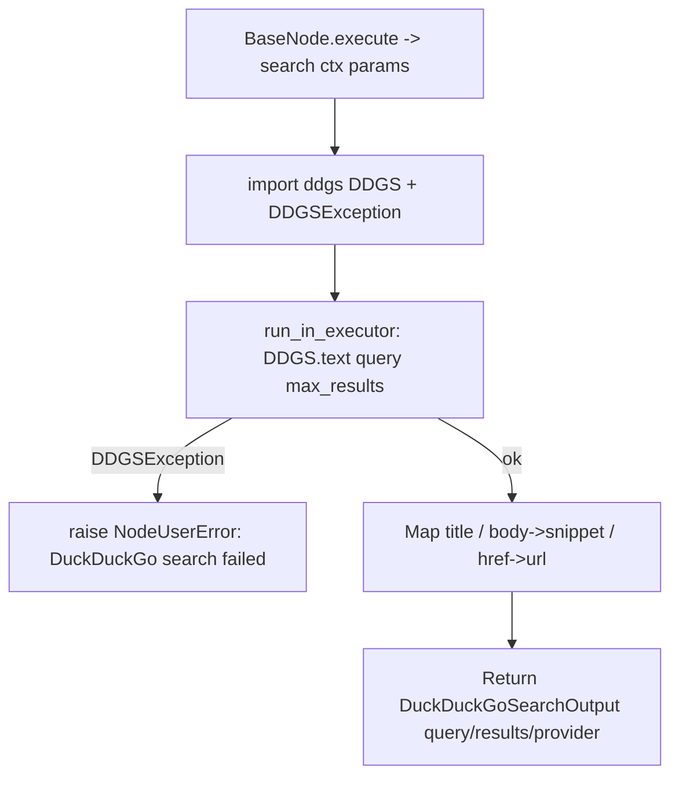

# DuckDuckGo Search (`duckduckgoSearch`)

| Field | Value |
|------|-------|
| **Category** | ai_tools (dedicated AI tool; plugin lives under `server/nodes/search/`, group `("tool", "ai", "search")`) |
| **Backend handler** | [`server/nodes/search/duckduckgo_search/__init__.py`](../../../server/nodes/search/duckduckgo_search/__init__.py) — `DuckDuckGoSearchNode`, dispatched via `BaseNode.execute()` + the `@Operation("search")` method |
| **Tests** | [`server/tests/nodes/test_ai_tools.py`](../../../server/tests/nodes/test_ai_tools.py) |
| **Skill (if any)** | [`server/skills/web_agent/duckduckgo-search-skill/SKILL.md`](../../../server/skills/web_agent/duckduckgo-search-skill/SKILL.md) |
| **Dual-purpose tool** | tool-only — `ToolNode` exposed to the LLM as `web_search` (`tool_name` class attr) |

## Purpose

Free web search with no API key required. Wraps the `ddgs` Python library's
`DDGS().text(query, max_results=N)` call. Designed as the zero-configuration
default web search tool for AI Agents, complementing the keyed alternatives
(`braveSearch`, `serperSearch`, `perplexitySearch`).

## Inputs (handles)

| Handle | Connection type | Required | Purpose |
|--------|-----------------|----------|---------|
| `input-main` | main | no | Passive node - connect `output-tool` to an AI Agent's `input-tools` |

## Parameters

The `DuckDuckGoSearchParams` model fields ARE the LLM-provided tool args (no
separate `toolName` / `toolDescription` node params — those live on the class
as `tool_name` / `tool_description`).

| Name | Type | Default | Required | displayOptions.show | Description |
|------|------|---------|----------|---------------------|-------------|
| `query` | string | (required) | yes | - | Search query; `min_length=1` (empty fails Pydantic validation) |
| `max_results` | int | `5` | no | - | Result cap; Pydantic-clamped `1..20` (`ge=1, le=20`) |

## Outputs (handles)

| Handle | Shape | Description |
|--------|-------|-------------|
| `output-tool` | object | `DuckDuckGoSearchOutput` model, serialized per `BaseNode._serialize_result` |

### Output payload (TypeScript shape)

On success (matches the `DuckDuckGoSearchOutput` model):
```ts
{
  query: string;
  results: Array<{ title: string; snippet: string; url: string }>;
  provider: 'duckduckgo';  // fixed default
}
```

On a `DDGSException` (rate-limit / network / bot detection) the op raises
`NodeUserError("DuckDuckGo search failed: <e>")`, which `BaseNode.execute()`
catches into a single WARN line + `{success: false, error_type: "NodeUserError",
error: ...}` envelope (no traceback).

## Logic Flow



## Decision Logic

- **Empty query**: rejected at Pydantic validation (`query` has `min_length=1`)
  before the op runs — no library call.
- **No provider switch / no fallback**: the plugin always uses the `ddgs`
  library `DDGS().text(...)`. The old Instant Answer API (`api.duckduckgo.com`)
  httpx fallback was removed; `ddgs` is a hard dependency now.
- **`DDGSException`**: caught and re-raised as `NodeUserError` so the LLM can
  retry with a different query (one WARN line, no traceback).
- **Sync-in-async**: `DDGS().text(...)` is synchronous; the op wraps it in
  `loop.run_in_executor(None, ...)` to avoid blocking the event loop.

## Side Effects

- **Database writes**: none. (Unlike `braveSearch`/`serperSearch`/`perplexitySearch`,
  this handler does **not** write to `api_usage_metrics` - it is free and
  tracking cost is skipped.)
- **Broadcasts**: none.
- **External API calls**: `ddgs` library (HTTPS to `duckduckgo.com`; the
  library manages its own networking, timeout, and rate limits).
- **File I/O**: none.
- **Subprocess**: none.

## External Dependencies

- **Credentials**: none.
- **Services**: none.
- **Python packages**: `ddgs` (hard dependency; lazy-imported inside the op).
- **Environment variables**: none.

## Edge cases & known limits

- A `DDGSException` (the only caught error) becomes a `NodeUserError`; other
  unexpected exceptions bubble up to `BaseNode.execute()`'s generic handler
  with a full traceback.
- `max_results` clamp (`1..20`) is enforced by Pydantic on the model
  (`ge=1, le=20`), so an out-of-range LLM value fails validation rather than
  being silently honoured.
- `results[].url` uses the `href` field from `ddgs`; missing keys default to
  `""` to stay defensive.

## Related

- **Sibling tools**: [`calculatorTool`](./calculatorTool.md), [`currentTimeTool`](./currentTimeTool.md), [`taskManager`](./taskManager.md), [`writeTodos`](./writeTodos.md), [`agentBuilder`](./agentBuilder.md)
- **Companion search nodes** (API-keyed, track cost): [`braveSearch`](../search/braveSearch.md), [`serperSearch`](../search/serperSearch.md), [`perplexitySearch`](../search/perplexitySearch.md)
- **Skill using this tool**: [`duckduckgo-search-skill/SKILL.md`](../../../server/skills/web_agent/duckduckgo-search-skill/SKILL.md)
