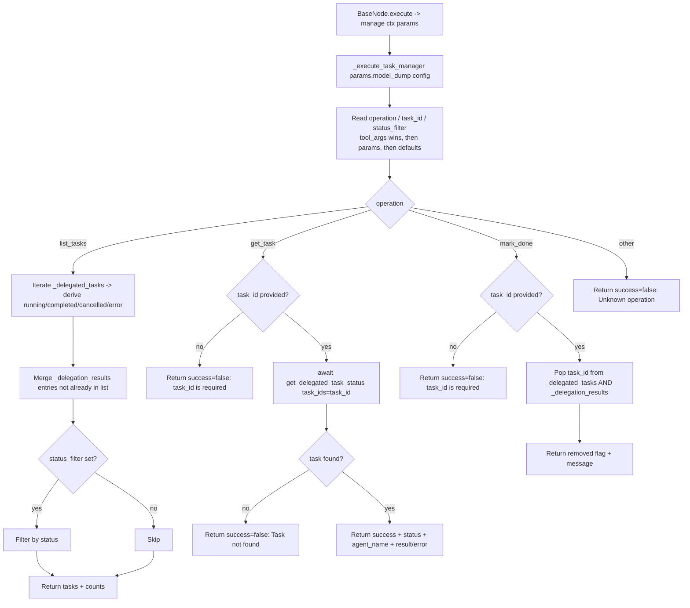

# Task Manager (`taskManager`)

| Field | Value |
|------|-------|
| **Category** | ai_tools (dedicated AI tool, group `("tool", "ai")`) |
| **Backend handler** | [`server/nodes/tool/task_manager/__init__.py`](../../../server/nodes/tool/task_manager/__init__.py) — `TaskManagerNode`, dispatched via `BaseNode.execute()` + the `@Operation("manage")` method, which calls the inlined `_execute_task_manager` in the same file |
| **Tests** | [`server/tests/nodes/test_ai_tools.py`](../../../server/tests/nodes/test_ai_tools.py) |
| **Skill (if any)** | [`server/skills/task_agent/task-manager-skill/SKILL.md`](../../../server/skills/task_agent/task-manager-skill/SKILL.md) |
| **Dual-purpose tool** | tool-only — `ToolNode` exposed to the LLM as `task_manager` (`tool_name` class attr) |

## Purpose

Inspects the in-process registry of delegated agent tasks. The
`_execute_task_manager` body lives in the plugin file but reads **through** to
the delegation registry owned by `services/handlers/tools.py` (the
`_delegated_tasks` + `_delegation_results` dicts + `get_delegated_task_status`
3-layer lookup) — that lifecycle state stays in `tools.py` intentionally. Lets a
parent agent list currently-running / completed delegations, fetch details for a
specific `task_id`, or clear a finished task from tracking. Does **not** spawn
work itself; it only reads/mutates the delegation state populated by
`_execute_delegated_agent`.

## Inputs (handles)

| Handle | Connection type | Required | Purpose |
|--------|-----------------|----------|---------|
| `input-main` | main | no | Passive node - connect `output-tool` to an AI Agent's `input-tools` |

## Parameters

The declared `TaskManagerParams` model fields are below. The model carries
`model_config = ConfigDict(extra="allow")`, so the LLM-driven `operation` /
`status_filter` args (which `_execute_task_manager` reads) pass through even
though they are not declared fields.

| Name | Type | Default | Required | displayOptions.show | Description |
|------|------|---------|----------|---------------------|-------------|
| `action` | enum | `create` | no | - | Declared field: one of `create`, `list`, `complete`, `delete`, `update` (not the dispatch discriminator — see below) |
| `task_id` | string? | `None` | no | - | Target task id |
| `title` | string? | `None` | no | - | Declared but unused by the inlined op |
| `description` | string? | `None` | no | - | Declared but unused by the inlined op |
| `status` | string? | `None` | no | - | Declared but unused by the inlined op |

### LLM-provided tool args (the operations the op actually dispatches on)

The `manage` op passes `params.model_dump()` (with extras) into
`_execute_task_manager`, which reads `operation` / `task_id` / `status_filter`:

| Arg | Type | Description |
|-----|------|-------------|
| `operation` | string | One of `list_tasks`, `get_task`, `mark_done`; defaults to `'list_tasks'` |
| `task_id` | string | Required for `get_task` / `mark_done`; otherwise ignored |
| `status_filter` | string | Optional filter applied to `list_tasks` |

## Outputs (handles)

| Handle | Shape | Description |
|--------|-------|-------------|
| `output-tool` | object | Raw dict returned to the LLM (the `TaskManagerOutput` model has `extra="allow"`, so the full operation dict passes through) |

### Output payload (TypeScript shape)

`list_tasks`:
```ts
{
  success: true;
  operation: 'list_tasks';
  tasks: Array<{
    task_id: string;
    status: 'running' | 'completed' | 'error' | 'cancelled';
    active: boolean;           // true = still in _delegated_tasks
    agent_name?: string;       // only present for entries from _delegation_results
    result_summary?: string;   // truncated to 200 chars
  }>;
  count: number;
  running: number;
  completed: number;
  errors: number;
}
```

`get_task`:
```ts
{
  success: boolean;
  operation: 'get_task';
  task_id: string;
  status?: string;
  agent_name?: string;
  result?: unknown;
  error?: string;
}
```

`mark_done`:
```ts
{
  success: true;
  operation: 'mark_done';
  task_id: string;
  removed: boolean;
  message: string;
}
```

Unknown operation: `{success: false, error: "Unknown operation: <op>"}`.

## Logic Flow



## Decision Logic

- **Operation resolution**: `tool_args.operation OR node_params.operation OR 'list_tasks'`.
- **list_tasks status derivation**: for each entry in `_delegated_tasks`,
  `task.done()` is checked; if done, `cancelled()` / `exception()` determine
  `cancelled` vs `error` vs `completed`; otherwise `running`.
- **De-duplication**: `_delegation_results` entries whose `task_id` is
  already in the `_delegated_tasks`-derived list are skipped.
- **status_filter**: an empty string means "all"; the check
  `if status_filter:` treats `""` as falsy, so no filter is applied.
- **get_task missing id**: returns `{success: false, error: 'task_id is required ...'}`.
- **get_task not found**: `get_delegated_task_status` returns `{tasks: []}`,
  handler returns `{success: false, error: 'Task <id> not found'}`.
- **mark_done missing id**: same `task_id is required` short-circuit.
- **mark_done when not tracked**: still returns `success=true` but with
  `removed=false` and a "was not in active tracking" message.

## Side Effects

- **In-memory state writes**: `mark_done` deletes entries from the
  module-level dicts `_delegated_tasks` and `_delegation_results`
  (in `services/handlers/tools.py`).
- **Database writes**: none directly. `get_task` calls
  `get_delegated_task_status`, which may read from `database` (if supplied),
  but there is no write from `taskManager`.
- **Broadcasts**: none.
- **External API calls**: none.
- **File I/O**: none.
- **Subprocess**: none.

## External Dependencies

- **Credentials**: none.
- **Services**: `database` (optional) passed through from `context` for
  `get_delegated_task_status`.
- **Python packages**: stdlib only.
- **Environment variables**: none.

## Edge cases & known limits

- State is **process-local** (module-level dicts). A restart wipes all
  tracked tasks; a horizontally-scaled deployment never sees tasks spawned
  on a different worker.
- `result_summary` is truncated to 200 characters via `str(...)[:200]`;
  multi-line results may be cut mid-line.
- `list_tasks` counts only `running` / `completed` / `error` explicitly -
  `cancelled` entries are included in `tasks` but not counted in any of the
  three aggregate counters.
- Unknown `operation` returns a failed envelope rather than raising; the
  agent might keep retrying with the same bad operation string.
- The dispatch discriminator is `operation` (read from the extra-allowed
  tool args), NOT the declared `action` field — the `action` / `title` /
  `description` / `status` model fields are vestigial and unused by the op.

## Related

- **Sibling tools**: [`calculatorTool`](./calculatorTool.md), [`currentTimeTool`](./currentTimeTool.md), [`duckduckgoSearch`](./duckduckgoSearch.md), [`writeTodos`](./writeTodos.md), [`agentBuilder`](./agentBuilder.md)
- **Skill using this tool**: [`task-manager-skill/SKILL.md`](../../../server/skills/task_agent/task-manager-skill/SKILL.md)
- **Architecture docs**: [Agent Delegation](../../agent_delegation.md)
