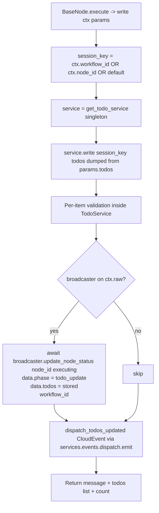

# Write Todos (`writeTodos`)

| Field | Value |
|------|-------|
| **Category** | ai_tools (dual-purpose) |
| **Backend handler** | [`server/nodes/tool/write_todos/__init__.py`](../../../server/nodes/tool/write_todos/__init__.py) — `WriteTodosNode`, dispatched via `BaseNode.execute()` + the `@Operation("write")` method (logic inlined; the standalone `services/handlers/todo.py::handle_write_todos` / `execute_write_todos` still exist but are no longer the dispatch path) |
| **Service** | [`server/services/todo_service.py::TodoService`](../../../server/services/todo_service.py) |
| **Tests** | [`server/tests/nodes/test_ai_tools.py`](../../../server/tests/nodes/test_ai_tools.py) |
| **Skill (if any)** | [`server/skills/assistant/write-todos-skill/SKILL.md`](../../../server/skills/assistant/write-todos-skill/SKILL.md) |
| **Dual-purpose tool** | yes - tool name `write_todos` |

## Purpose

Lets an AI Agent maintain a structured, per-session checklist while working
on a multi-step task. Each call **replaces** the entire todo list for the
session with the new snapshot the agent produces, then broadcasts the new
state over WebSocket so the UI can render a live checklist. Storage is an
in-process `TodoService` singleton keyed by `workflow_id` (or `node_id` as
fallback).

## Parameter-panel editor (editable Current Todos)

The node's middle section is an **editable** Current Todos manager, not the empty
generic-params card. `uiHints.isTodoEditor` (declared on the plugin) routes
`MiddleSection` to [`client/src/components/parameterPanel/TodoEditor.tsx`](../../../client/src/components/parameterPanel/TodoEditor.tsx).

- **Source of truth = the live `TodoService` list** (same `workflow_id` → `node_id`
  key as the `write` op), NOT `parameters.todos`. Because the key is the workflow,
  every writeTodos node in one workflow shares one list (surfaced in the panel).
- **Read / write WS handlers** (self-registered from the plugin folder via
  `register_ws_handlers`, see `server/nodes/tool/write_todos/_handlers.py`):
  - `get_todos` `{workflow_id?, node_id?}` → `{todos, session_key}` (TanStack
    Query key `['todos', session_key]`, fetched on open).
  - `set_todos` `{workflow_id?, node_id?, todos}` → `{success, todos}`; replaces
    the list via `TodoService.write` (same validation/normalisation as the tool).
- **Edits**: add / remove / inline edit content / click-to-cycle status; optimistic
  cache update + `set_todos`. While a row's content input is focused, incoming
  remote updates are suppressed so they can't clobber an in-progress edit.
- **Live updates**: both the tool `write` op AND `set_todos` emit the typed
  `todos_updated` CloudEvent via the centralized `services.events.dispatch.emit`
  (`server/nodes/tool/write_todos/_events.py`); the FE `todos_updated` case in
  `WebSocketContext` writes the inner `todos` into `['todos', session_key]`. This
  is a plain CloudEvent (NOT a `node_status` "executing" broadcast), so a manual
  edit never makes the canvas node glow.

## Inputs (handles)

| Handle | Connection type | Required | Purpose |
|--------|-----------------|----------|---------|
| (none) | - | - | Passive node - connect `output-tool` to an AI Agent's `input-tools` |

## Parameters

The `WriteTodosParams` model field IS the LLM-provided tool arg (no separate
`toolName` / `toolDescription` node params — those live on the class as
`tool_name` / `tool_description`).

| Name | Type | Default | Required | displayOptions.show | Description |
|------|------|---------|----------|---------------------|-------------|
| `todos` | `Array<TodoItem>` | `[]` | no | - | Full replacement snapshot. `TodoItem = {id?: string, content: string, status: 'pending' \| 'in_progress' \| 'completed'}`. A JSON-encoded string is coerced to a list by the `_coerce_todos` `field_validator(mode="before")` (handles Gemini stringified-array args). |

## Outputs (handles)

| Handle | Shape | Description |
|--------|-------|-------------|
| `output-tool` | object | Tool result returned to the LLM (`WriteTodosOutput` has `extra="allow"`, so the dict below passes through) |

### Output payload (TypeScript shape)

```ts
{
  message: string;   // "Updated todo list (<N> items)"
  todos: Array<{ id?: string; content: string; status: string }>;  // the validated list (NOT a JSON string)
  count: number;     // len(stored)
}
```

Note: the op returns the validated `todos` LIST, not a JSON string. The
pre-fix `format_for_llm()` call that stringified this leaked a raw JSON string
into the key, which the `WriteTodosOutput` contract now rejects — the
LLM-facing serialization happens downstream.

## Logic Flow



## Decision Logic

- **Session key**: `workflow_id` if truthy, else `node_id`, else literal
  `"default"`.
- **Empty / malformed items dropped**:
  - Non-dict entries: skipped silently.
  - `content.strip() == ""`: skipped silently.
  - `status` not in `{pending, in_progress, completed}`: coerced to
    `"pending"`.
- **Full replacement semantics**: each call overwrites `_store[session_key]`
  entirely - there is no merge / append. Agents are expected to send the
  complete snapshot.
- **Broadcast guarded**: `update_node_status` is called only when both
  `broadcaster` and `node_id` are truthy, so direct invocations without a
  broadcaster still succeed silently.
- **Status `"executing"`** (not `"success"`): the broadcast uses the status
  string `"executing"` with `data.phase = "todo_update"`, which the frontend
  uses to refresh the checklist without moving the node out of its current
  execution state.

## Side Effects

- **In-memory state writes**: `TodoService._store[session_key] = json.dumps(validated)`.
  State persists for the lifetime of the Python process only.
- **Database writes**: none.
- **Broadcasts** (two per successful write):
  - `StatusBroadcaster.update_node_status(node_id, "executing",
    {"phase": "todo_update", "todos": [...]}, workflow_id=...)` — drives the
    canvas glow; only when a broadcaster is present on `ctx.raw`.
  - `dispatch_todos_updated(...)` — typed `todos_updated` CloudEvent
    (`com.machinaos.todos.updated`) via `services.events.dispatch.emit`
    (`server/nodes/tool/write_todos/_events.py`), refreshing the open Current
    Todos panel's `['todos', session_key]` query. Fires unconditionally.
- **External API calls**: none.
- **File I/O**: none.
- **Subprocess**: none.

## External Dependencies

- **Credentials**: none.
- **Services**: `TodoService` singleton (`get_todo_service()`);
  `StatusBroadcaster` via `context['broadcaster']`.
- **Python packages**: stdlib `json` only.
- **Environment variables**: none.

## Edge cases & known limits

- **Process-local state**: a server restart clears every todo list.
  Horizontal scaling never shares state across workers.
- **No TTL / cleanup**: sessions accumulate forever in `_store` unless
  `TodoService.clear(session_key)` is called explicitly (no caller does this
  today).
- **All validation silent**: dropping an item with empty content or coercing
  an invalid status never produces a warning in the return payload - only a
  DEBUG log line.
- **Broadcast failures bubble up**: the `write` op awaits
  `update_node_status`; if the broadcaster raises, the exception bubbles up
  to `BaseNode.execute()` (no `try/except` inside the op).
- **`todos` returned as a list, not a JSON string**: the Output contract
  declares `todos: Optional[list]`; returning a stringified list is rejected
  by `BaseNode._serialize_result`.
- **Content is trimmed** (`.strip()`) but otherwise not sanitised - markdown
  or HTML in content survives untouched.

## Related

- **Sibling tools**: [`calculatorTool`](./calculatorTool.md), [`currentTimeTool`](./currentTimeTool.md), [`duckduckgoSearch`](./duckduckgoSearch.md), [`taskManager`](./taskManager.md), [`agentBuilder`](./agentBuilder.md)
- **Skill using this tool**: [`write-todos-skill/SKILL.md`](../../../server/skills/assistant/write-todos-skill/SKILL.md)
- **Architecture docs**: [Status Broadcaster](../../status_broadcaster.md), [Agent Architecture](../../agent_architecture.md)
