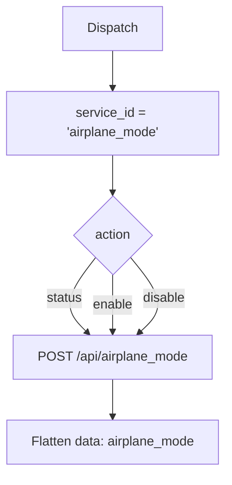

# Airplane Mode Control (`airplaneModeControl`)

| Field | Value |
|------|-------|
| **Category** | android / automation |
| **Backend handler** | plugin [`server/nodes/android/airplane_mode_control/__init__.py`](../../../server/nodes/android/airplane_mode_control/__init__.py); dispatch via `BaseNode.execute()` -> shared [`AndroidServiceBase.invoke`](../../../server/nodes/android/_base.py) (`@Operation("invoke")`) |
| **Tests** | [`server/tests/nodes/test_android.py`](../../../server/tests/nodes/test_android.py) |
| **Skill (if any)** | none |
| **Dual-purpose tool** | sub-node of `androidTool`; connectable directly to any agent's `input-tools` |

## Purpose

Airplane mode status reporting and control.

## Backend service mapping

| Field | Value |
|------|-------|
| `SERVICE_ID_MAP[airplaneModeControl]` | `airplane_mode` |
| Default action | `status` |

## Parameters

Shared parameter set only.

## Logic Flow (node-specific slice)

## Edge cases & known limits

- Frontend hidden `service_id` is `airplane_mode_control`; handler rewrites to
  `airplane_mode` via `SERVICE_ID_MAP`. See
  [`_pattern.md`](./_pattern.md#known-inconsistencies--edge-cases) item 1.
- Non-system apps cannot toggle airplane mode on Android 4.2+. Expect
  device-side `success=false` on `enable` / `disable` without signature perms.
- Shared edge cases only otherwise.

## Related

- Sibling: [`deviceStateAutomation`](./deviceStateAutomation.md)
- Shared pattern: [`_pattern.md`](./_pattern.md)
