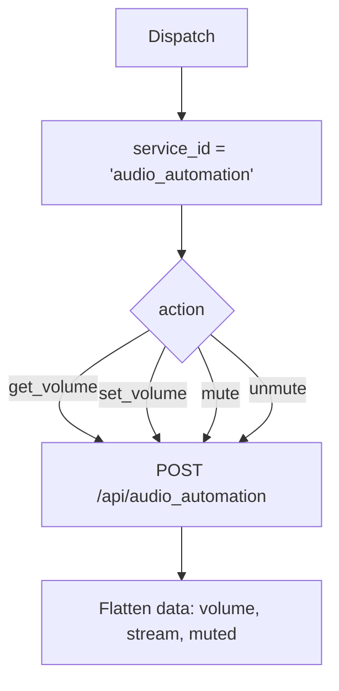

# Audio Automation (`audioAutomation`)

| Field | Value |
|------|-------|
| **Category** | android / automation |
| **Backend handler** | plugin [`server/nodes/android/audio_automation/__init__.py`](../../../server/nodes/android/audio_automation/__init__.py); dispatch via `BaseNode.execute()` -> shared [`AndroidServiceBase.invoke`](../../../server/nodes/android/_base.py) (`@Operation("invoke")`) |
| **Tests** | [`server/tests/nodes/test_android.py`](../../../server/tests/nodes/test_android.py) |
| **Skill (if any)** | [`server/skills/android_agent/audio-skill/SKILL.md`](../../../server/skills/android_agent/audio-skill/SKILL.md) |
| **Dual-purpose tool** | sub-node of `androidTool`; connectable directly to any agent's `input-tools` |

## Purpose

Volume and audio state control: get/set volume per stream, mute, unmute.

## Backend service mapping

| Field | Value |
|------|-------|
| `SERVICE_ID_MAP[audioAutomation]` | `audio_automation` |
| Default action | `get_volume` |

## Parameters

Shared parameter set only. Stream and value live inside `parameters`.

## Logic Flow (node-specific slice)

## Edge cases & known limits

- Do Not Disturb and notification policy restrictions on Android can cause
  `set_volume` to be ignored by the system.
- Shared edge cases only otherwise.

## Related

- Skill: [`audio-skill/SKILL.md`](../../../server/skills/android_agent/audio-skill/SKILL.md)
- Sibling: [`mediaControl`](./mediaControl.md)
- Shared pattern: [`_pattern.md`](./_pattern.md)
