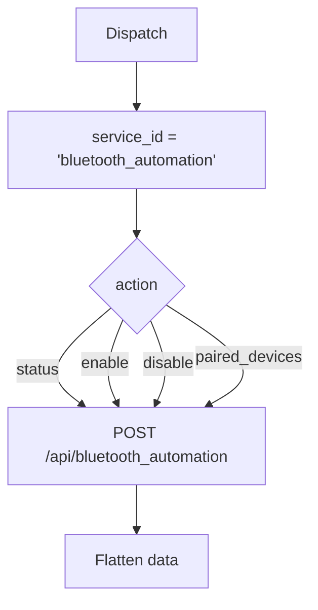

# Bluetooth Automation (`bluetoothAutomation`)

| Field | Value |
|------|-------|
| **Category** | android / automation |
| **Backend handler** | plugin [`server/nodes/android/bluetooth_automation/__init__.py`](../../../server/nodes/android/bluetooth_automation/__init__.py); dispatch via `BaseNode.execute()` -> shared [`AndroidServiceBase.invoke`](../../../server/nodes/android/_base.py) (`@Operation("invoke")`) |
| **Tests** | [`server/tests/nodes/test_android.py`](../../../server/tests/nodes/test_android.py) |
| **Skill (if any)** | [`server/skills/android_agent/bluetooth-skill/SKILL.md`](../../../server/skills/android_agent/bluetooth-skill/SKILL.md) |
| **Direct agent tool** | connectable to any agent's `input-tools` |

## Purpose

Bluetooth control: enable, disable, get adapter status, list paired devices.

## Backend service mapping

| Field | Value |
|------|-------|
| `SERVICE_ID_MAP[bluetoothAutomation]` | `bluetooth_automation` |
| Default action | `status` |

## Parameters

Shared parameter set only.

## Logic Flow (node-specific slice)

## Edge cases & known limits

- Programmatic Bluetooth enable/disable requires `BLUETOOTH_CONNECT` runtime
  permission on Android 12+; the device-side service reports the failure.
- Shared edge cases only otherwise.

## Related

- Skill: [`bluetooth-skill/SKILL.md`](../../../server/skills/android_agent/bluetooth-skill/SKILL.md)
- Shared pattern: [`_pattern.md`](./_pattern.md)
