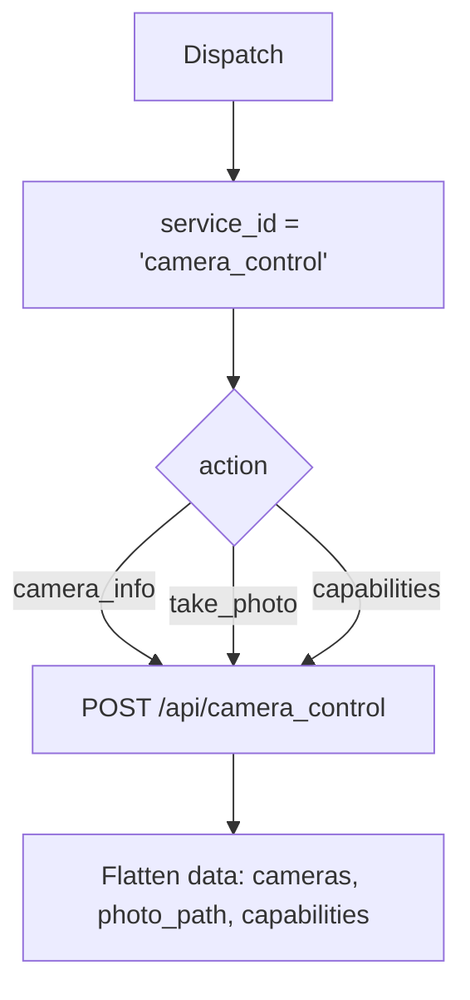

# Camera Control (`cameraControl`)

| Field | Value |
|------|-------|
| **Category** | android / media |
| **Backend handler** | plugin [`server/nodes/android/camera_control/__init__.py`](../../../server/nodes/android/camera_control/__init__.py); dispatch via `BaseNode.execute()` -> shared [`AndroidServiceBase.invoke`](../../../server/nodes/android/_base.py) (`@Operation("invoke")`) |
| **Tests** | [`server/tests/nodes/test_android.py`](../../../server/tests/nodes/test_android.py) |
| **Skill (if any)** | [`server/skills/android_agent/camera-skill/SKILL.md`](../../../server/skills/android_agent/camera-skill/SKILL.md) |
| **Direct agent tool** | connectable to any agent's `input-tools` |

## Purpose

Camera inspection and capture: enumerate cameras, describe capabilities, take
photos.

## Backend service mapping

| Field | Value |
|------|-------|
| `SERVICE_ID_MAP[cameraControl]` | `camera_control` |
| Default action | `camera_info` |

## Parameters

Shared parameter set only.

## Logic Flow (node-specific slice)

## Edge cases & known limits

- `take_photo` requires the `CAMERA` runtime permission on the device; the
  device-side service returns `success=false` with the permission error if
  missing.
- Photo paths returned by the device are relative to the device's filesystem,
  not the host.
- Shared edge cases only otherwise.

## Related

- Skill: [`camera-skill/SKILL.md`](../../../server/skills/android_agent/camera-skill/SKILL.md)
- Sibling: [`mediaControl`](./mediaControl.md)
- Shared pattern: [`_pattern.md`](./_pattern.md)
