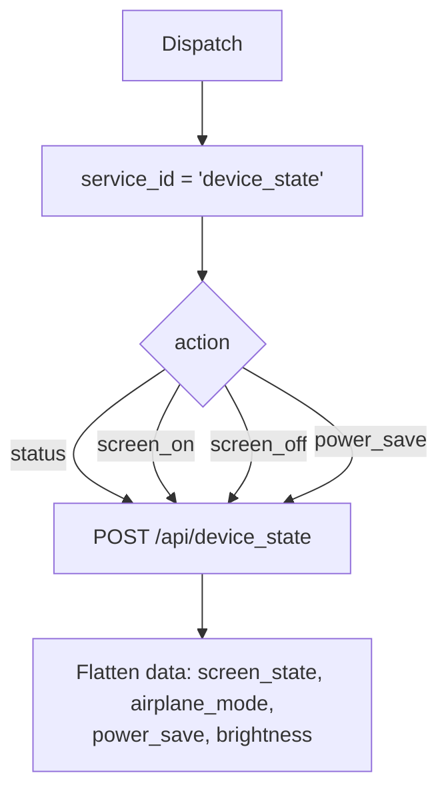

# Device State (`deviceStateAutomation`)

| Field | Value |
|------|-------|
| **Category** | android / automation |
| **Backend handler** | plugin [`server/nodes/android/device_state_automation/__init__.py`](../../../server/nodes/android/device_state_automation/__init__.py); dispatch via `BaseNode.execute()` -> shared [`AndroidServiceBase.invoke`](../../../server/nodes/android/_base.py) (`@Operation("invoke")`) |
| **Tests** | [`server/tests/nodes/test_android.py`](../../../server/tests/nodes/test_android.py) |
| **Skill (if any)** | none |
| **Dual-purpose tool** | sub-node of `androidTool`; connectable directly to any agent's `input-tools` |

## Purpose

Aggregate device state control: airplane mode, screen on/off, power save mode,
brightness level.

## Backend service mapping

| Field | Value |
|------|-------|
| `SERVICE_ID_MAP[deviceStateAutomation]` | `device_state` |
| Default action | `status` |

## Parameters

Shared parameter set only.

## Logic Flow (node-specific slice)

## Edge cases & known limits

- Frontend hidden `service_id` is `device_state_automation`; the handler
  rewrites it to `device_state` via `SERVICE_ID_MAP`. See
  [`_pattern.md`](./_pattern.md#known-inconsistencies--edge-cases) item 1.
- Shared edge cases only otherwise.

## Related

- Siblings: [`screenControlAutomation`](./screenControlAutomation.md), [`airplaneModeControl`](./airplaneModeControl.md)
- Shared pattern: [`_pattern.md`](./_pattern.md)
