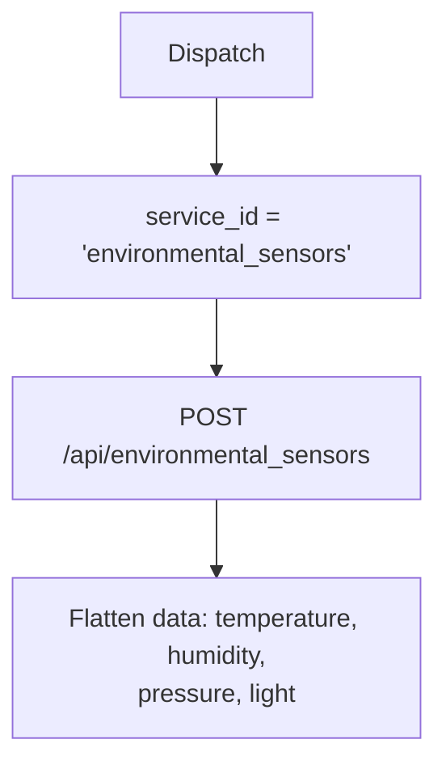

# Environmental Sensors (`environmentalSensors`)

| Field | Value |
|------|-------|
| **Category** | android / sensors |
| **Backend handler** | plugin [`server/nodes/android/environmental_sensors/__init__.py`](../../../server/nodes/android/environmental_sensors/__init__.py); dispatch via `BaseNode.execute()` -> shared [`AndroidServiceBase.invoke`](../../../server/nodes/android/_base.py) (`@Operation("invoke")`) |
| **Tests** | [`server/tests/nodes/test_android.py`](../../../server/tests/nodes/test_android.py) |
| **Skill (if any)** | [`server/skills/android_agent/environmental-skill/SKILL.md`](../../../server/skills/android_agent/environmental-skill/SKILL.md) |
| **Dual-purpose tool** | sub-node of `androidTool`; connectable directly to any agent's `input-tools` |

## Purpose

Ambient environment readings: temperature, humidity, atmospheric pressure,
light level.

## Backend service mapping

| Field | Value |
|------|-------|
| `SERVICE_ID_MAP[environmentalSensors]` | `environmental_sensors` |
| Default action | `ambient_conditions` |

## Parameters

Shared parameter set only.

## Logic Flow (node-specific slice)

## Edge cases & known limits

- Many devices ship only a subset of environmental sensors; missing sensors
  are reported as `null` or omitted by the device service.
- Shared edge cases only otherwise.

## Related

- Skill: [`environmental-skill/SKILL.md`](../../../server/skills/android_agent/environmental-skill/SKILL.md)
- Sibling: [`motionDetection`](./motionDetection.md)
- Shared pattern: [`_pattern.md`](./_pattern.md)
