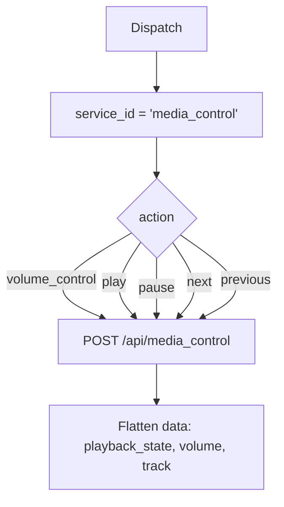

# Media Control (`mediaControl`)

| Field | Value |
|------|-------|
| **Category** | android / media |
| **Backend handler** | plugin [`server/nodes/android/media_control/__init__.py`](../../../server/nodes/android/media_control/__init__.py); dispatch via `BaseNode.execute()` -> shared [`AndroidServiceBase.invoke`](../../../server/nodes/android/_base.py) (`@Operation("invoke")`) |
| **Tests** | [`server/tests/nodes/test_android.py`](../../../server/tests/nodes/test_android.py) |
| **Skill (if any)** | none |
| **Direct agent tool** | connectable to any agent's `input-tools` |

## Purpose

Media playback and media-stream volume control. Distinct from
`audioAutomation` in that it targets the media session / playback APIs rather
than raw stream volumes.

## Backend service mapping

| Field | Value |
|------|-------|
| `SERVICE_ID_MAP[mediaControl]` | `media_control` |
| Default action | `volume_control` |

## Parameters

Shared parameter set only.

## Logic Flow (node-specific slice)

## Edge cases & known limits

- Requires `MEDIA_CONTENT_CONTROL` or the active notification-listener
  permission on recent Android for full control; without it only coarse
  volume actions succeed.
- Shared edge cases only otherwise.

## Related

- Sibling: [`audioAutomation`](./audioAutomation.md)
- Shared pattern: [`_pattern.md`](./_pattern.md)
