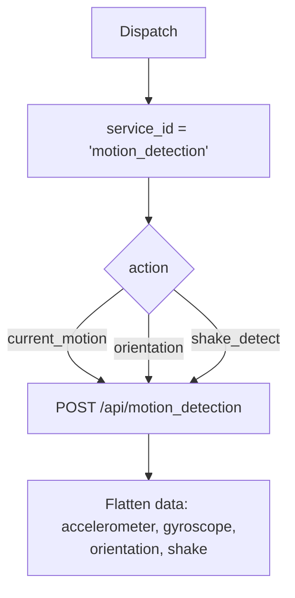

# Motion Detection (`motionDetection`)

| Field | Value |
|------|-------|
| **Category** | android / sensors |
| **Backend handler** | plugin [`server/nodes/android/motion_detection/__init__.py`](../../../server/nodes/android/motion_detection/__init__.py); dispatch via `BaseNode.execute()` -> shared [`AndroidServiceBase.invoke`](../../../server/nodes/android/_base.py) (`@Operation("invoke")`) |
| **Tests** | [`server/tests/nodes/test_android.py`](../../../server/tests/nodes/test_android.py) |
| **Skill (if any)** | [`server/skills/android_agent/motion-skill/SKILL.md`](../../../server/skills/android_agent/motion-skill/SKILL.md) |
| **Dual-purpose tool** | sub-node of `androidTool`; connectable directly to any agent's `input-tools` |

## Purpose

Accelerometer and gyroscope readings; derived signals such as shake gestures
and device orientation.

## Backend service mapping

| Field | Value |
|------|-------|
| `SERVICE_ID_MAP[motionDetection]` | `motion_detection` |
| Default action | `current_motion` |

## Parameters

Shared parameter set only.

## Logic Flow (node-specific slice)

## Edge cases & known limits

- Experimental service - sensor availability varies by device. Missing sensors
  return `success=false` with a device-level error.
- Shared edge cases only otherwise.

## Related

- Skill: [`motion-skill/SKILL.md`](../../../server/skills/android_agent/motion-skill/SKILL.md)
- Sibling: [`environmentalSensors`](./environmentalSensors.md)
- Shared pattern: [`_pattern.md`](./_pattern.md)
