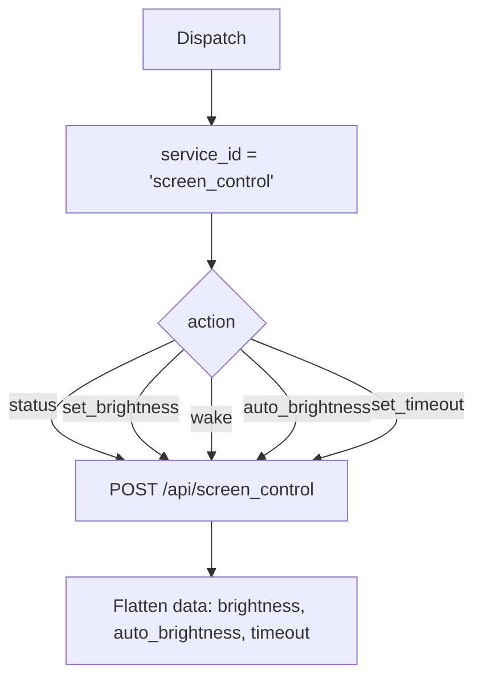

# Screen Control (`screenControlAutomation`)

| Field | Value |
|------|-------|
| **Category** | android / automation |
| **Backend handler** | plugin [`server/nodes/android/screen_control_automation/__init__.py`](../../../server/nodes/android/screen_control_automation/__init__.py); dispatch via `BaseNode.execute()` -> shared [`AndroidServiceBase.invoke`](../../../server/nodes/android/_base.py) (`@Operation("invoke")`) |
| **Tests** | [`server/tests/nodes/test_android.py`](../../../server/tests/nodes/test_android.py) |
| **Skill (if any)** | [`server/skills/android_agent/screen-control-skill/SKILL.md`](../../../server/skills/android_agent/screen-control-skill/SKILL.md) |
| **Direct agent tool** | connectable to any agent's `input-tools` |

## Purpose

Screen-focused subset of device state: brightness adjustment, wake screen,
auto-brightness toggle, screen timeout.

## Backend service mapping

| Field | Value |
|------|-------|
| `SERVICE_ID_MAP[screenControlAutomation]` | `screen_control` |
| Default action | `status` |

## Parameters

Shared parameter set only.

## Logic Flow (node-specific slice)

## Edge cases & known limits

- Frontend hidden `service_id` is `screen_control_automation`; handler
  rewrites to `screen_control` via `SERVICE_ID_MAP`. See
  [`_pattern.md`](./_pattern.md#known-inconsistencies--edge-cases) item 1.
- Brightness value range is device-dependent (0-255 on AOSP).
- Shared edge cases only otherwise.

## Related

- Skill: [`screen-control-skill/SKILL.md`](../../../server/skills/android_agent/screen-control-skill/SKILL.md)
- Sibling: [`deviceStateAutomation`](./deviceStateAutomation.md)
- Shared pattern: [`_pattern.md`](./_pattern.md)
