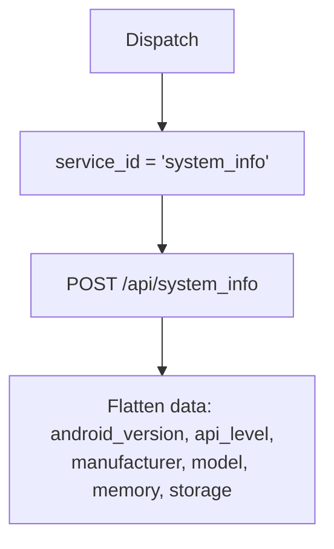

# System Info (`systemInfo`)

| Field | Value |
|------|-------|
| **Category** | android / monitoring |
| **Backend handler** | plugin [`server/nodes/android/system_info/__init__.py`](../../../server/nodes/android/system_info/__init__.py); dispatch via `BaseNode.execute()` -> shared [`AndroidServiceBase.invoke`](../../../server/nodes/android/_base.py) (`@Operation("invoke")`) |
| **Tests** | [`server/tests/nodes/test_android.py`](../../../server/tests/nodes/test_android.py) |
| **Skill (if any)** | none |
| **Dual-purpose tool** | sub-node of `androidTool`; connectable directly to any agent's `input-tools` |

## Purpose

Device and OS metadata: Android version, API level, manufacturer, model,
memory, storage, build fingerprint.

## Backend service mapping

| Field | Value |
|------|-------|
| `SERVICE_ID_MAP[systemInfo]` | `system_info` |
| Default action | `info` |

## Parameters

Shared parameter set only. See [`_pattern.md`](./_pattern.md#shared-parameter-set).

## Logic Flow (node-specific slice)

## Edge cases & known limits

- Shared edge cases only.

## Related

- Shared pattern: [`_pattern.md`](./_pattern.md)
