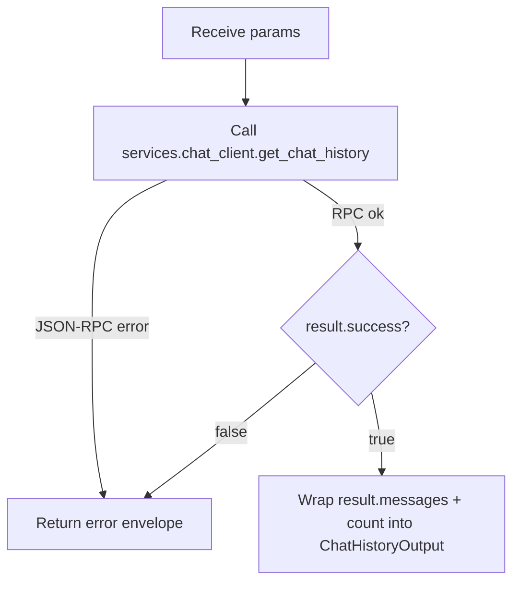

# Chat History (`chatHistory`)

| Field | Value |
|------|-------|
| **Category** | chat_utility |
| **Backend handler** | [`server/nodes/chat/chat_history/__init__.py`](../../../server/nodes/chat/chat_history/__init__.py) — dispatch via `BaseNode.execute()` + `@Operation("read")` |
| **Tests** | [`server/tests/nodes/test_chat_utility.py`](../../../server/tests/nodes/test_chat_utility.py) |
| **Skill (if any)** | - |
| **Dual-purpose tool** | no |

## Purpose

Retrieves chat history from an external chat backend via the JSON-RPC 2.0
WebSocket `services.chat_client.get_chat_history`. Complements `chatSend` for
workflows that need to read a conversation from a remote chat host.

## Inputs (handles)

| Handle | Connection type | Required | Purpose |
|--------|-----------------|----------|---------|
| `input-main` | main | no | Upstream payload; template variables can populate params |

## Parameters

| Name | Type | Default | Required | displayOptions.show | Description |
|------|------|---------|----------|---------------------|-------------|
| `host` | string | `localhost` | no | - | Chat backend host |
| `port` | number | `8080` | no | - | Chat backend port (1..65535) |
| `session_id` | string | `default` | no | - | Chat session identifier |
| `api_key` | string (password) | `""` | no | - | Auth token forwarded to the chat backend |
| `limit` | number | `50` | no | - | Maximum messages to return (1..500) |

## Outputs (handles)

| Handle | Shape | Description |
|--------|-------|-------------|
| `output-main` | object | `{ messages: Array<ChatMessage>, count: number }` |

### Output payload (TypeScript shape)

```ts
// ChatHistoryOutput (model_config extra="allow")
{
  messages: Array<{
    role: string;      // e.g. "user" | "assistant"
    message: string;   // body
    created_at: string;
    [key: string]: unknown;
  }>;
  count: number;       // len(messages)
}
```

## Logic Flow



## Decision Logic

- **Validation**: none; no parameter is required.
- **Branches**: success vs error branch on RPC response `success` flag.
- **Fallbacks**: `host`/`port`/`session_id`/`api_key`/`limit` all have defaults.
- **Error paths**: `not result.success` raises `RuntimeError(result.error or "chatHistory fetch failed")`;
  `BaseNode.execute()` wraps the raised exception into the standard error envelope
  (`success=false`, `error`, plus full traceback at `logger.exception` for non-`NodeUserError`).

## Side Effects

- **Database writes**: none.
- **Broadcasts**: none.
- **External API calls**: JSON-RPC 2.0 WebSocket to `ws://<host>:<port>` via
  `services.chat_client.get_chat_history`.
- **File I/O**: none.
- **Subprocess**: none.

## External Dependencies

- **Credentials**: optional `api_key` parameter, not looked up via
  `auth_service`.
- **Services**: external chat backend speaking the project chat JSON-RPC
  protocol.
- **Python packages**: `websockets` (via `services.chat_client`).
- **Environment variables**: none.

## Edge cases & known limits

- Any exception from `get_chat_history` is swallowed and surfaced as
  `success=false`. No retry.
- `port` and `limit` are coerced via `int()`; non-numeric strings raise
  `ValueError` and surface as `success=false`.
- The handler returns `{"messages": ...}` using `result.get('messages', [])`
  from the RPC. If the chat backend returns messages nested under another key,
  they will be dropped silently (returned as empty list).

## Related

- **Skills using this as a tool**: none.
- **Other nodes that consume this output**: any node templating
  `{{chatHistory.messages}}`.
- **Architecture docs**: [`docs-internal/status_broadcaster.md`](../../status_broadcaster.md).
