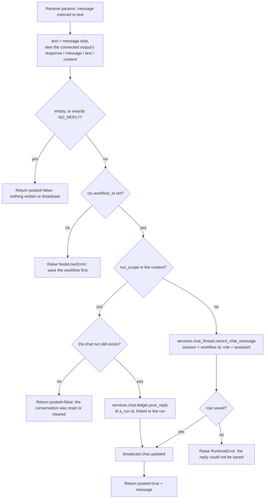

# Reply in Chat (`chatReply`)

| Field | Value |
|------|-------|
| **Category** | chat_utility (group `("chat",)`) |
| **Backend handler** | [`server/nodes/chat/chat_reply/__init__.py`](../../../server/nodes/chat/chat_reply/__init__.py) — `ChatReplyNode`; dispatch via `BaseNode.execute()` + `@Operation("reply")` |
| **Tests** | [`server/tests/nodes/test_chat_reply.py`](../../../server/tests/nodes/test_chat_reply.py) |
| **Skill (if any)** | - |
| **Dual-purpose tool** | no |

## Purpose

Posts an answer into the chat thread of the workflow it runs in, as the
assistant. A workflow's thread is the chat session whose id is the workflow
id: the owner reads it in Talk on the employee's Home page and in the
editor's chat pane. It is the last step of a talk line (a `chatTrigger`
feeds an agent, which answers through this node), and, labelled "Post to
Talk", it puts a schedule worker's reports in the thread. The Hire builder,
Turn on Talk and the shipped example workflows wire it after an agent, with
`message` set to `{{<agent label key>.response}}` and the edge condition
`result.response neq NO_REPLY`. See [Normal mode → Talk](../../normal_mode.md#talk).

## Inputs (handles)

| Handle | Connection type | Required | Purpose |
|--------|-----------------|----------|---------|
| `input-main` | main | no | The agent whose answer it posts. The answer is read through the `message` template; with `message` empty, from the connected output (`connected_outputs`, since the node is in `NodeExecutor._NEEDS_CONNECTED_OUTPUTS`). |

`hide_output_handle = True`, so it renders as a sink with only `input-main`,
like `console`. It does not carry console's `isConsoleSink` hint.

## Parameters

| Name | Type | Default | Required | displayOptions.show | Description |
|------|------|---------|----------|---------------------|-------------|
| `message` | string (3 rows, placeholder `{{agent.response}}`) | `""` | no | - | The text to post, usually a template such as `{{aiagent.response}}`. A whole-value template keeps the upstream value's type, so a dict or list arrives as-is and is posted as JSON text; `None` becomes empty. Empty posts what the connected agent answered. |

`model_config = ConfigDict(extra="ignore")`.

## Outputs (handles)

| Handle | Shape | Description |
|--------|-------|-------------|
| (no output handle) | object | `hide_output_handle = True`; the op still returns the payload below |

### Output payload (TypeScript shape)

```ts
// ChatReplyOutput (model_config extra="allow")
{
  posted: boolean;      // false when there was nothing to post
  message?: string;     // the trimmed text, when posted
  message_id?: string;  // the saved message's id
  run_id?: string;      // the chat run it answered, in a run the owner's message started
}
```

## Logic Flow



## Decision Logic

- **Coercion** (`field_validator(mode="before")` on `message`): `None` -> `""`,
  a dict or list -> `json.dumps(..., ensure_ascii=False, default=str)`,
  anything else -> `str(...)`.
- **No message**: an empty `message` posts what the node's input answered:
  the first connected output's `response` (an agent's answer), else its
  `message`, `text` or `content`. So an agent wired to it in the editor needs no
  template; before, its answer streamed into the chat and then vanished.
- **Nothing to say**: after trimming, an empty text or exactly `NO_REPLY`
  (`services.approvals.contract.NO_REPLY`, what an agent answers when it has
  nothing to send) posts nothing and succeeds with `posted: false`. The edges
  the builders wire into the node carry the same `result.response neq NO_REPLY`
  condition, so normally the node does not run then at all.
- **Chat runs**: in a run the owner's chat message started, MachinaWorkflow
  passes `run_scope {run_id, session_id}` in the context
  ([chat_protocol.md → Runs](../../chat_protocol.md#runs)). The reply is then
  saved through `services.chat.ledger.post_reply` as that run's answer: the
  first reply takes the run's reply id `a_<run id>`, another reply node in the
  same run `a_<run id>.<n>`, and a retried step returns the row it saved. When
  the run no longer exists (a Reset or the owner's Clear removed the
  conversation it answered) nothing is posted and the node succeeds with
  `posted: false`.
- **Generation**: `record_chat_message` stamps the row with the latest
  control's `root_execution_id` (`chat_thread.chat_execution_id`; none when
  nothing was started since the last Reset). The editor's chat pane reads the
  latest generation only, so a row without the stamp would not show there
  while one is live; Home's Talk reads every generation and draws a restart
  divider where the stamp changes (a row left from before a Start).
- **Reset** (`reset_execution_state`): clears the workflow's thread, every
  generation, through `chat_thread.clear_chat_thread`. The conversation
  ended with the generation (the Context node forgets it in the same Reset,
  and every restart, Home's Apply and Turn on Talk included, is a Reset), so
  neither Talk nor the editor's chat pane keeps showing it. Returns
  `{reset, cleared_chat_messages}`; `reset` is false when there was nothing
  to clear, as when `chatTrigger`'s identical hook ran first in the same
  Reset.
- **Workflow deleted**: the plugin registers `clear_chat_thread` as a
  workflow-deleted hook (`services/workflow_storage/hooks.py`), so a deleted
  workflow's thread goes with it.
- **Error paths**: no `ctx.workflow_id` raises
  `NodeUserError("Reply in Chat posts to the workflow's chat: save the workflow first.")`
  (one WARN line, no traceback); a row the database did not save
  (`record_chat_message` returns false) raises
  `RuntimeError("The reply could not be saved to the chat")`, and nothing is
  announced.

## Side Effects

- **Database writes**: one `chat_messages` row: `session_id` = the workflow id,
  `role` = `assistant`, `message` = the trimmed text, `execution_id` = the
  live generation, appended after the thread's last message; in a chat run,
  `run_id` and `uid` name the run and its reply. On a Reset or a workflow
  delete, every row of the workflow's thread is deleted, with its chat runs.
- **Broadcasts**: `chat.updated` (CloudEvents `com.opencompany.chat.updated`,
  data `{workflow_id, session_id, role: "assistant"}`), sent directly through
  the status broadcaster, not `services.events.dispatch.emit`. Home's thread
  query and the editor's chat pane refetch on it.
- **External API calls**: none.
- **File I/O**: none.
- **Subprocess**: none.

## External Dependencies

- **Credentials**: none.
- **Services**: `services.chat_thread` (`record_chat_message`), `services.chat.ledger` (`get_run`, `post_reply`), the database
  (`services.plugin.deps.get_database`), `StatusBroadcaster`.
- **Python packages**: stdlib only (`json`).
- **Environment variables**: none.

## Edge cases & known limits

- A thread is per workflow, not per user.
- An agent that serves several triggers posts every answer through its Reply
  in Chat node, whichever trigger started the run: the shipped AI Employee and
  Claude Assistant examples (fed by Chat and Telegram) put their Telegram
  answers in the thread too.
- Not an AI tool (`usable_as_tool` is off): an agent cannot call it; an answer
  reaches it only through the main edge.
- Allowed for Hire by `node_allowlist.json` `enabled_nodes`; the test file
  checks that, together with `agentBuilder`.

## Related

- **Other nodes**: [`chatTrigger`](../workflow_triggers/chatTrigger.md) (the
  owner's messages in), [`console`](./console.md) (the other sink Hire adds,
  "Activity log"), [`chatSend`](./chatSend.md) (an external chat backend,
  unrelated to this thread).
- **Architecture docs**: [Normal mode → Talk](../../normal_mode.md#talk),
  [Status Broadcaster](../../status_broadcaster.md),
  [Event Framework → UI-only lifecycle events](../../event_framework.md#ui-only-lifecycle-events-broadcast-directly-never-through-emit).
