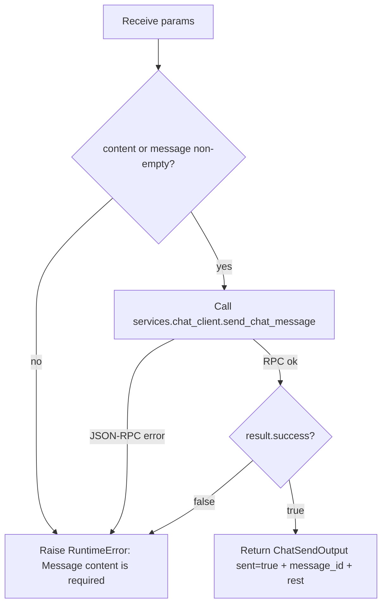

# Chat Send (`chatSend`)

| Field | Value |
|------|-------|
| **Category** | chat_utility |
| **Backend handler** | [`server/nodes/chat/chat_send/__init__.py`](../../../server/nodes/chat/chat_send/__init__.py) — dispatch via `BaseNode.execute()` + `@Operation("send")` |
| **Tests** | [`server/tests/nodes/test_chat_utility.py`](../../../server/tests/nodes/test_chat_utility.py) |
| **Skill (if any)** | - |
| **Dual-purpose tool** | no |

## Purpose

Sends a single chat message to an external chat backend via the JSON-RPC 2.0
WebSocket `services.chat_client.send_chat_message`. Used in workflows that need
to forward agent output into a chat room, customer-support channel, or any
external service that speaks the project's chat JSON-RPC protocol. Unlike the
`chatTrigger` node (which receives messages from the built-in Console Panel
chat), `chatSend` pushes into a remote chat host.

## Inputs (handles)

| Handle | Connection type | Required | Purpose |
|--------|-----------------|----------|---------|
| `input-main` | main | no | Upstream payload used via template variables in `content` |

## Parameters

| Name | Type | Default | Required | displayOptions.show | Description |
|------|------|---------|----------|---------------------|-------------|
| `host` | string | `localhost` | no | - | Chat backend host |
| `port` | number | `8080` | no | - | Chat backend port (1..65535) |
| `session_id` | string | `default` | no | - | Chat session identifier |
| `api_key` | string (password) | `""` | no | - | Auth token forwarded to the chat backend |
| `content` | string | `""` | conditional | - | Message body. Defaults to `""` at the Param level; the op raises if both `content` and `message` are empty |
| `message` | string | `""` | no | - | Legacy alias for `content` (used as fallback when `content` is empty) |

## Outputs (handles)

| Handle | Shape | Description |
|--------|-------|-------------|
| `output-main` | object | `{ sent: true, message_id, ...rest }` from the chat backend |

### Output payload (TypeScript shape)

```ts
// ChatSendOutput (model_config extra="allow")
{
  sent: true;                 // hard-set on success
  message_id: string | null;  // from RPC result.message_id
  // plus every other key from the RPC result payload (extra="allow"),
  // e.g. timestamp
  [key: string]: unknown;
}
```

## Logic Flow



## Decision Logic

- **Validation**: empty `content` AND empty `message` raises
  `RuntimeError("Message content is required")`.
- **Branches**: success vs error branch on RPC response `success` flag;
  `content = params.content or params.message` (legacy alias fallback).
- **Fallbacks**: `host`/`port`/`session_id` default to `localhost:8080/default`,
  `api_key` defaults to empty string.
- **Error paths**: `not result.success` raises `RuntimeError(result.error or "chatSend failed")`;
  `BaseNode.execute()` wraps any raised exception into the standard error envelope
  (`success=false`, `error`, `node_id`, `node_type`, timing fields).

## Side Effects

- **Database writes**: none.
- **Broadcasts**: none from this handler (the chat backend may broadcast on its
  side but that is external to OpenCompany).
- **External API calls**: JSON-RPC 2.0 WebSocket to `ws://<host>:<port>` via
  `services.chat_client.send_chat_message`.
- **File I/O**: none.
- **Subprocess**: none.

## External Dependencies

- **Credentials**: optional `api_key` parameter forwarded as the chat backend's
  auth token. No lookup via `auth_service`.
- **Services**: external chat backend speaking the project chat JSON-RPC
  protocol (e.g. the chat mircoservice in `docs-internal/chat-service.md`).
- **Python packages**: `websockets` (via `services.chat_client`).
- **Environment variables**: none.

## Edge cases & known limits

- Any exception from `send_chat_message` (connection refused, timeout, malformed
  RPC response) is swallowed and surfaced as `success=false` with the stringified
  error. No retry is performed.
- `port` is validated by the Pydantic Param (`int`, `ge=1, le=65535`); a non-coercible
  or out-of-range value fails Param validation before the op runs.
- Templates in `content` (e.g. `{{aiAgent.response}}`) are resolved upstream by
  `ParameterResolver`; this handler never sees unresolved `{{...}}`.
- `session_id` here is the chat-backend session, not the OpenCompany workflow
  `session_id` from `context`. They are unrelated.

## Related

- **Skills using this as a tool**: none (not a dual-purpose tool).
- **Other nodes that consume this output**: any downstream node can consume the
  RPC response via `{{chatSend.message_id}}` etc.
- **Architecture docs**: [`docs-internal/status_broadcaster.md`](../../status_broadcaster.md)
  (for comparison with WebSocket-first in-app chat), this node bypasses the
  in-app WebSocket entirely.
