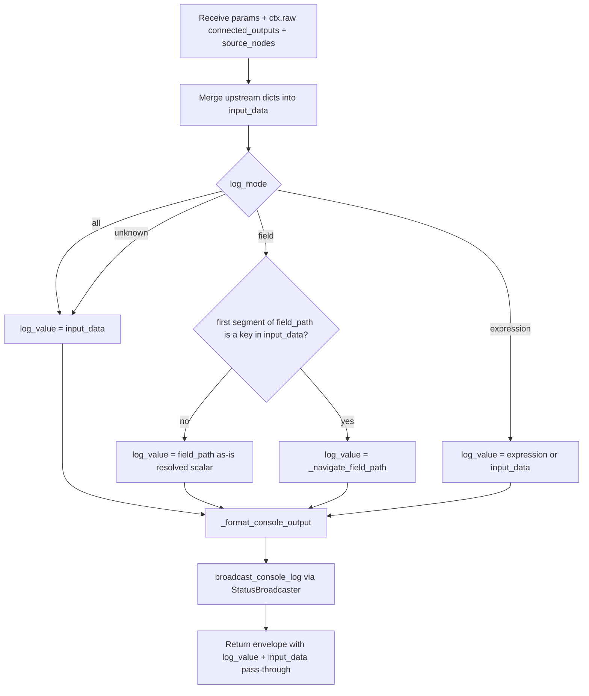

# Console (`console`)

| Field | Value |
|------|-------|
| **Category** | chat_utility |
| **Backend handler** | [`server/nodes/utility/console/__init__.py`](../../../server/nodes/utility/console/__init__.py) — dispatch via `BaseNode.execute()` + `@Operation("log")` (logic fully inlined in the plugin) |
| **Tests** | [`server/tests/nodes/test_chat_utility.py`](../../../server/tests/nodes/test_chat_utility.py) |
| **Skill (if any)** | - |
| **Dual-purpose tool** | no |

## Purpose

Debug/inspection node that logs the output of connected upstream nodes to the
Console tab in the frontend Console Panel and to the backend logger. Mirrors
n8n's "Debug / Log" node. Supports whole-object logging, single field
extraction (dot-path with `field[index]`), or pre-resolved template expression
logging. Passes the merged input through to downstream nodes so it can be
spliced into a pipeline without breaking data flow.

## Inputs (handles)

| Handle | Connection type | Required | Purpose |
|--------|-----------------|----------|---------|
| `input-main` | main | no | Any number of upstream outputs merged into `input_data` |

`console` declares its type in `NodeExecutor._NEEDS_CONNECTED_OUTPUTS`, so the
executor injects `connected_outputs` (keyed by source node type) and
`source_nodes` (ids/types/labels of source nodes) into `ctx.raw` before
dispatching. The op reads `ctx.raw.get("connected_outputs")` /
`ctx.raw.get("source_nodes")`. The node has `hide_output_handle = True` and
`ui_hints = {"isConsoleSink": True}`, so it renders as a sink with only an
`input-main` handle on the canvas.

## Parameters

| Name | Type | Default | Required | displayOptions.show | Description |
|------|------|---------|----------|---------------------|-------------|
| `label` | string | `""` | no | - | Display label for this console entry |
| `log_mode` | string | `all` | no | - | `all`, `field`, or `expression` |
| `field_path` | string | `""` | no | `log_mode=field` | Dot path like `data.items[0].name` |
| `expression` | string | `""` | no | `log_mode=expression` | Pre-resolved template output |
| `format` | string | `json` | no | - | `json`, `json_compact`, `text`, or `table` |

## Outputs (handles)

| Handle | Shape | Description |
|--------|-------|-------------|
| (no output handle) | object | `hide_output_handle = True` — renders as a sink, but the op still RETURNS the pass-through dict below so the output store can serve `{{console.*}}` downstream |

### Output payload (TypeScript shape)

```ts
// ConsoleOutput (model_config extra="allow")
{
  label: string;           // user label or "Console (<nodeid[:8]>)"
  logged_at: string;       // ISO timestamp
  format: string;          // format parameter (json/text/table/json_compact)
  data: unknown;           // the logged value (respects log_mode)
  formatted: string;       // stringified representation for display
  // plus every key from the merged upstream input so downstream nodes
  // can keep templating against the upstream shape
  [key: string]: unknown;
}
```

## Logic Flow



## Decision Logic

- **Validation**: none; all parameters optional.
- **Branches**:
  - `log_mode=all` - logs the full merged `input_data`.
  - `log_mode=field`: takes the first segment of `field_path` (before `.` / `[`).
    If that segment matches a top-level key in `input_data` -> `_navigate_field_path`.
    Otherwise the resolver already replaced `{{...}}` with a scalar, so log
    `field_path` as-is. (Empty `field_path` -> `input_data`.)
  - `log_mode=expression` -> use resolved `expression` or fall back to
    `input_data` when empty.
  - Any other `log_mode` falls through to `input_data` (via `match _`).
- **Fallbacks**: non-dict upstream output is wrapped as `{"value": output}` in
  `input_data`; label defaults to `Console (<first 8 chars of node_id>)`.
- **Error paths**: no in-op try/except; any raised exception is wrapped by
  `BaseNode.execute()` into the standard error envelope.

## Side Effects

- **Database writes**: none (console logs are transient; they are NOT persisted
  via `database.add_console_log` in this handler - persistence happens via the
  WebSocket broadcast consumer in the frontend/DB layer).
- **Broadcasts**: `get_status_broadcaster().broadcast_console_log(...)` with
  `{node_id, label, timestamp, data, formatted, format, workflow_id,
  source_node_id, source_node_type, source_node_label}`.
- **External API calls**: none.
- **File I/O**: none.
- **Subprocess**: none.

## External Dependencies

- **Credentials**: none.
- **Services**: `StatusBroadcaster` (`services.status_broadcaster`).
- **Python packages**: stdlib only (`json`, `re`).
- **Environment variables**: none.

## Edge cases & known limits

- `_navigate_field_path` returns `None` for any missing key or out-of-range
  index, so `log_value` silently becomes `null` rather than raising.
- `field_path` heuristic: the op treats a field path as "already a resolved
  template scalar" when its first segment is NOT a top-level key in `input_data`.
  This can misfire if the user's literal path happens not to match a top-level
  key even though the intent was to navigate.
- `format=table` falls back to indented JSON for non-tabular data (not a list
  of dicts).
- JSON formatting uses `default=str` so non-JSON-serialisable types become
  string reprs rather than failing.
- `connected_outputs` is keyed by source *node type*, so two upstream nodes of
  the same type will collide - only the last one processed ends up in
  `input_data` per key.

## Related

- **Skills using this as a tool**: none.
- **Other nodes that consume this output**: any node downstream of the console
  (pass-through shape matches the upstream input).
- **Architecture docs**:
  [`docs-internal/status_broadcaster.md`](../../status_broadcaster.md) -
  `broadcast_console_log` is one of the broadcast methods defined there.
