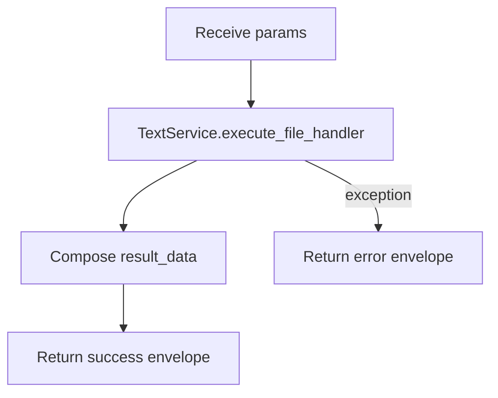

# File Handler (`fileHandler`)

| Field | Value |
|------|-------|
| **Category** | chat_utility |
| **Backend handler** | [`server/nodes/text/file_handler/__init__.py`](../../../server/nodes/text/file_handler/__init__.py) — dispatch via `BaseNode.execute()` + `@Operation("wrap")` → [`server/services/text.py::TextService.execute_file_handler`](../../../server/services/text.py) |
| **Tests** | [`server/tests/nodes/test_chat_utility.py`](../../../server/tests/nodes/test_chat_utility.py) |
| **Skill (if any)** | - |
| **Dual-purpose tool** | no |

## Purpose

Content-metadata wrapper (NOT file I/O), retained from the Node.js-era engine.
It only composes a descriptive dict (`fileName`, `fileType`, `content`, `size`)
around an already-in-memory string and returns a `{type: "file", data: {...}}`
envelope for downstream nodes. For real filesystem access use the `fileRead`,
`fileModify`, `fsSearch`, and `fileDownloader` nodes in the `code_fs_process`
and `document` categories.

## Inputs (handles)

| Handle | Connection type | Required | Purpose |
|--------|-----------------|----------|---------|
| `input-main` | main | no | Upstream text/JSON used via templates |

## Parameters

| Name | Type | Default | Required | displayOptions.show | Description |
|------|------|---------|----------|---------------------|-------------|
| `file_type` | enum | `generic` | no | - | One of `generic`, `markdown`, `text`, `json`, `csv`, `html`, `xml` — content-type hint stored in output |
| `file_name` | string | `untitled.txt` | no | - | Filename label attached to the wrapped content |
| `content` | string | `""` | no | - | In-memory text content to wrap (8 rows) |

Note: parameters in are snake_case (`file_type` / `file_name` / `content`), but
the service's output dict keeps camelCase keys (`fileName` / `fileType`) by
historical wire contract — the frontend reads them that way.

## Outputs (handles)

| Handle | Shape | Description |
|--------|-------|-------------|
| `output-main` | object | `{ type: "file", data: {...}, nodeId, timestamp }` |

### Output payload (TypeScript shape)

```ts
// FileHandlerOutput (model_config extra="allow"); the service returns
// result = { type, data, nodeId, timestamp }, which the op returns verbatim.
{
  type: "file";
  data: {
    fileName: string;
    fileType: string;
    content: string;
    size: number;          // len(content) — character count, not byte count
    processed: true;
    processingType: string; // === fileType
    nodeId: string;
  };
  nodeId: string;
  timestamp: string;
}
```

## Logic Flow



## Decision Logic

- **Validation**: none.
- **Branches**: none; the handler is effectively a pure data-shape wrapper.
- **Fallbacks**: all three params have defaults.
- **Error paths**: any exception inside `TextService.execute_file_handler` is
  caught and returned as `success=false`.

## Side Effects

- **Database writes**: none.
- **Broadcasts**: none.
- **External API calls**: none.
- **File I/O**: none (despite the name).
- **Subprocess**: none.

## External Dependencies

- **Credentials**: none.
- **Services**: `TextService` obtained via `services.plugin.deps.get_text_service()`.
- **Python packages**: stdlib only.
- **Environment variables**: none.

## Edge cases & known limits

- `processed` is hard-coded to `true` regardless of input.
- `processingType` duplicates `fileType`; there is no actual processing logic.
- `size` is `len(content)` on the string (character count, not byte count of
  an encoded representation).
- Not a real filesystem node; misleading name retained for backward
  compatibility with older workflow JSON.

## Related

- **Skills using this as a tool**: none.
- **Other nodes that consume this output**: any templating downstream.
- **Architecture docs**: see `docs-internal/node-logic-flows/code_fs_process/`
  for the real filesystem nodes (`fileRead`, `fileModify`, `fsSearch`).
