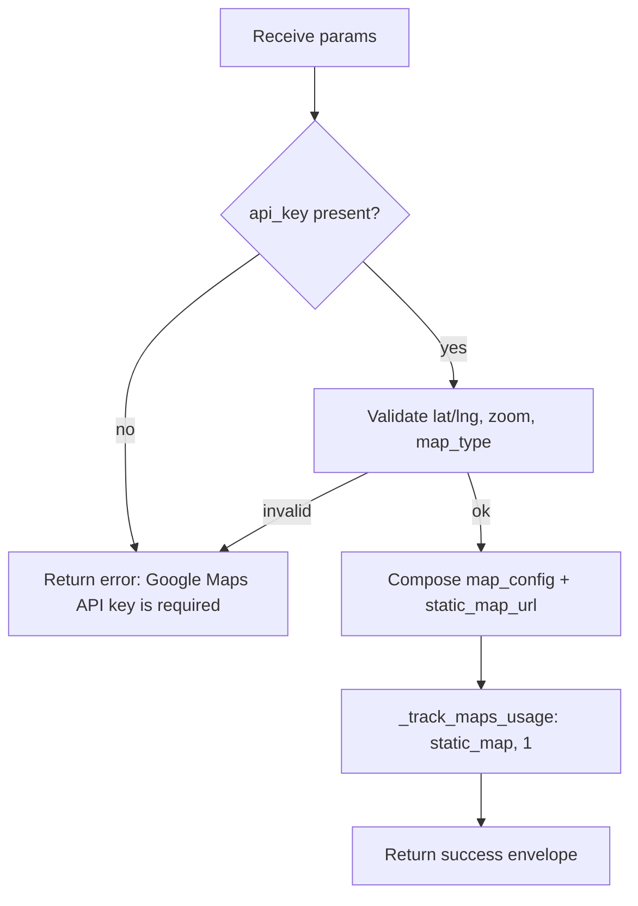

# Create Map (`gmaps_create`)

| Field | Value |
|------|-------|
| **Category** | chat_utility (grouping) / location (functional domain) |
| **Backend handler** | [`server/nodes/location/gmaps_create/__init__.py`](../../../server/nodes/location/gmaps_create/__init__.py) — dispatch via `BaseNode.execute()` + `@Operation("create")` → [`server/nodes/location/_service.py::MapsService.create_map`](../../../server/nodes/location/_service.py) |
| **Tests** | [`server/tests/nodes/test_chat_utility.py`](../../../server/tests/nodes/test_chat_utility.py) |
| **Skill (if any)** | - |
| **Dual-purpose tool** | no (display-only; `gmaps_locations` and `gmaps_nearby_places` are the dual-purpose pair) |

## Purpose

Builds a Google Maps configuration (center, zoom, map type) and a Static Maps
URL for display on the canvas or downstream consumers. The node does NOT hit
the Maps API - it assembles the URL from parameters and tracks a
`static_map` usage cost of $0.002 per execution.

## Inputs (handles)

| Handle | Connection type | Required | Purpose |
|--------|-----------------|----------|---------|
| `input-main` | main | no | Upstream lat/lng via templates |

## Parameters

Params model (`GmapsCreateParams`):

| Name | Type | Default | Required | displayOptions.show | Description |
|------|------|---------|----------|---------------------|-------------|
| `center_lat` | number | `0.0` | no | - | Map center latitude |
| `center_lng` | number | `0.0` | no | - | Map center longitude |
| `zoom` | number | `10` | no | - | Zoom level, `ge=1, le=20` (1=world, 20=street) |
| `map_type` | enum | `roadmap` | no | - | One of `roadmap`, `satellite`, `hybrid`, `terrain` |
| `options` | object | `{}` | no | - | Map customization (`disable_default_ui`, `zoom_control`, `street_view_control`, `map_type_control`, `fullscreen_control`); 4 rows |

The Google Maps API key is NOT a node Param — `MapsService.create_map` reads it
from `parameters.get("api_key")` (absent here) falling back to
`settings.google_maps_api_key`. The `GoogleMapsCredential` (`google_maps`) is
declared on the node for credential-modal visibility.

## Outputs (handles)

| Handle | Shape | Description |
|--------|-------|-------------|
| `output-main` | object | Map config + static URL |

### Output payload (TypeScript shape)

```ts
{
  map_config: {
    center: { lat: number; lng: number };
    zoom: number;
    mapTypeId: "ROADMAP" | "SATELLITE" | "HYBRID" | "TERRAIN";
  };
  static_map_url: string; // https://maps.googleapis.com/maps/api/staticmap?...
  status: "OK";
}
```

## Logic Flow



## Decision Logic

- **Validation** (inside `MapsService.create_map`):
  - `api_key` required (from `parameters.get("api_key")`, else `settings.google_maps_api_key`).
  - `lat`/`lng` validated via `validate_coordinates`.
  - `zoom` validated via `validate_zoom_level` (0-21).
  - `map_type` restricted to `["ROADMAP", "SATELLITE", "HYBRID", "TERRAIN"]` (uppercase).
- **Branches**: success envelope vs error envelope.
- **Fallbacks**: when `lat`/`lng`/`zoom`/`map_type_id` keys are absent in the
  dumped params, the service centres on New York City (40.7128, -74.0060), zoom 13,
  `ROADMAP` (see the key-mismatch note under Edge cases).
- **Error paths**: on `not response.success` the op raises
  `NodeUserError(response.error or "Map create failed")` (single WARN line,
  no traceback); `BaseNode.execute()` builds the structured error envelope.

## Side Effects

- **Database writes**: `api_usage_metrics` row via `_track_maps_usage` with
  `operation=static_map`, `resource_count=1`, `total_cost=0.002`.
- **Broadcasts**: none.
- **External API calls**: none. The URL is assembled locally and meant to be
  fetched by the frontend or downstream `httpRequest` node.
- **File I/O**: none.
- **Subprocess**: none.

## External Dependencies

- **Credentials**: `GoogleMapsCredential` (`google_maps`); the service resolves
  the key from `parameters.get("api_key")` else `settings.google_maps_api_key`
  (env `GOOGLE_MAPS_API_KEY`).
- **Services**: `MapsService` obtained via `services.plugin.deps.get_maps_service()`.
- **Python packages**: stdlib only for this path (googlemaps is used by other
  map handlers, not this one).
- **Environment variables**: `GOOGLE_MAPS_API_KEY` (fallback).

## Edge cases & known limits

- Param/service key mismatch: the plugin Params are `center_lat` / `center_lng`
  / `map_type`, but `MapsService.create_map` reads `lat` / `lng` / `map_type_id`.
  With the current `params.model_dump()` wiring the service falls back to its
  NYC / ROADMAP defaults regardless of the configured center / map type.
  (Documented, not fixed here.)
- The static map URL embeds the API key in plain text - any downstream node or
  log that captures the output leaks the key. Treat the output as sensitive.
- Size is hard-coded to `600x400`; there is no parameter to override.
- `map_type` validation is case-sensitive (uppercase `ROADMAP`...); the lowercase
  enum values the Params expose would be rejected if they reached the service.
- Cost tracking is optimistic: the $0.002 is charged even if the frontend
  never actually fetches the static map URL.

## Related

- **Skills using this as a tool**: none (display-only node).
- **Other nodes that consume this output**: downstream map-display components
  on the frontend, or `httpRequest` for server-side image fetch.
- **Architecture docs**: [`docs-internal/pricing_service.md`](../../pricing_service.md)
  for API cost tracking.
