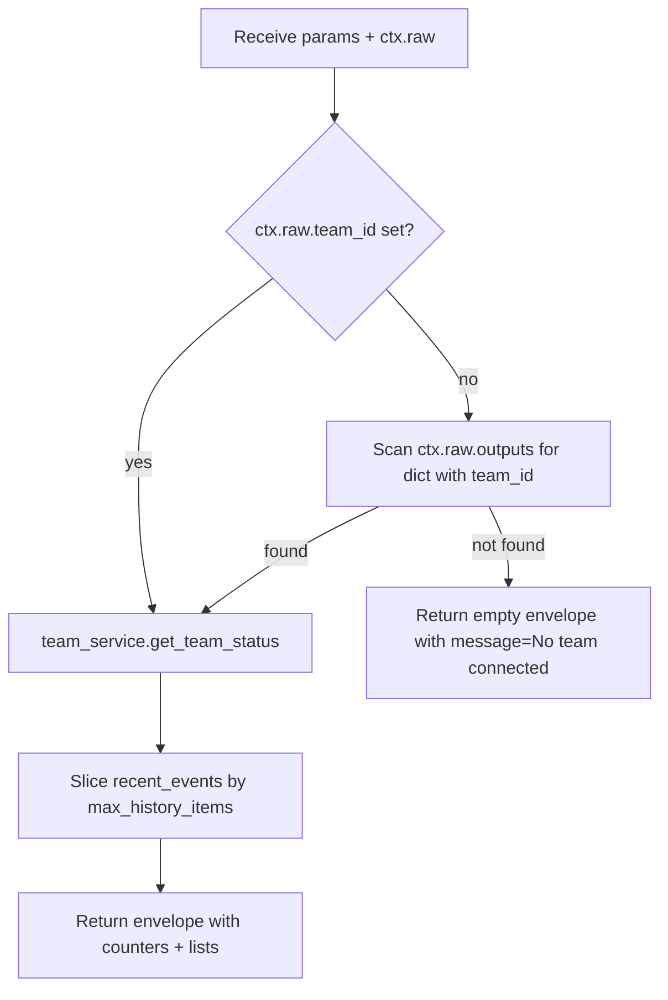

# Team Monitor (`teamMonitor`)

| Field | Value |
|------|-------|
| **Category** | chat_utility |
| **Backend handler** | [`server/nodes/utility/team_monitor/__init__.py`](../../../server/nodes/utility/team_monitor/__init__.py) — dispatch via `BaseNode.execute()` + `@Operation("monitor")` |
| **Tests** | [`server/tests/nodes/test_chat_utility.py`](../../../server/tests/nodes/test_chat_utility.py) |
| **Skill (if any)** | - |
| **Dual-purpose tool** | no |

## Purpose

Real-time monitoring window for Agent Team operations. Connects to the output
of an AI Employee or Orchestrator node and surfaces the team's members, task
counters, active tasks, and recent events for display. See
[`docs-internal/agent_teams.md`](../../agent_teams.md) for the overall teams
architecture.

## Inputs (handles)

| Handle | Connection type | Required | Purpose |
|--------|-----------------|----------|---------|
| `input-main` | main | yes (for non-empty output) | Upstream team-lead node whose output carries `team_id` |

## Parameters

| Name | Type | Default | Required | displayOptions.show | Description |
|------|------|---------|----------|---------------------|-------------|
| `team_id` | string | `""` | no | - | Explicit team id (usually resolved from upstream output instead) |
| `auto_refresh` | boolean | `true` | no | - | UI flag for periodic refresh of the monitor panel |
| `max_history_items` | number | `50` | no | - | Cap on `recent_events` slice length (`ge=1`) |

The node carries `ui_hints = {"isMonitorPanel": True, "hideInputSection": True,
"hideOutputSection": True}` — it renders as a dedicated monitor panel.

## Outputs (handles)

| Handle | Shape | Description |
|--------|-------|-------------|
| `output-main` | object | Team status snapshot (see shape) |

### Output payload (TypeScript shape)

```ts
{
  team_id: string | null;
  members: Array<unknown>;
  tasks: {
    total: number;
    completed: number;
    active: number;
    pending: number;
    failed: number;
  };
  active_tasks: Array<unknown>;
  recent_events: Array<unknown>;
  // When no team_id is resolved:
  message?: "No team connected";
}
```

## Logic Flow



## Decision Logic

- **Validation**: none.
- **Branches**:
  - `team_id` resolved via `ctx.raw["team_id"]` first, else the first value in
    `ctx.raw["outputs"]` that is a dict containing a truthy `team_id`.
  - When no `team_id` is found, returns an intentional success envelope with
    zero counters - the node does not error.
- **Fallbacks**: counters default to 0 for any missing key; `members`,
  `active_tasks`, `recent_events` default to empty lists.
- **Error paths**: no in-op try/except; any exception from
  `get_team_status` is wrapped by `BaseNode.execute()` into the error envelope.

## Side Effects

- **Database writes**: none (the service reads `agent_teams`, `team_members`,
  `team_tasks`, `agent_messages` tables behind `get_team_status`, but this
  handler only reads the returned status dict).
- **Broadcasts**: none from this handler.
- **External API calls**: none.
- **File I/O**: none.
- **Subprocess**: none.

## External Dependencies

- **Credentials**: none.
- **Services**: `AgentTeamService` via
  `services.agent_team.get_agent_team_service()`.
- **Python packages**: stdlib only.
- **Environment variables**: none.

## Edge cases & known limits

- `max_history_items` is used as a negative slice (`[-max:]`) on `recent_events`.
- The "find team_id in outputs" loop stops at the first dict it sees containing
  a truthy `team_id`; if two upstream outputs carry different team ids, behaviour
  is order-dependent.
- When the team disappears mid-run (`get_team_status` raises `TeamNotFound` or
  similar) the envelope is `success=false` - the monitor does not gracefully
  degrade.

## Related

- **Skills using this as a tool**: none.
- **Other nodes that consume this output**: downstream nodes can template on
  `{{teamMonitor.tasks.total}}`, `{{teamMonitor.active_tasks}}` etc.
- **Architecture docs**: [`docs-internal/agent_teams.md`](../../agent_teams.md).
