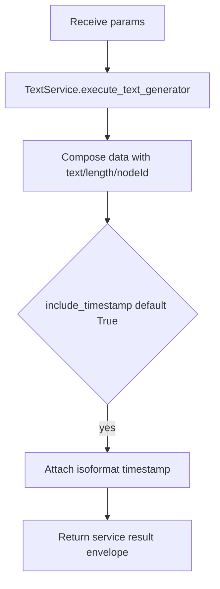

# Text Generator (`textGenerator`)

| Field | Value |
|------|-------|
| **Category** | chat_utility |
| **Backend handler** | [`server/nodes/text/text_generator/__init__.py`](../../../server/nodes/text/text_generator/__init__.py) — dispatch via `BaseNode.execute()` + `@Operation("generate")` → [`server/services/text.py::TextService.execute_text_generator`](../../../server/services/text.py) |
| **Tests** | [`server/tests/nodes/test_chat_utility.py`](../../../server/tests/nodes/test_chat_utility.py) |
| **Skill (if any)** | - |
| **Dual-purpose tool** | no |

## Purpose

Text factory node retained from the original Node.js-era workflow engine.
Emits a text string plus its length and an ISO timestamp. The Params expose a
`source` selector (`static` / `ai` / `file` / `api`) for future expansion, but
the current `TextService.execute_text_generator` only consumes `text` and
returns the static-text envelope regardless of `source`.

## Inputs (handles)

| Handle | Connection type | Required | Purpose |
|--------|-----------------|----------|---------|
| `input-main` | main | no | Upstream value usable via templates in `text` |

## Parameters

Params model (`TextGeneratorParams`, `model_config extra="allow"`):

| Name | Type | Default | Required | displayOptions.show | Description |
|------|------|---------|----------|---------------------|-------------|
| `source` | enum | `static` | no | - | One of `static`, `ai`, `file`, `api` (only `static` behaviour is implemented today) |
| `text` | string | `""` | no | - | Text payload to emit (4 rows) |
| `file_path` | string | `""` | no | - | Reserved for `source=file` (unused by the current service) |
| `api_url` | string | `""` | no | - | Reserved for `source=api` (unused by the current service) |

Note: the service reads `include_timestamp` (default `True`) but no Param exposes
it, so the ISO `timestamp` is always attached to `data`. If `text` is omitted the
service substitutes `"Hello World"`.

## Outputs (handles)

| Handle | Shape | Description |
|--------|-------|-------------|
| `output-main` | object | Wrapper containing `data` with the generated text |

### Output payload (TypeScript shape)

```ts
// Service returns result = { type, data, nodeId, timestamp }, returned verbatim.
// The TextGeneratorOutput model (extra="allow") declares text/source but the
// op returns the service result dict, so the runtime shape is:
{
  type: "text";
  data: {
    text: string;
    length: number;     // len(text) — character count
    nodeId: string;
    timestamp: string;  // always present (include_timestamp defaults True)
  };
  nodeId: string;
  timestamp: string;
}
```

## Logic Flow



## Decision Logic

- **Validation**: none; all params have defaults.
- **Branches**: `source` is accepted but ignored; only the static-text path runs.
- **Fallbacks**: empty `text` falls back to `"Hello World"` inside the service.
- **Error paths**: the service catches exceptions and returns `success=false`;
  on `not response.success` the op raises `RuntimeError(response.error or "Text generator failed")`.

## Side Effects

- **Database writes**: none.
- **Broadcasts**: none.
- **External API calls**: none.
- **File I/O**: none.
- **Subprocess**: none.

## External Dependencies

- **Credentials**: none.
- **Services**: `TextService` obtained via `services.plugin.deps.get_text_service()`.
- **Python packages**: stdlib only.
- **Environment variables**: none.

## Edge cases & known limits

- `length` is the Python `len(text)` which counts characters (not bytes), so
  non-ASCII strings report their Unicode code-point count.
- There is no upper bound on `text` length; the entire payload is stored in
  the output store and broadcast to every WS client subscribed to the
  execution run.

## Related

- **Skills using this as a tool**: none.
- **Other nodes that consume this output**: any downstream node that
  templates `{{textGenerator.data.text}}`.
- **Architecture docs**: none.
