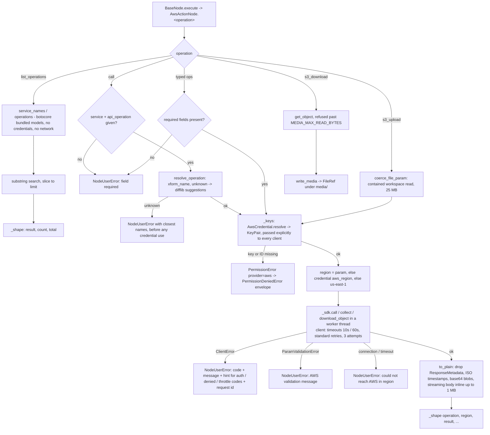

# AWS (`awsAction`)

| Field | Value |
|------|-------|
| **Category** | deployment / tool (dual-purpose) |
| **Backend handler** | [`server/nodes/aws/aws_action.py`](../../../server/nodes/aws/aws_action.py) - `AwsActionNode`; dispatched via `BaseNode.execute()` + the `@Operation("<op>")` methods; SDK glue in [`_sdk.py`](../../../server/nodes/aws/_sdk.py) |
| **Tests** | [`server/tests/nodes/test_aws.py`](../../../server/tests/nodes/test_aws.py) |
| **Skill (if any)** | [`server/skills/aws/aws-skill/SKILL.md`](../../../server/skills/aws/aws-skill/SKILL.md) |
| **Dual-purpose tool** | yes - tool name `aws_action` (`usable_as_tool = True`; both canvas handles explicitly kept visible) |

## Purpose

Work with Amazon Web Services through the official boto3 SDK, authenticated
by an IAM access key pair saved in Credentials -> AWS. Typed operations cover
the common flows (the identity behind the key, EC2 instance list / describe /
start / stop, S3 list / upload / download / delete); `call` reaches any
operation of any AWS service by its boto3 method name, and `list_operations`
discovers services and operations from the SDK's bundled models without
credentials or network. Used both as a workflow node and as an AI-agent tool.

## Inputs (handles)

| Handle | Connection type | Required | Purpose |
|--------|-----------------|----------|---------|
| `input-main` | main | no | Upstream data; not consumed directly - all inputs come from `parameters` (or the LLM's tool args when used as a tool) |

## Parameters

(Pydantic `AwsActionParams`, `extra="ignore"`; a `@model_validator(mode="before")`
runs `coerce_blank_params(..., object_fields=("request",))` so the panel's `""`
and LLM-stringified JSON both become a dict.)

| Name | Type | Default | Required | displayOptions.show | Description |
|------|------|---------|----------|---------------------|-------------|
| `operation` | options | `whoami` | yes (dispatch reads the raw key) | - | `whoami` / `ec2_instances_list` / `ec2_instance_describe` / `ec2_instance_start` / `ec2_instance_stop` / `s3_list` / `s3_upload` / `s3_download` / `s3_delete` / `call` / `list_operations` |
| `region` | string | `""` | no | every operation but `list_operations` | Region for this call; blank = the credential's `aws_region`, else `us-east-1` |
| `instance_id` | string | `""` | yes for describe / start / stop | `ec2_instance_*` | EC2 instance id |
| `instance_state` | options | `all` | no | `ec2_instances_list` | `all`, `pending`, `running`, `stopping`, `stopped`, `shutting-down`, `terminated` |
| `bucket` | string | `""` | yes except `s3_list` | `s3_*` | S3 bucket; `s3_list` without it lists the buckets |
| `prefix` | string | `""` | no | `s3_list` | Object key prefix |
| `key` | string | `""` | yes for download / delete | `s3_upload`, `s3_download`, `s3_delete` | Object key; `s3_upload` defaults to the file name |
| `file` | file (`widget: file`) | `""` | yes for `s3_upload` | `s3_upload` | A file reference, a workspace path, or the legacy upload envelope (read by `coerce_file_param`) |
| `service` | string (dynamic options: `awsServices`) | `""` | yes for `call` | `call`, `list_operations` | boto3 service name (`ec2`, `s3`, `lambda`, ...) |
| `api_operation` | string (dynamic options: `awsOperations`, depends on `service`) | `""` | yes for `call` | `call` | boto3 method (`describe_vpcs`) or API name (`DescribeVpcs`) |
| `request` | object (JSON editor) | `{}` | no | `call` | API parameters with AWS's PascalCase names |
| `search` | string | `""` | no | `list_operations` | Substring filter over service / operation names and summaries |
| `limit` | int (`ge=1, le=1000`) | `100` | no | `ec2_instances_list`, `s3_list`, `list_operations` | Maximum items returned |

Field names `model`, `api_key`, `parameters`, `action`, `service_id` and
`session_id` are deliberately avoided (name-based magic in `ParameterRenderer.tsx`).

## Outputs (handles)

| Handle | Shape | Description |
|--------|-------|-------------|
| `output-main` | object | `_shape(operation, **fields)` payload (see below); the same payload is returned to the LLM when wired to `input-tools` |
| `output-tool` | - | Auto-appended for `usable_as_tool` |

### Output payload (TypeScript shape)

```ts
// AwsActionOutput (extra="allow"); _shape drops only None, so [] / {} results stay
{
  operation: string;
  region?: string;           // every operation that called AWS
  service?: string;          // call / list_operations with a service
  api_operation?: string;    // call: the resolved boto3 method
  result: unknown;           // AWS's own response fields (timestamps ISO 8601, blobs base64),
                             // without ResponseMetadata. ec2_instances_list: one row per
                             // instance {InstanceId, Name, State, InstanceType, PublicIpAddress,
                             // PrivateIpAddress, AvailabilityZone, LaunchTime, ImageId, KeyName}
  count?: number;            // listings: items returned
  total?: number;            // list_operations: matches before limit
  truncated?: boolean;       // ec2_instances_list / s3_list: more items than limit
  file?: FileRef;            // s3_download: the saved workspace file (kind "file")
}
```

## Logic Flow



## Decision Logic

- **Validation**: dispatch requires the `operation` key; `instance_id` for
  describe / start / stop; `bucket` for upload / download / delete; `file`
  for upload; `key` for download / delete; `service` and `api_operation`
  for `call`. Each missing field raises before any credential or network use.
- **Operation resolution** (`call`): accepts the boto3 method or the API
  name; unknown services and operations fail with up to five close matches.
- **Parameter validation**: botocore validates `request` against the API
  model before building a request; errors name the offending parameter.
- **Region**: the `region` field, else the credential's `aws_region`, else
  `us-east-1`. S3 follows bucket-region redirects itself.
- **Pagination**: `ec2_instances_list` and `s3_list` page through results
  until `limit` items and report `truncated`; `call` returns one page
  (pass the service's `NextToken` back in `request`).
- **Error paths**: missing credential -> `PermissionDeniedError` envelope;
  AWS `ClientError` -> `NodeUserError` with the AWS code, message and
  request id; client-side botocore errors -> `NodeUserError`. Anything else
  keeps its traceback.

## Side Effects

- **Database writes**: none.
- **Broadcasts**: per-node status via `BaseNode.execute`; the credential
  path emits `credential.api_key.runtime_failed` when the key is missing.
- **External API calls**: AWS service endpoints of the chosen region, signed
  with SigV4 by botocore using the saved key pair; `list_operations` makes none.
- **File I/O**: `s3_upload` reads one workspace file (containment-checked);
  `s3_download` writes one file under the workspace's `media/` folder.
- **Subprocess**: none.

## External Dependencies

- **Credentials**: `AwsCredential` (`ApiKeyCredential`, id `aws`): the Secret
  Access Key under the provider id, plus the `aws_access_key_id` and
  `aws_region` rows (`extra_fields`), resolved via
  `AwsCredential.resolve(user_id=ctx.credential_customer_id)`. Modal
  probe: `sts:GetCallerIdentity` signed with the pair.
- **Services**: option-loader registry (`awsServices`, `awsOperations`),
  `services.media` (`coerce_file_param`, `write_media`).
- **Python packages**: `boto3` (with `botocore`, `s3transfer`, `jmespath`),
  imported lazily inside `_sdk.py` only.
- **Environment variables**: none. Ambient AWS credentials (environment,
  `~/.aws`, an instance profile) are never used: the key pair is passed explicitly.

## Edge cases & known limits

- **Transfers are capped at 25 MB** (`MEDIA_MAX_READ_BYTES`) and run in
  memory; larger objects need a different path.
- **Streaming responses** (Lambda `Payload`) are read inline up to 1 MB as
  UTF-8 text (base64 if binary); event streams are refused.
- **Long listings**: `call` returns whatever one AWS page holds; filters in
  `request` keep results small.
- **A new client per call**: each operation builds a client, with the key
  pair, from one shared botocore session that caches service models (about
  5 ms when warm; the first client of a service loads its model, ~0.3 s).
  Client creation is serialised by a lock because botocore sessions are not
  thread-safe; the API calls run concurrently.

## Related

- **Skills using this as a tool**: [`aws-skill/SKILL.md`](../../../server/skills/aws/aws-skill/SKILL.md)
- **Companion nodes**: [`gcloudAction`](./gcloudAction.md), [`cloudflareAction`](./cloudflareAction.md)
- **Architecture docs**: [AWS Service](../../aws_service.md), [Plugin System](../../plugin_system.md), [Media Transport](../../media_transport.md), [Credentials Encryption](../../credentials_encryption.md)
