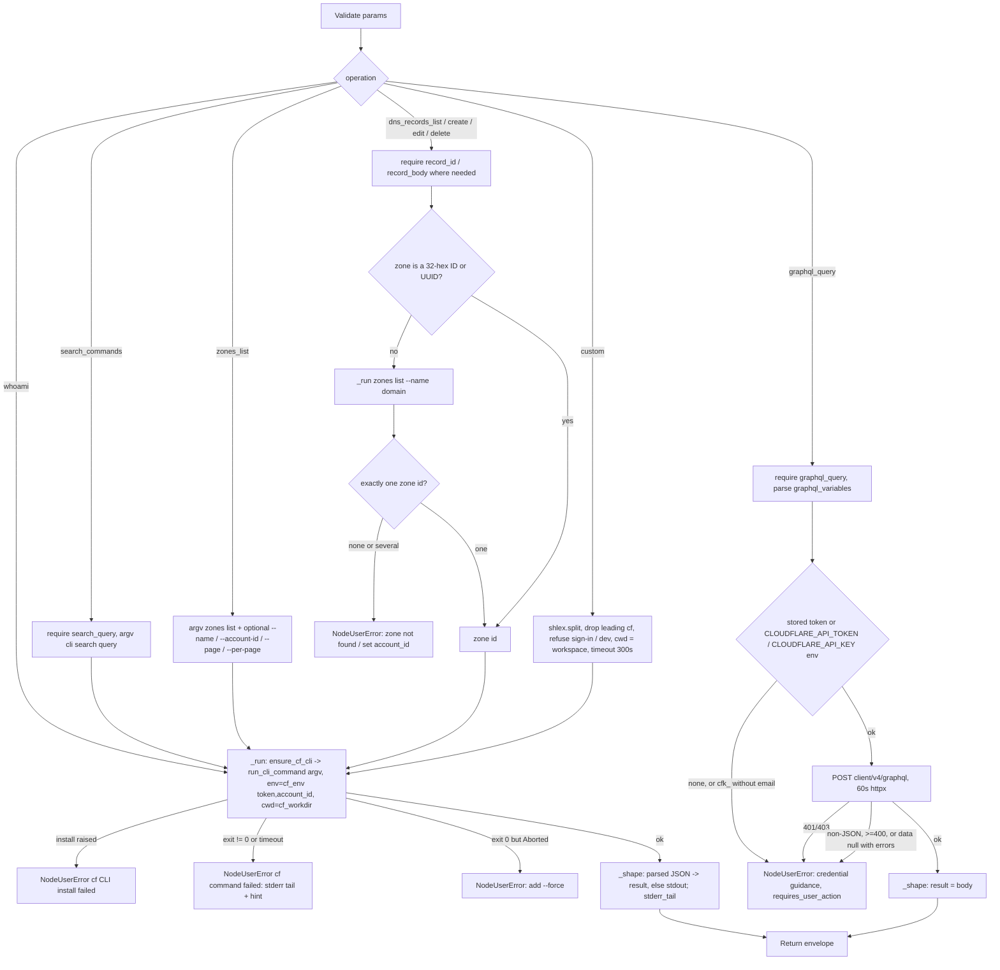

# Cloudflare (`cloudflareAction`)

| Field | Value |
|------|-------|
| **Category** | deployment (palette group `deployment`; class `group = ("deployment", "tool")`) |
| **Backend handler** | [`server/nodes/cloudflare/cloudflare_action.py`](../../../server/nodes/cloudflare/cloudflare_action.py) (`CloudflareActionNode`, on `ActionNode`); env / credential routing and the neutral working directory in [`_service.py`](../../../server/nodes/cloudflare/_service.py); installer [`_install.py`](../../../server/nodes/cloudflare/_install.py); login WS handlers [`_handlers.py`](../../../server/nodes/cloudflare/_handlers.py) |
| **Tests** | [`server/tests/test_cloudflare_plugin.py`](../../../server/tests/test_cloudflare_plugin.py) |
| **Skill (if any)** | [`server/skills/cloudflare/cloudflare-skill/SKILL.md`](../../../server/skills/cloudflare/cloudflare-skill/SKILL.md) (`allowed-tools: "cloudflare"`) |
| **Dual-purpose tool** | yes - tool name `cloudflare` |

## Purpose

Drive Cloudflare through the official `cf` CLI (npm `cf@1.0.0-beta.12`, in
open beta) from a workflow or from an agent. Typed operations cover the
CLI identity, a command search, zone listing and DNS record list / create /
edit / delete; one operation posts directly to the GraphQL Analytics API
(cf has no GraphQL command); `custom` passes any other `cf ...` command
through. The CLI owns its own auth: the node performs no credential
pre-flight and never puts a token in argv.

## Inputs (handles)

| Handle | Connection type | Required | Purpose |
|--------|-----------------|----------|---------|
| `input-main` | main | no | Declared, so it renders on the canvas although `hideInputHandle` is auto-set (`usable_as_tool = True`); the node is usually reached through `output-tool` |

## Parameters

`extra="ignore"` on the model. A `mode="before"` model validator
(`coerce_blank_params`) drops panel blanks for the integer fields, and
`record_body` / `graphql_variables` have a `mode="before"` validator that
`json.dumps` a dict / list (LLM tool calls pass real objects; the CLI flag
and HTTP body want a string).

| Name | Type | Default | Required | displayOptions.show | Description |
|------|------|---------|----------|---------------------|-------------|
| `operation` | `whoami \| search_commands \| zones_list \| dns_records_list \| dns_record_create \| dns_record_edit \| dns_record_delete \| graphql_query \| custom` | `whoami` | no | - | Operation dispatch key |
| `account_id` | string | `""` | no | `zones_list`, the four `dns_*` ops, `custom` | Sent as `CLOUDFLARE_ACCOUNT_ID` (cf has no `--account-id` flag on most commands); `zones_list` also passes it as `--account-id` |
| `zone` | string | `""` | yes* | the four `dns_*` ops | Zone ID or domain; a domain is resolved to its ID first (see Decision Logic). Empty raises `NodeUserError` |
| `name_filter` | string | `""` | no | `zones_list`, `dns_records_list` | `--name <f>` (a domain for zones, a full record name for DNS) |
| `record_type` | string | `""` | no | `dns_records_list` | `--type`, upper-cased |
| `page` | int \| null | `null` | no | `zones_list`, `dns_records_list` | `--page N` (>= 1) |
| `per_page` | int \| null | `null` | no | `zones_list`, `dns_records_list` | `--per-page N` (>= 1) |
| `record_body` | string (JSON object) | `""` | yes* | `dns_record_create`, `dns_record_edit` | Passed as `--body`; must parse as a JSON object |
| `record_id` | string | `""` | yes* | `dns_record_edit`, `dns_record_delete` | Positional record id |
| `graphql_query` | string | `""` | yes* | `operation=graphql_query` | GraphQL Analytics API query text |
| `graphql_variables` | string (JSON object) | `""` | no | `operation=graphql_query` | Parsed with `json.loads`; invalid JSON raises `NodeUserError` |
| `search_query` | string | `""` | yes* | `operation=search_commands` | The task to find a command for (`cf cli search`) |
| `command` | string | `""` | yes* | `operation=custom` | Everything after `cf `, split with `shlex.split` |

## Outputs (handles)

| Handle | Shape | Description |
|--------|-------|-------------|
| `output-main` | object | `CloudflareActionOutput`; declared, so it renders although `hideOutputHandle` is auto-set |
| `output-tool` | - | Auto-appended for `usable_as_tool` |

### Output payload (TypeScript shape)

Keys are omitted when empty (`_shape` never writes `None`; `exclude_unset`
preserves that). `extra="allow"`.

```ts
{
  operation: string;
  success: true;            // failures raise instead of returning
  url?: string;             // custom only: stdout that is one line starting with "http"
  result?: unknown;         // parsed JSON stdout (cf prints the unwrapped API result), or the GraphQL body
  stdout?: string;          // raw stdout ONLY when it did not parse as JSON (e.g. a BIND export)
  stderr_tail?: string;     // last 2000 chars of stderr when cf printed status lines
}
```

## Logic Flow



## Decision Logic

- **Validation** (all `NodeUserError`, raised before any CLI call): blank
  `zone` on a DNS op; blank or non-object `record_body`; blank `record_id`;
  blank `search_query`; blank `graphql_query`; `graphql_variables` that is
  not JSON; blank or unparseable `command`.
- **No auth pre-flight**: `_run` never checks whether cf is logged in. cf's
  own "No authentication token found" text arrives on stderr and is
  surfaced by the failure wrap.
- **Zone resolution** (`_zone_id`): a 32-hex ID or UUID is used as-is.
  Anything else is a domain: lower-cased, trailing dot dropped, looked up
  with `zones list --name <domain> [--account-id <id>]` (exact match across
  every account the credential sees). No match -> "Zone not found";
  matches with different ids -> "set account_id". cf's own domain lookup is
  avoided because it needs an account selected and searches only the
  first page of that account's zones.
- **Credential routing for CLI ops** (`cf_env`): a stored key that does not
  start with `cfk_` becomes `CLOUDFLARE_API_TOKEN` (beats the OAuth login
  and an ambient token); a `cfk_` Global API Key is not injected (cf does
  not accept Global API Keys). `account_id` becomes `CLOUDFLARE_ACCOUNT_ID`.
  `CF_DELEGATION=1`, `CF_SEND_TELEMETRY=false` and `NO_COLOR=1` are always
  set. Ambient env vars are otherwise left in place.
- **Working directory**: typed ops run from `cf_workdir()`
  (`<DATA_DIR>/cloudflare`), so no stray `.env` or `cloudflare.config.ts`
  is read; `custom` runs from the workflow workspace when it exists (else
  `cf_workdir()`), so relative `--body @file` / `--file` / `--dir` paths
  resolve there.
- **Credential routing for `graphql_query`** (`api_auth_headers`): key from
  the stored `cloudflare` row, else `CLOUDFLARE_API_TOKEN`, else
  `CLOUDFLARE_API_KEY` env; email from the stored `cloudflare_email` row,
  else `CLOUDFLARE_EMAIL`. `cfk_` + email sends `X-Auth-Email` /
  `X-Auth-Key`; any other key sends `Authorization: Bearer`; `cfk_` without
  email yields no headers and the op fails before any request.
- **GraphQL response**: HTTP 401/403 -> `NodeUserError` naming the required
  token permission; non-JSON body -> `NodeUserError`; status >= 400 or
  (`data` is null and `errors` present) -> `NodeUserError` with the first
  error's `message`; otherwise the whole body (including partial `errors`)
  is returned as `result`.
- **Failure hints** (`_failure`, on the `NodeUserError`): no login / 401 ->
  connect in Credentials -> Cloudflare, `requires_user_action=True` (plus a
  note when only a `cfk_` key is stored); "More than one account" -> set
  `account_id`; 403 -> missing token permission; "not supported on Bun" ->
  the command needs Node.js 22.18+; "Zone not found" -> pass the zone ID.
- **Unconfirmed destructive commands**: cf exits 0 with "Aborted." when a
  destructive command lacks `--force`; `_run` raises a `NodeUserError`
  asking for `--force`. `dns_record_delete` always passes `--force`.
- **`custom` guards**: `auth login|logout|create|delete|activate|deactivate`
  and `login` are refused (sign-in belongs to the Credentials modal), as is
  `dev` (a long-running local server). A leading `cf` / `cloudflare` word
  is dropped.
- **Output shaping** (`_shape`): `run_cli_command` already ran `json.loads`
  on stdout (cf prints one pretty-printed document); when that is `None`,
  non-empty stdout ships as text. `url` is set only by `custom`, and only
  when stdout is a single line starting with `http`.
- **Timeouts**: 120 s for the typed CLI ops (and the zone lookup), 300 s for
  `custom`, 60 s for the GraphQL POST. `run_cli_command` kills the process
  tree on timeout; the wrap reports `cf <command> timed out after Ns`.
- **Error paths**: `ensure_cf_cli()` raising (bun missing, `bun add`
  failing) -> `NodeUserError("cf CLI install failed: ...")` with a hint.
  Non-zero exit -> `NodeUserError("cf <command> failed: <last 2000 chars of
  stderr>")`, falling back to the envelope `error` when stderr is empty.

## Side Effects

- **Subprocess**: one `cf` process per operation (two for a DNS op given a
  domain) from the project-local shim `<DATA_DIR>/packages/node_modules/.bin/cf`
  (`cf.exe` plus a `cf.bunx` file on Windows — bun's shims, never `.cmd`),
  which runs the CLI on bun (or Node when one is on PATH). The system-global
  `cf` is never consulted. Child env is a copy of the server env plus the
  vars above.
- **Install**: on first use, or when another cf version is installed,
  `core.js_runtime.add_package("cf@1.0.0-beta.12")` — `bun add --cwd
  <DATA_DIR>/packages --no-progress cf@1.0.0-beta.12` (about 300 MB with
  miniflare + workerd) — runs in a worker thread under an install lock. A
  version change also clears the Cloudflare login marker and broadcasts
  `credential.oauth.disconnected`.
- **Files**: cf may cache the auto-selected account under
  `<DATA_DIR>/cloudflare/.cloudflare/cache/` (or the workspace, for
  `custom`).
- **External API calls**: cf's own calls to `api.cloudflare.com` (30 s per
  request, no retries); `POST https://api.cloudflare.com/client/v4/graphql`
  with `{query, variables}` (`graphql_query` only). `search_commands` is
  local.
- **Credential reads**: `auth_service.get_api_key("cloudflare")` on every
  CLI call, plus `get_api_key("cloudflare_email")` for GraphQL.
- **Cost metadata**: every operation declares
  `cost={"service": "cloudflare", "action": "<operation>", "count": 1}`.
- **Broadcasts**: standard node status via `BaseNode.execute`; nothing
  plugin-specific beyond the upgrade marker clear. (Login / logout / status
  belong to the WS handlers `cloudflare_login` / `cloudflare_logout` /
  `cloudflare_status`, not to this node.)
- **Database writes**: none by the node, apart from the upgrade marker
  clear.

## External Dependencies

- **Credentials**: `CloudflareCredential` (`id = "cloudflare"`,
  `auth = "custom"`). `resolve()` returns the optional
  `cloudflare_api_token` (stored under the provider id `cloudflare`; an API
  token or a `cfk_` Global API Key) and `cloudflare_email`. The cf OAuth
  login lives in cf's own profile store
  (`<xdg-config>/cloudflare/config/default.json`) and is never read by
  OpenCompany; the modal badge is a synthetic `cli-managed` marker OAuth
  row written by `_handlers.py`.
- **Services**: the `cf` CLI (declares `engines.node >= 22`; its API
  commands run on bun — only commands that load a `cloudflare.config.ts`
  need Node 22.18+; `bun` on PATH or `OPENCOMPANY_BUN_BIN` for the
  install); Cloudflare's OAuth device authorization for login (URL + code
  shown in the modal; see `_handlers.py`).
- **Python packages**: `httpx`, `pydantic`; `services.events.run_cli_command`.
- **Environment variables**: `CLOUDFLARE_API_TOKEN`, `CF_API_TOKEN`
  (ambient values honoured for ops, stripped for login / whoami / logout),
  `CLOUDFLARE_ACCOUNT_ID`, `CLOUDFLARE_ZONE_ID` (read by cf), and
  `CLOUDFLARE_API_KEY` / `CLOUDFLARE_EMAIL` (GraphQL fallback only). Set
  for the child: `NO_COLOR`, `CF_DELEGATION`, `CF_SEND_TELEMETRY`.

## Edge cases & known limits

- `annotations` declare `destructive: True` (`dns_record_delete`, and
  `custom` can run any destructive command with `--force`).
- `ui_hints = {"outputMode": "terminal"}`: text output renders
  preformatted; JSON `result` renders as a tree.
- Lists return one page; `result_info` (totals, cursors) is dropped by cf,
  so cursor-paginated lists (`kv keys list`, `r2 objects list`) cannot be
  followed past the first page from CLI output.
- Project commands (`init`, `build`, `dev`, `deploy`) need Node.js 22.18+;
  under bun, any command that finds a `cloudflare.config.ts` above its
  working directory fails. `custom` runs from the workspace, so a
  `cloudflare.config.ts` written there affects later `custom` calls.
- The GraphQL op ignores the cf OAuth login entirely: the token never
  leaves the CLI, so only a stored / ambient token or Global API Key can
  satisfy it.
- `whoami` under a stored or ambient API token reports that token, not the
  OAuth login (that is why the WS status handler uses `login_env`).
- Argv shapes are verified only against the pinned `cf@1.0.0-beta.12`; the
  beta CLI's surface can change between releases.

## Related

- **Skills using this as a tool**: [cloudflare-skill](../../../server/skills/cloudflare/cloudflare-skill/SKILL.md)
- **Siblings**: [`gcloudAction`](./gcloudAction.md), [`vercelAction`](./vercelAction.md), [`githubAction`](./githubAction.md) - the same CLI-managed-auth pattern
- **Also in the deployment group**: [`awsAction`](./awsAction.md) (boto3 SDK with an IAM access key, no CLI)
- **Architecture docs**: [Cloudflare Service](../../cloudflare_service.md), [Plugin System](../../plugin_system.md)
