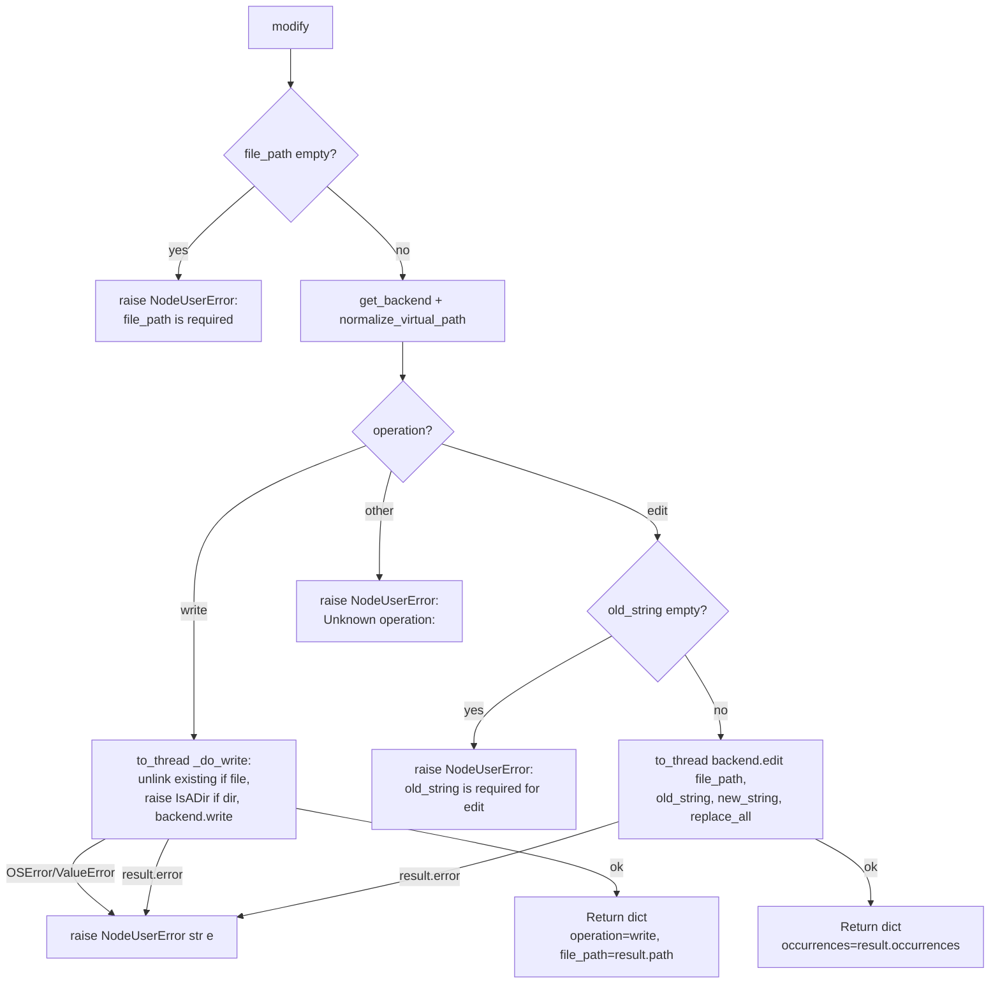

# File Modify (`fileModify`)

| Field | Value |
|------|-------|
| **Category** | code_fs_process / filesystem |
| **Backend handler** | [`server/nodes/filesystem/file_modify/__init__.py::FileModifyNode.modify`](../../../server/nodes/filesystem/file_modify/__init__.py) (dispatched via `BaseNode.execute()` + `@Operation("modify")`) |
| **Backend** | `NushellBackend` (subclasses `deepagents.backends.LocalShellBackend`) in [`server/nodes/filesystem/_backend.py`](../../../server/nodes/filesystem/_backend.py) |
| **Tests** | [`server/tests/nodes/test_code_fs_process.py`](../../../server/tests/nodes/test_code_fs_process.py) |
| **Skill (if any)** | [`server/skills/coding_agent/file-modify-skill/SKILL.md`](../../../server/skills/coding_agent/file-modify-skill/SKILL.md) |
| **Dual-purpose tool** | yes - tool name `file_modify` |

## Purpose

Writes a new file or edits an existing one inside the per-workflow workspace.
Two operations: `write` (create/overwrite) and `edit` (string find-and-replace).
Delegates to `backend.write()` / `backend.edit()` on `NushellBackend`
(`virtual_mode=True`, `inherit_env=True`) via `get_backend()`, invoked through
`asyncio.to_thread()`. Paths are normalised with `normalize_virtual_path()`
first. Because deepagents' `backend.write()` refuses to overwrite, the `write`
op first unlinks any pre-existing file at the resolved path (wholesale
create-or-replace), guarding against `IsADirectoryError`.

## Inputs (handles)

| Handle | Connection type | Required | Purpose |
|--------|-----------------|----------|---------|
| `input-main` | main | no | Not consumed by the handler |

## Parameters

| Name | Type | Default | Required | displayOptions.show | Description |
|------|------|---------|----------|---------------------|-------------|
| `operation` | `write` \| `edit` (Literal) | `write` | no | - | `write` or `edit` |
| `file_path` | string | `""` | yes | - | Target file path |
| `content` | string | `""` | yes (when `operation=write`) | `operation=write` | File content |
| `old_string` | string | `""` | yes (when `operation=edit`) | `operation=edit` | Text to find |
| `new_string` | string | `""` | no | `operation=edit` | Replacement text |
| `replace_all` | boolean | `false` | no | `operation=edit` | Replace every occurrence; when `false` the backend insists `old_string` is unique |

`FileModifyParams` uses `extra="ignore"` — `working_directory` is NOT exposed by
this node (the model drops unknown keys before `model_dump()`).

## Outputs (handles)

| Handle | Shape | Description |
|--------|-------|-------------|
| `output-main` | object | Standard envelope payload (node declares only `input-main` / `output-main`; `usable_as_tool=True` exposes the same payload as the `file_modify` tool result) |

### Output payload

Write:
```ts
{ operation: "write"; file_path: string }
```

Edit:
```ts
{ operation: "edit"; file_path: string; occurrences: number }
```

`node_output_schemas.FileModifyOutput` declares `operation` / `file_path` /
`occurrences` (the model's declared `Output` has `written` / `replacements`,
but the operation returns the dicts above; `_OutputBase`/`extra="allow"` keeps
them).

## Logic Flow



## Decision Logic

- **Validation**:
  - empty `file_path` -> `raise NodeUserError("file_path is required")`.
  - `operation=edit` with empty `old_string` -> `raise NodeUserError("old_string
    is required for edit")`.
  - Anything other than `write` / `edit` -> `raise NodeUserError("Unknown
    operation: <op>")` (Pydantic Literal already constrains it).
- **`write` overwrite handling**: `_do_write` resolves the path, raises
  `IsADirectoryError` if it's a directory, `unlink()`s an existing file, then
  calls `backend.write()` (which itself refuses to overwrite). `OSError` /
  `ValueError` are caught and re-raised as `NodeUserError`.
- **Backend-level errors**: a non-empty `result.error` from `write`/`edit`
  short-circuits with `raise NodeUserError(result.error)`. Common: non-unique
  `old_string` when `replace_all=False`, path escape with `virtual_mode=True`.
- **`edit` uniqueness constraint**: when `replace_all=False`, the backend
  REQUIRES `old_string` to appear exactly once. Zero or multiple matches
  trigger a backend-level error.
- **`file_path` echoed from `result.path`**: on success the returned
  `file_path` comes from the backend's normalised path, falling back to the
  normalised `file_path` only if `result.path` is empty.

## Side Effects

- **Database writes**: none.
- **Broadcasts**: none.
- **External API calls**: none.
- **File I/O**:
  - `get_backend` ensures the workspace root exists.
  - For `write`: `unlink()` an existing file then writes `<root>/<file_path>`.
  - For `edit`: rewrites `<root>/<file_path>` in place.
- **Subprocess**: none.

## External Dependencies

- **Python packages**: `deepagents` (via `NushellBackend`).
- **Environment variables**: `WORKSPACE_BASE_DIR`.

## Edge cases & known limits

- **Silent overwrite on `write`**: there is no "fail if exists" flag - every
  `write` call unlinks then replaces the file.
- **`edit` without a match**: raises `NodeUserError` (backend surfaces the
  message). The handler never distinguishes "not found" from "multiple
  matches" - both are `NodeUserError` strings.
- **No encoding option**: the backend opens files in text mode with the
  platform default encoding.
- **`working_directory` not exposed**: `extra="ignore"` means the sandbox
  cannot be widened via a node param on this node.
- **`replace_all=true` with empty `new_string`**: effectively deletes every
  occurrence of `old_string`. No safeguard.
- **Atomicity**: the backend does not do atomic writes - a crash mid-write
  can leave a truncated file.

## Related

- **Skills using this as a tool**: [`file-modify-skill/SKILL.md`](../../../server/skills/coding_agent/file-modify-skill/SKILL.md)
- **Sibling nodes**: [`fileRead`](./fileRead.md), [`fsSearch`](./fsSearch.md), [`shell`](./shell.md)
