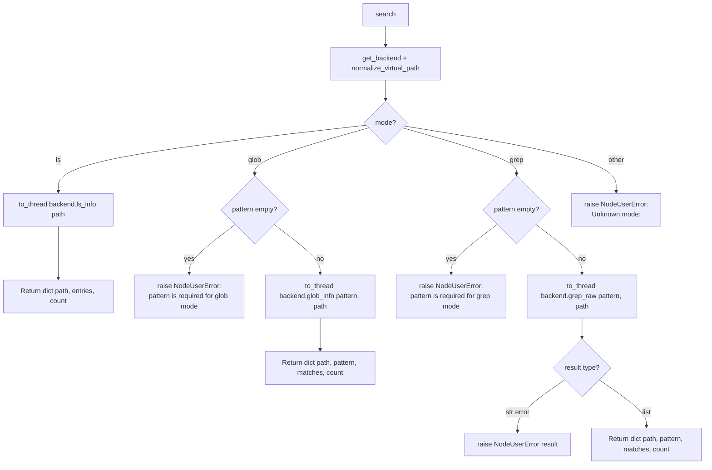

# FS Search (`fsSearch`)

| Field | Value |
|------|-------|
| **Category** | code_fs_process / filesystem |
| **Backend handler** | [`server/nodes/filesystem/fs_search/__init__.py::FsSearchNode.search`](../../../server/nodes/filesystem/fs_search/__init__.py) (dispatched via `BaseNode.execute()` + `@Operation("search")`) |
| **Backend** | Native `WorkspaceBackend` (`ls_info`, `glob_info`, `grep_raw`) in [`server/nodes/filesystem/_backend.py`](../../../server/nodes/filesystem/_backend.py) |
| **Tests** | [`server/tests/nodes/test_code_fs_process.py`](../../../server/tests/nodes/test_code_fs_process.py) |
| **Skill (if any)** | [`server/skills/coding_agent/fs-search-skill/SKILL.md`](../../../server/skills/coding_agent/fs-search-skill/SKILL.md) |
| **Dual-purpose tool** | yes - tool name `fs_search` |

## Purpose

Three-mode filesystem query node confined to the per-workflow workspace.
Dispatches to `ls_info()`, `glob_info()`, or `grep_raw()` on the native
`WorkspaceBackend` via `get_backend()` depending on `mode`. The `path` is run
through `normalize_virtual_path()` first, and each filesystem operation
resolves the target beneath the workspace root with symlink containment.

## Inputs (handles)

| Handle | Connection type | Required | Purpose |
|--------|-----------------|----------|---------|
| `input-main` | main | no | Not consumed |

## Parameters

| Name | Type | Default | Required | displayOptions.show | Description |
|------|------|---------|----------|---------------------|-------------|
| `mode` | `ls` \| `glob` \| `grep` (Literal) | `ls` | no | - | `ls`, `glob`, or `grep` |
| `path` | string | `.` | no | - | Directory path to search in (workspace-relative) |
| `pattern` | string | `""` | yes (when `mode != ls`) | - | Glob pattern or literal grep text |

`FsSearchParams` uses `extra="ignore"` — there are NO `file_filter` or
`working_directory` params; the model drops unknown keys. The grep mode passes
only `pattern` + `path` to `backend.grep_raw()`. (displayOptions are not
declared on these fields in the current Params model.)

## Outputs (handles)

| Handle | Shape | Description |
|--------|-------|-------------|
| `output-main` | object | Standard envelope payload (node declares only `input-main` / `output-main`; `usable_as_tool=True` exposes the same payload as the `fs_search` tool result) |

### Output payload

```ts
// ls
{ path: string; entries: Array<FileInfo>; count: number }
// glob
{ path: string; pattern: string; matches: Array<FileInfo>; count: number }
// grep
{ path: string; pattern: string; matches: Array<GrepMatch>; count: number }
```

`FileInfo` and `GrepMatch` are JSON-safe dictionaries returned by the native
backend. The node defensively copies each with `dict(entry)`.
`node_output_schemas.FsSearchOutput` declares `path` / `entries` / `matches` /
`pattern` / `count` (extra fields allowed by `_OutputBase`).

## Logic Flow



## Decision Logic

- **`mode=ls`** requires nothing; defaults `path='.'`.
- **`mode=glob`** requires `pattern`. Missing pattern -> `raise NodeUserError`.
- **`mode=grep`** requires `pattern`. No file-filter kwarg is passed (only
  `pattern` + `path`).
- **`grep_raw` polymorphic return**: the backend returns either a list of
  `GrepMatch` objects (success) OR a plain string (error description). The
  plugin checks `isinstance(result, str)` and `raise NodeUserError(result)`.
- **Unknown modes**: `raise NodeUserError("Unknown mode: <mode>")` (Pydantic
  Literal already constrains it).
- All raises become single-WARN-line `error_type="NodeUserError"` envelopes via
  `BaseNode.execute()`.

## Side Effects

- **Database writes**: none.
- **Broadcasts**: none.
- **External API calls**: none.
- **File I/O**:
  - `get_backend` ensures the workspace root exists.
  - Reads directory listings and file contents under `<root>/<path>`.
- **Subprocess**: none (`grep_raw` is a local Python file walk and literal
  substring search; it does not invoke `grep(1)`).

## External Dependencies

- **Python packages**: standard library only.
- **Environment variables**: `WORKSPACE_BASE_DIR`.

## Edge cases & known limits

- **`grep_raw` string-error path is unique**: unlike ls/glob which raise,
  grep can "succeed" at the Python level but return a string; the plugin
  converts that to a `NodeUserError` so the final envelope shape is consistent.
- **Glob patterns match the backend's semantics**: `**` globs work, but
  the backend's behaviour for symlinks, hidden files, and case sensitivity
  is inherited from `pathlib`.
- **No maxResults cap**: a `**/*` glob over a huge workspace returns every
  match; the handler does not paginate. The caller must truncate.
- **`path='.'` resolves against the workspace root, not the server CWD**.
- **`working_directory` not exposed**: `extra="ignore"` means the sandbox
  cannot be widened via a node param on this node.
- **Result copying**: `dict()` makes each native result mapping independent
  before output validation and serialization.

## Related

- **Skills using this as a tool**: [`fs-search-skill/SKILL.md`](../../../server/skills/coding_agent/fs-search-skill/SKILL.md)
- **Sibling nodes**: [`fileRead`](./fileRead.md), [`fileModify`](./fileModify.md), [`shell`](./shell.md)
